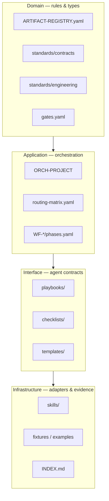

# AI Dev OS — Platform Architecture

| Field | Value |
|-------|-------|
| document_id | DOC-ARCH-001 |
| version | 1.0.0 |
| status | active |
| updated | 2026-06-18 |

---

## 1. Purpose

Define the **Clean Architecture** layout of the AI Development Operating System — vendor-agnostic, globally installed at `AI_DEV_OS_HOME`, never copied into project repositories.

---

## 2. Deployment Model

| Concept | Rule |
|---------|------|
| `AI_DEV_OS_HOME` | Global OS root (this repository) |
| `project_root` | Target software project |
| Project artifacts | `{project_root}/work/` only |
| Playbook SSOT | `{AI_DEV_OS_HOME}/playbooks/` |
| Platform adapters | `{AI_DEV_OS_HOME}/skills/` — pointers only |

---

## 3. Clean Architecture Layers

### Dependency rule

- **Inward only:** Infrastructure → Interface → Application → Domain
- Playbooks **reference** standards and routing SSOT; they do not embed duplicate routing tables
- Orchestrator reads machine SSOT under `workflows/project-orchestrator/`
- Chat is never SSOT — artifacts and Work Records are

---

## 4. Central Components

| Component | Role | SSOT path |
|-----------|------|-----------|
| ORCH-PROJECT | Route, sequence, gate, recover | `workflows/project-orchestrator/DESIGN.md` |
| Work Record (WR) | Work metadata, artifact index | `templates/work-record/template.md` |
| Orchestrator Run State (ORS) | Run control, gate history | `templates/orchestrator-run-state/template.md` |
| INT / DISC / … | Domain artifacts | `ARTIFACT-REGISTRY.yaml` + `templates/` |
| Skill graph | Dependencies + execution order | `skill-dependency-graph.yaml` |
| Routing matrix | Per-skill orchestrator routing | `routing-matrix.yaml` |

---

## 5. Phase Spine

`Intake → Frame → Plan → Decompose → Implement → Verify → Ship → Operate`

Workflow-specific paths are defined in `workflows/{WF-*}/phases.yaml`, derived from `skill-dependency-graph.yaml` `execution_graphs`.

---

## 6. Non-goals (v1)

- Executable orchestrator service (spec-only coordinator)
- CI enforcement of human gates (advisory model)
- Copying OS into project repos

---

## 7. References

| Doc | Path |
|-----|------|
| Foundation manifest | `FOUNDATION.md` |
| SSOT hierarchy | `SSOT-HIERARCHY.md` |
| Governance | `GOVERNANCE.md` |
| Orchestrator design | `workflows/project-orchestrator/DESIGN.md` |
| Skill contract | `standards/SKILL-CONTRACT.md` |
| Engineering standards | `standards/engineering/README.md` |