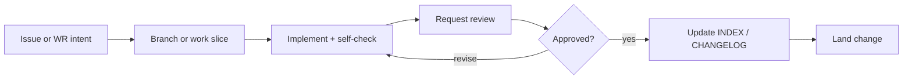

# Contributing

| Field | Value |
|-------|-------|
| document_id | DOC-CONTRIB-001 |
| version | 1.0.0 |
| status | active |
| owner | Maintainer |
| updated | 2026-06-18 |

---

## 1. Purpose

How to propose, author, review, and land changes to the AI Dev OS repository. Governance rules: [REPOSITORY-GOVERNANCE.md](./REPOSITORY-GOVERNANCE.md).

---

## 2. Who can contribute

| Contributor | Typical changes |
|-------------|-----------------|
| Skill Author | Playbooks, checklists, fixtures |
| Workflow Owner | `WF-*` specs and phases |
| Template Owner | `templates/*/template.md` |
| Maintainer | INDEX, routing-matrix, CHANGELOG |
| Platform / Principal Architect | Standards, orchestrator, foundation |
| Agent | Drafts under human review — never self-approve promotion |

---

## 3. Before you start

1. Read [SSOT-HIERARCHY.md](./SSOT-HIERARCHY.md) — know where truth lives
2. Check [INDEX.md](../INDEX.md) — avoid duplicate IDs
3. Identify path owner in [OWNERSHIP.yaml](./OWNERSHIP.yaml)
4. Classify change: PATCH / MINOR / MAJOR / breaking ([STD-VER-001](../standards/engineering/STD-VER-001.md))

---

## 4. Change workflow



### 4.1 Propose

| Size | Proposal channel |
|------|------------------|
| PATCH | Direct change with CHANGELOG note |
| MINOR | WR or issue describing scope + affected IDs |
| MAJOR / breaking | Architect approval before implementation |
| New skill / workflow | Lifecycle phase 1 Design ([LIFECYCLE.md](../skills/meta-skill/LIFECYCLE.md)) |

### 4.2 Author

| Asset | Start from |
|-------|------------|
| Playbook | `playbooks/_contract-scaffold/` |
| Workflow | `workflows/_spec-template.yaml` + `WF-*/phases.yaml` peer |
| Template | `templates/_template/template.md` |
| Standard | Existing `standards/engineering/STD-*.md` structure |
| Checklist | Existing `checklists/*.md` pattern |

### 4.3 Self-check (MUST before review)

| Change type | Run |
|-------------|-----|
| Playbook | Applicable `CL-*`; G-SKILL-01–08 evidence |
| Workflow | G-WF-01–05; spec ↔ phases alignment |
| Document | D-DOC-01–04 (**STD-DOC-001**) |
| Version bump | V-VER-01–04 (**STD-VER-001**) |
| Any | Path owner README still accurate |

### 4.4 Request review

| Change | Reviewer |
|--------|----------|
| `playbooks/*` promotion | Principal Architect (`10-review.md`) |
| `workflows/*` | Workflow Owner |
| `standards/*` MAJOR | Standard owner + Architect |
| `templates/*` MAJOR | Template Owner + affected Skill Authors |
| Catalog / routing | Maintainer |
| Full OS audit | MS-repository-review |

### 4.5 Land

1. Update `CHANGELOG.md` (MINOR+ mandatory; PATCH optional for typos)
2. Update `INDEX.md` if catalog changed
3. Update `OWNERSHIP.yaml` if owner changed
4. Bump version fields on affected assets
5. Obtain merge approval from path owner

---

## 5. Contribution rules (MUST)

### 5.1 SSOT discipline

- Playbook specs live in `playbooks/` only
- `skills/` contains adapter pointers — no `01-purpose.md` specs
- Routing changes go through `skill-dependency-graph.yaml` → `routing-matrix.yaml`
- Do not duplicate checklist text in `03-workflow` and `09-system-prompt` verbatim

### 5.2 Naming

Follow **STD-NAMING-001**: `PB-*`, `MS-*`, `WF-*`, `TP-*`, `CL-*`, `STD-*`, `H-*`, `G-*`.

### 5.3 Discovery semantics

Do not redesign `PB-discovery-research` intake/discovery semantics. Promotion artifacts only unless Architect waives.

### 5.4 Tests and fixtures

| Asset | Requirement before `active` |
|-------|----------------------------|
| Playbook | `fixtures/`, `examples/golden/`, `11-test-plan.md` pass |
| Workflow | Orchestrator integration per G-WF-05 |
| Template | At least one consuming playbook references TP-* |

### 5.5 Documentation

- New folder → `README.md` with purpose, owner, catalog link
- New catalog asset → `INDEX.md` row same change set
- Cross-reference standards — do not paste full standard text

---

## 6. Pull request / patch checklist

Use this checklist in PR description or WR handoff:

```markdown
## Contribution checklist

- [ ] Owner identified (OWNERSHIP.yaml)
- [ ] Change class: PATCH | MINOR | MAJOR
- [ ] Breaking: yes/no — migration doc if yes
- [ ] INDEX.md updated (if catalog)
- [ ] CHANGELOG.md updated (if MINOR+)
- [ ] Version fields bumped
- [ ] CL-* / G-* self-check pass
- [ ] No SSOT duplication introduced
- [ ] Reviewer assigned per REPOSITORY-GOVERNANCE §4
```

---

## 7. What requires architect approval

| Item | Approver |
|------|----------|
| MAJOR skill / standard / workflow bump | Principal Architect |
| `contract_waivers[]` | Principal Architect |
| `FOUNDATION.md` `status: frozen` | Principal Architect |
| Breaking routing or artifact contract | Principal Architect |
| Discovery semantic change | Principal Architect |

---

## 8. What NOT to contribute here

| Item | Correct location |
|------|------------------|
| Project application code | Target `project_root` repo |
| Filled INT/PRD/CODE artifacts | Project `work/` directory |
| Vendor-specific prompt packs as SSOT | Derive from `09-system-prompt.md` |
| Per-project playbook forks | Extend OS playbooks; use WR context |

---

## 9. Getting help

| Question | Resource |
|----------|----------|
| Where does X live? | [SSOT-HIERARCHY.md](./SSOT-HIERARCHY.md) |
| How do I promote a skill? | [GOVERNANCE.md](./GOVERNANCE.md) §4, **STD-SKILL-001** §16 |
| How do I add a workflow? | [workflows/ENGINE.md](../workflows/ENGINE.md) |
| Repo health audit? | `MS-repository-review` |

---

## 10. Related documents

| Document | Path |
|----------|------|
| Repository governance | [REPOSITORY-GOVERNANCE.md](./REPOSITORY-GOVERNANCE.md) |
| Ownership registry | [OWNERSHIP.yaml](./OWNERSHIP.yaml) |
| Skill lifecycle | [LIFECYCLE.md](../skills/meta-skill/LIFECYCLE.md) |
| Skill contract | [STD-SKILL-001](../standards/SKILL-CONTRACT.md) |