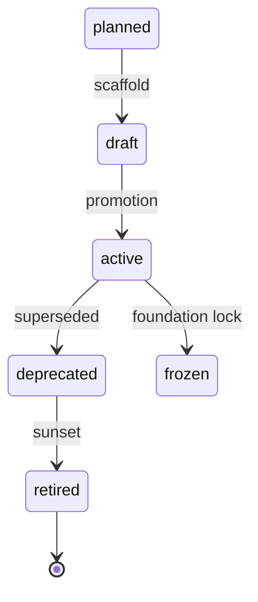
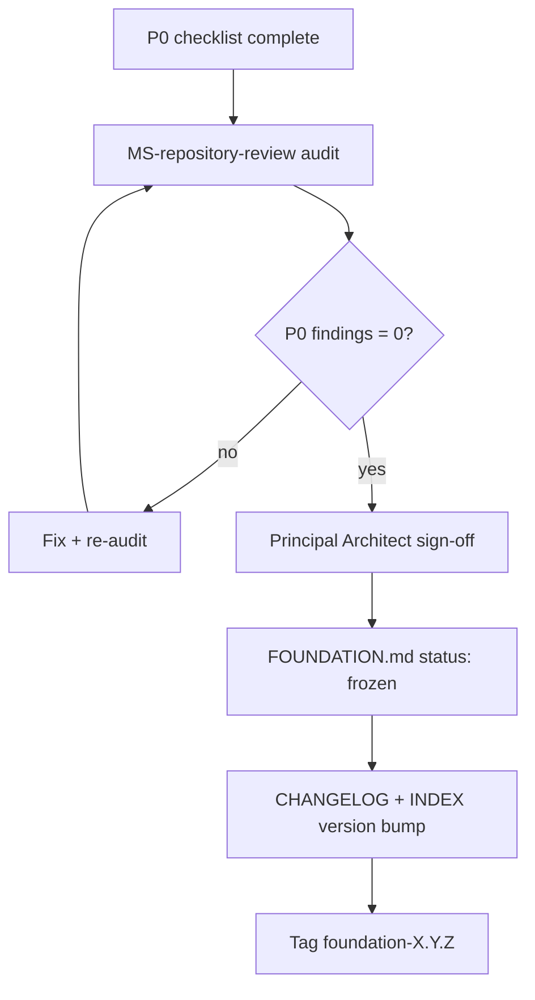

# Repository Governance

| Field | Value |
|-------|-------|
| document_id | DOC-REPO-GOV-001 |
| version | 1.0.0 |
| status | active |
| owner | Principal Architect |
| updated | 2026-06-18 |

---

## 1. Purpose

Define **how the AI Dev OS repository is owned, changed, reviewed, approved, versioned, and released**. This document governs the OS repo (`AI_DEV_OS_HOME`). Runtime workflow gates remain in [GOVERNANCE.md](./GOVERNANCE.md).

**Consumers:** Contributors, skill authors, workflow owners, meta skills (`MS-repository-review`), Principal Architect.

---

## 2. Governance roles

| Role | Accountability | Decides |
|------|----------------|---------|
| **Principal Architect** | Foundation freeze, breaking changes, contract waivers | `FOUNDATION.md` status, MAJOR standard bumps, skill `active` promotion |
| **Platform Architect** | Architecture, contracts, orchestrator design | `docs/ARCHITECTURE.md`, `STD-SKILL-001`, `gates.yaml`, routing graph |
| **Workflow Owner** | Workflow catalog integrity | `WF-*` specs, `phases.yaml`, `WORKFLOW-REGISTRY.yaml` |
| **Maintainer** | Catalog and routing hygiene | `INDEX.md`, `routing-matrix.yaml`, `CHANGELOG.md` |
| **Skill Author** | Playbook correctness | `playbooks/{name}/` through promotion |
| **Template Owner** | Artifact shape consistency | `templates/{type}/` |
| **Engineering Lead** | Code review norms (project delivery) | Per **STD-REVIEW-001** |
| **QA** | Test and promotion evidence | `11-test-plan.md`, RT/ST suites |

One person MAY hold multiple roles. Role assignments are recorded in [OWNERSHIP.yaml](./OWNERSHIP.yaml).

---

## 3. Repository ownership

### 3.1 Repository model

| Property | Rule |
|----------|------|
| SSOT location | Single global OS at `AI_DEV_OS_HOME` — not per-project copies |
| Playbooks | `playbooks/` — normative skill specs |
| Adapters | `skills/` — deployment pointers only; never SSOT |
| Contracts | `standards/` — immutable-by-convention rules |
| Execution | `workflows/` — orchestrator routing and workflow engine |
| Catalog | `INDEX.md` — human + agent discovery |

### 3.2 Top-level ownership

| Path | Owner | Change authority |
|------|-------|------------------|
| `FOUNDATION.md` | Principal Architect | Architect sign-off |
| `INDEX.md`, `CHANGELOG.md`, `ROADMAP.md` | Maintainer | Maintainer + architect on MAJOR |
| `docs/` | Platform Architect | Architect review |
| `standards/` | Per-standard owner | Owner + architect on MAJOR |
| `playbooks/` | Skill Author (per folder) | Author through promotion gate |
| `workflows/` | Workflow Owner | Workflow Owner + architect on graph change |
| `templates/` | Template Owner | Template Owner |
| `checklists/` | Skill Author (bound skill) | Author with skill change |
| `skills/` | Maintainer | Pointer-only; no spec content |
| `ARTIFACT-REGISTRY.yaml` | Platform Architect | Architect review |

### 3.3 Prohibited changes (MUST NOT)

- Embed routing matrices in playbooks (SSOT: `routing-matrix.yaml`)
- Author skill specs under `skills/` (adapters only)
- Use chat history as durable SSOT (**STD-MEM-001**)
- Redesign Discovery semantics without architect waiver (`PB-discovery-research`)

Full SSOT table: [SSOT-HIERARCHY.md](./SSOT-HIERARCHY.md). Machine registry: [OWNERSHIP.yaml](./OWNERSHIP.yaml).

---

## 4. Review process

Reviews are **typed** — each change class uses a distinct review path. Reviews produce durable records, not chat-only approval.

### 4.1 Review types

| Type | Trigger | Reviewer | Record | Standard |
|------|---------|----------|--------|----------|
| **Spec review** | Playbook promotion, MAJOR skill bump | Principal Architect | `10-review.md` score ≥ 70 | **STD-SKILL-001** §16 |
| **Meta audit** | OS health, foundation prep | MS-* or human | `reviews/` or WR meta artifact | **STD-META-001** |
| **Workflow review** | New/changed `WF-*` | Workflow Owner + MS-workflow-review | Spec diff + G-WF pass | **STD-WF-001** |
| **Standards review** | New/changed `STD-*` | Standard owner + MS-standards-review | Standard metadata + CHANGELOG | **STD-DOC-001** |
| **Repository audit** | Quarterly or pre-freeze | MS-repository-review | Prioritized findings | This doc §12 |
| **Code review** | Implement/Verify in target project | Human (+ agent assist) | `TP-review` or WR note | **STD-REVIEW-001** |
| **Contribution review** | Any PR/patch to OS repo | CODEOWNERS path owner | PR comments + checklist | [CONTRIBUTING.md](./CONTRIBUTING.md) |

### 4.2 Severity (all review types)

| Level | Meaning | Blocks promotion / merge |
|-------|---------|--------------------------|
| P0 | Contract violation, missing SSOT, security | Yes |
| P1 | Incomplete tests, spec drift, missing INDEX | Yes for `active` |
| P2 | Style, naming, doc clarity | No |

### 4.3 Review cadence

| Asset | Cadence | Owner |
|-------|---------|-------|
| Engineering standards | Quarterly | Per `review_cycle` in standard metadata |
| Workflow specs | On change + annual | Workflow Owner |
| `routing-matrix.yaml` | On graph change | Maintainer |
| Foundation manifest | Pre-freeze + each release | Principal Architect |
| Full repository audit | Quarterly or pre-`frozen` | MS-repository-review |

### 4.4 Self-check before review (MUST)

Contributors MUST run applicable `CL-*` checklists and `D-DOC-*` / `V-VER-*` validation gates from **STD-DOC-001** and **STD-VER-001** before requesting human review.

---

## 5. Approval process

Approvals are **explicit**, **logged**, and **binding** for the artifact they cover.

### 5.1 Approval channels

| Channel | Scope | Record location |
|---------|-------|-----------------|
| **H-* gates** | Workflow phase boundaries | WR `approvals[]`, ORS `gate_history` |
| **H-META** | Meta skill recommendations | WR / `reviews/` |
| **Architect sign-off** | Foundation freeze, MAJOR bumps, waivers | `FOUNDATION.md`, `10-review.md`, `registry.yaml` `contract_waivers[]` |
| **Promotion approve** | `draft` → `active` skill | `10-review.md` + INDEX status |
| **Maintainer merge** | Catalog/routing PATCH | CHANGELOG + INDEX |

### 5.2 Gate decisions (workflow runtime)

Per [GOVERNANCE.md](./GOVERNANCE.md):

| Decision | Effect |
|----------|--------|
| `approve` | Advance phase |
| `revise` | Re-invoke playbook |
| `reject` | Abort or hold |
| `waive` | Logged advance per `gates.yaml` allowlist |

### 5.3 Repository change approval matrix

| Change class | Required approver | Evidence |
|--------------|-------------------|----------|
| PATCH doc typo | Path owner | CHANGELOG optional |
| MINOR skill (additive) | Skill Author + Maintainer | `registry.yaml` changelog, RT pass |
| MAJOR skill | Principal Architect | §15 process, `MIGRATION.md` |
| New `WF-*` | Workflow Owner | Spec + phases + registry row |
| New `STD-*` | Standard owner + Architect | Standard file + engineering README |
| `FOUNDATION.md` → `frozen` | Principal Architect | P0 checklist + audit |
| `routing-matrix.yaml` regen | Maintainer | Graph alignment check |
| Contract waiver | Principal Architect | `contract_waivers[]` in registry |

### 5.4 Advisory enforcement

Human gates are **surfaced** by the orchestrator, not CI-enforced. Repository governance assumes humans and agents self-check; audits close gaps.

---

## 6. Versioning

Normative semver rules: **STD-VER-001**. Summary for repository contributors:

### 6.1 Versioned assets

| Asset | Version field | Changelog |
|-------|---------------|-----------|
| Foundation | `FOUNDATION.md` `version` | `CHANGELOG.md` |
| Standards | `version` in metadata table | `CHANGELOG.md` on MINOR+ |
| Playbooks | `registry.yaml` `version`, `spec_version` | `registry.yaml` `changelog[]` on MINOR+ |
| Prompts | `prompt_version` | Independent PATCH if behaviour unchanged |
| Workflows | Spec `version` in `WF-*.yaml` | `CHANGELOG.md` on MINOR+ |
| Templates | `INDEX.md` row or template header | `CHANGELOG.md` on shape change |
| OS catalog | `INDEX.md` `version` | `CHANGELOG.md` |

### 6.2 Bump rules

| Bump | When |
|------|------|
| **MAJOR** | Breaking contract, removed required field, tightened MUST without waiver |
| **MINOR** | Additive capability, new optional field, new workflow slice |
| **PATCH** | Clarification, typo, non-behaviour prompt tuning |

### 6.3 Traceability (MUST)

Work Records SHOULD record `os_refs` with pinned `spec_version` and `ai_dev_os_home` per **STD-VER-001**.

### 6.4 Immutability after `active`

`skill_id`, `workflow_id`, `TP-*` IDs, and `STD-*` IDs are immutable. Behaviour changes via version bumps only (**STD-NAMING-001**).

---

## 7. Deprecation

Deprecation is a **published transition** — not silent removal.

### 7.1 Lifecycle statuses



| Status | Meaning |
|--------|---------|
| `planned` | Stub only; orchestrator blocks invoke |
| `draft` | Spec complete enough for review; not default routing |
| `active` | Eligible for orchestrator happy path |
| `deprecated` | Superseded; invoke discouraged |
| `retired` | MUST NOT invoke |
| `frozen` | Foundation-locked; PATCH only |

### 7.2 Deprecation requirements (MUST)

| Asset | Actions |
|-------|---------|
| **Skill** | INDEX `deprecated`; `registry.yaml` `superseded_by`; banner in `01-purpose.md`; routing redirect or block (**STD-SKILL-001** §14) |
| **Workflow** | `WORKFLOW-REGISTRY.yaml` note; spec `status: deprecated`; intake routing update |
| **Standard** | `status: deprecated` in metadata; successor linked; 90-day notice before retirement |
| **Template** | INDEX flag; `superseded_by: TP-*` in README; playbooks updated |
| **Document** | Header `status: deprecated`; link to replacement |

### 7.3 Minimum notice

**90 days** SHOULD elapse between `deprecated` and `retired` for skills and standards. Emergency security deprecation MAY shorten per **STD-SEC-001** with incident WR.

### 7.4 Retirement

Retired assets MUST NOT appear in default `routing-matrix.yaml` or workflow `execution_sequence`. Files MAY remain read-only for audit.

---

## 8. Breaking changes

### 8.1 Definition (repository-wide)

A change is **breaking** when it forces consumers to modify behaviour, artifacts, or integrations without a documented waiver path.

| Domain | Breaking triggers | Detail |
|--------|-------------------|--------|
| Skills | B1–B7 | **STD-SKILL-001** §15.1 |
| Standards | Tightened MUST, removed exception | **STD-VER-001** |
| Workflows | Removed phase, changed terminal gate, new required skill | **STD-WF-001** |
| Templates | Removed required section, renamed placeholder | Template Owner policy |
| Artifacts | Renamed type, changed WR required field | **STD-ARTIFACT-001** |
| Routing | Removed workflow eligibility without migration | `routing-matrix.yaml` |

### 8.2 Breaking change process (MUST)

1. Classify breaking vs non-breaking (author + reviewer)
2. Bump **MAJOR** version on affected asset
3. Document migration steps (`MIGRATION.md` in skill README or CHANGELOG section)
4. Architect re-review (`10-review.md` or standard owner sign-off)
5. Re-run promotion gates / RT suite / workflow G-WF checks
6. Update downstream: INDEX, routing-matrix, workflow specs, templates
7. Announce in `CHANGELOG.md` under `### Breaking`

### 8.3 Batch breaking changes

Foundation MAJOR releases MAY batch breaking changes. `FOUNDATION.md` MUST list breaking items and migration pointers.

---

## 9. Compatibility policy

### 9.1 Backward compatibility (SHOULD)

| Layer | Policy |
|-------|--------|
| **Active skills** | MINOR additions backward compatible; MAJOR requires migration |
| **Workflows** | Existing `work_id` resumes on PATCH; MAJOR may require new ORS |
| **Templates** | New optional sections allowed in MINOR; required sections only in MAJOR |
| **Standards** | Clarifications = PATCH; new MUST rules = MAJOR or explicit waiver |
| **Adapters** | `skills/` MAY lag playbooks one MINOR; MUST pin `spec_version` in adapter README |

### 9.2 Forward compatibility (MAY)

- Optional fields in `registry.yaml`, WR, ORS — unknown fields ignored by orchestrator
- New workflows added without changing existing `WF-*` sequences

### 9.3 Pinning

| Consumer | Pin |
|----------|-----|
| Project WR | `os_refs.spec_version` per skill invoked |
| Foundation release | `FOUNDATION.md` `version` |
| CI / audit | `INDEX.md` `version` + git tag when repo is versioned |

### 9.4 Compatibility matrix (orchestrator)

| Skill status | Workflow invoke | Action |
|--------------|-----------------|--------|
| `active` | Allowed | Normal |
| `draft` | Allowed with human ack | Per **DESIGN.md** ORCH-S7 |
| `planned` | Blocked | `E-WF-PLANNED` |
| `deprecated` | Warn + redirect | Per routing message |
| `retired` | Blocked | Fail fast |

### 9.5 Waiver path

Contract deviations require Principal Architect approval recorded in `registry.yaml` `contract_waivers[]` or WR. Waivers are **not** a compatibility substitute — they are scoped exceptions with expiry.

---

## 10. Folder ownership

Every repository path has a **primary owner** responsible for drift, README presence, and INDEX linkage.

### 10.1 Top-level folders

| Folder | Owner | README required | INDEX section |
|--------|-------|-----------------|---------------|
| `docs/` | Platform Architect | `docs/README.md` | Documentation |
| `standards/` | Platform Architect | `standards/README.md` | Standards |
| `standards/engineering/` | Platform Architect | `engineering/README.md` | Engineering Standards |
| `playbooks/` | Per-skill author | Per playbook | Playbooks |
| `workflows/` | Workflow Owner | `workflows/README.md` | Workflows |
| `workflows/specs/` | Workflow Owner | `specs/README.md` | Workflows |
| `workflows/project-orchestrator/` | Platform Architect | Via DESIGN.md | Workflows |
| `templates/` | Template Owner | `templates/README.md` | Templates |
| `checklists/` | Maintainer | `checklists/README.md` | Checklists |
| `skills/` | Maintainer | `skills/README.md` | Adapters |

### 10.2 Nested playbook folder

```
playbooks/{kebab-name}/
```

| File / folder | Owner |
|---------------|-------|
| `01–12` spec files | Skill Author |
| `registry.yaml` | Skill Author |
| `fixtures/`, `examples/` | Skill Author |
| `README.md` | Skill Author |
| Bound `checklists/{short}.md` | Skill Author |
| Bound `templates/{type}/` | Template Owner (shape); Skill Author (usage) |

### 10.3 Ownership transfer

1. Update [OWNERSHIP.yaml](./OWNERSHIP.yaml)
2. Update asset metadata `owner` field
3. CHANGELOG entry under `### Changed`
4. Notify Maintainer for INDEX row update

---

## 11. Skill ownership

### 11.1 Identity binding

| Field | Owner responsibility |
|-------|---------------------|
| `skill_id` (`PB-*`, `MS-*`, `ORCH-PROJECT`) | Immutable after `active`; author owns correctness |
| `registry.yaml` | Machine SSOT — author maintains |
| `09-system-prompt.md` | Author; `prompt_version` bumps |
| Adapter under `skills/` | Maintainer — pointer to playbook only |

### 11.2 Skill lifecycle ownership

Per [skills/meta-skill/LIFECYCLE.md](../skills/meta-skill/LIFECYCLE.md):

| Phase | Owner |
|-------|-------|
| Design → Improve | Skill Author |
| Review → Freeze | Principal Architect |
| Publish | Maintainer (INDEX, routing) |

### 11.3 Promotion ownership

Skill Author delivers evidence; Principal Architect approves `active`; Maintainer publishes catalog rows. Gates: **STD-SKILL-001** §16, [GOVERNANCE.md](./GOVERNANCE.md) §4.

### 11.4 Meta skills (`MS-*`)

Owned by Platform Architect. Produce review artifacts only — MUST NOT auto-modify playbooks without H-META (**STD-META-001**).

---

## 12. Workflow ownership

### 12.1 Artifacts per workflow

| Artifact | Owner |
|----------|-------|
| `workflows/specs/WF-*.yaml` | Workflow Owner |
| `workflows/WF-*/phases.yaml` | Workflow Owner |
| `workflows/WF-*/README.md` | Workflow Owner |
| `WORKFLOW-REGISTRY.yaml` row | Workflow Owner |
| `skill-dependency-graph.yaml` `execution_graphs` | Workflow Owner + Maintainer |
| `routing-matrix.yaml` workflow hints | Maintainer (derived) |

### 12.2 Change rules

- Spec `execution_sequence` MUST align with `phases.yaml` (**STD-WF-001**)
- New workflow: spec + phases + README + registry + INDEX + graph entry
- Terminal gate change = MAJOR workflow version + architect review

### 12.3 Orchestrator

`workflows/project-orchestrator/DESIGN.md` owned by Platform Architect. On conflict, DESIGN wins over playbook README (**SSOT-HIERARCHY**).

---

## 13. Template ownership

### 13.1 Template identity

| Field | Rule |
|-------|------|
| ID | `TP-<kebab-name>` — immutable after first `active` playbook depends on it |
| SSOT | `templates/{type}/template.md` |
| Catalog | `templates/README.md` + `INDEX.md` |

### 13.2 Owner responsibilities

| Task | Owner |
|------|-------|
| Placeholder schema `{{field}}` | Template Owner |
| `## Human Approval` section present | Template Owner |
| `## References` to producing skills | Template Owner |
| Registration when new TP-* created | Template Owner + Maintainer |

### 13.3 Change classification

| Change | Bump | Approver |
|--------|------|----------|
| Wording clarification | PATCH | Template Owner |
| New optional section | MINOR | Template Owner |
| New required section / rename placeholder | MAJOR | Template Owner + affected Skill Authors |
| Deprecate template | MAJOR | Template Owner; update all producing playbooks |

### 13.4 `_template/` scaffold

Copy source for new templates. Owned by Template Owner. Changes are PATCH unless scaffold structure changes (MINOR).

---

## 14. Document lifecycle

Extends **STD-DOC-001** with repository-level transitions.

### 14.1 States

| State | Entry | Exit |
|-------|-------|------|
| `draft` | Initial authoring | Review requested |
| `active` | Review pass + owner sign-off | Deprecation or freeze |
| `deprecated` | Superseded announced | Retirement date reached |
| `frozen` | Foundation lock | Architect unfreeze only |

### 14.2 Required metadata (MUST)

Every normative document includes a metadata table:

```
document_id | standard_id | workflow_id (if applicable)
version | status | owner | updated | review_cycle (standards)
```

### 14.3 Document classes and lifecycle

| Class | Create trigger | Activate trigger | Retire trigger |
|-------|----------------|------------------|----------------|
| Foundation doc | P0 scope defined | Architect `frozen` | Next MAJOR foundation only |
| Standard | New normative rule needed | Owner + D-DOC pass | Successor standard |
| Playbook | Skill planned | G-SKILL-01–08 pass | `retired` per §7 |
| Workflow spec | New `WF-*` | G-WF-01–05 pass | Deprecated in registry |
| Checklist | CL-* referenced | With skill `active` | With skill retirement |
| Template | TP-* registered | First consuming skill `active` | Superseded TP-* |

### 14.4 Orphan prevention

New documents MUST be linked from `INDEX.md` or parent folder README within the same change set (**STD-DOC-001** D-DOC-04).

---

## 15. Release lifecycle

### 15.1 Release types

| Type | Tag pattern | Scope |
|------|-------------|-------|
| **Foundation** | `foundation-X.Y.Z` | Substrate manifest, P0/P1 gates |
| **OS minor** | `os-X.Y.Z` | Additive workflows, skills, standards |
| **OS patch** | `os-X.Y.Z+pN` | Doc fixes, routing regen, clarifications |
| **Skill** | In `registry.yaml` only | Independent skill semver |
| **Standard** | In standard metadata | Independent standard semver |

### 15.2 Foundation release flow



### 15.3 OS release flow (post-foundation)

1. **Plan** — `ROADMAP.md` slice complete; breaking changes listed
2. **Validate** — G-WF, G-SKILL, D-DOC, V-VER checks
3. **Document** — `CHANGELOG.md` section with Added/Changed/Deprecated/Removed/Fixed/Security
4. **Approve** — Maintainer PATCH/MINOR; Architect MAJOR
5. **Publish** — Bump `INDEX.md` `version`; tag if git enabled
6. **Announce** — WR or release notes for downstream projects

### 15.4 Release gates

| Gate | Criterion |
|------|-----------|
| G-REL-01 | `CHANGELOG.md` entry for release |
| G-REL-02 | `INDEX.md` version matches release |
| G-REL-03 | No open P0 in promotion backlog (for MINOR+) |
| G-REL-04 | `FOUNDATION.md` updated if substrate scope changed |
| G-REL-05 | Breaking changes have migration docs |

### 15.5 Hotfix

Security or orchestrator-blocking defects MAY ship as PATCH without waiting for quarterly review. MUST document in CHANGELOG with `Security` or `Fixed` section. Architect notified within one business day.

### 15.6 Consumer upgrade guidance

Projects SHOULD:

1. Read `CHANGELOG.md` for pinned `FOUNDATION.md` / `INDEX.md` version
2. Update `WR.os_refs` when skill MAJOR bumps
3. Re-run intake if workflow routing changed

---

## 16. Related documents

| Document | Path |
|----------|------|
| Runtime governance | [GOVERNANCE.md](./GOVERNANCE.md) |
| Contribution process | [CONTRIBUTING.md](./CONTRIBUTING.md) |
| Ownership registry | [OWNERSHIP.yaml](./OWNERSHIP.yaml) |
| SSOT hierarchy | [SSOT-HIERARCHY.md](./SSOT-HIERARCHY.md) |
| Versioning standard | [STD-VER-001](../standards/engineering/STD-VER-001.md) |
| Document standard | [STD-DOC-001](../standards/engineering/STD-DOC-001.md) |
| Skill contract | [STD-SKILL-001](../standards/SKILL-CONTRACT.md) |
| Workflow standard | [STD-WF-001](../standards/engineering/STD-WF-001.md) |
| Skill lifecycle | [LIFECYCLE.md](../skills/meta-skill/LIFECYCLE.md) |
| Foundation manifest | [FOUNDATION.md](../FOUNDATION.md) |

---

## 17. Validation checklist (MS-repository-review)

| ID | Check |
|----|-------|
| RG-01 | Every top-level folder has README + owner in OWNERSHIP.yaml |
| RG-02 | INDEX lists all cataloged assets |
| RG-03 | No skill spec content under `skills/` |
| RG-04 | `routing-matrix.yaml` aligns with skill-dependency-graph |
| RG-05 | Deprecated assets have `superseded_by` or retirement date |
| RG-06 | MAJOR bumps have CHANGELOG + migration |
| RG-07 | Workflow spec ↔ phases alignment |
| RG-08 | Foundation freeze criteria met before `status: frozen` |