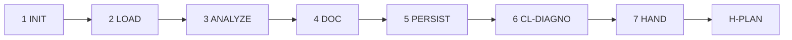

# PB-diagnose-bug — Workflow

| Field | Value |
|-------|-------|
| skill_id | PB-diagnose-bug |
| version | 1.0.0 |
| status | active |
| document | 03-workflow |

---

## Overview

Nine-step linear workflow: verify entry → load context → analyze → document → persist → validate → hand off at H-PLAN.

---

## Steps

| Step | ID | Action |
|------|-----|--------|
| 1 | INIT | Verify entry criteria; load INDEX, CL-DIAGNO, upstream path from WR |
| 2 | LOAD | Read upstream + soft artifacts + CONTEXT slice |
| 3 | ANALYZE | Build hypothesis tree and evidence table from INT repro signals |
| 4 | DOC | Build DIAG per 04-io-contract |
| 5 | PERSIST | Write `{project_root}/work/diagnose/{work_id}.md`; update Work Record |
| 6 | VAL | CL-DIAGNO (10 checks); recovery ≤3 attempts |
| 7 | HAND | Handoff package; **stop** — await H-PLAN |
| 8 | STOP | No downstream invoke until human approves |
| 9 | LOG | Record validation in OUT-03 |

---

## Entry Criteria

| # | Criterion |
|---|-----------|
| EC-01 | `work_id` and linked upstream artifact exist |
| EC-02 | Upstream gate satisfied per routing-matrix |
| EC-03 | No prior DIAG with H-PLAN `approve` unless `mode: revise` |
| EC-04 | `workflow_id` in INDEX.md |
| EC-05 | `project_root` resolvable when required |
| EC-06 | WR records upstream path in `artifacts[]` |

---

## Exit Criteria

| # | Criterion |
|---|-----------|
| XC-01 | OUT-01 persisted (or `persist: pending` with human ack) |
| XC-02 | CL-DIAGNO `result: pass` |
| XC-03 | OUT-04 handoff includes `gate_id: H-PLAN`, `decision: pending` |
| XC-04 | WR `status: diagnose_pending_review` |

---

## Human Gate — H-PLAN

| Field | Rule |
|-------|------|
| gate_id | `H-PLAN` |
| Agent sets | `decision: pending` only |
| Human options | `approve` \| `revise` \| `reject` |
| On approve | WR status advanced; may recommend `PB-draft-issue` |
| On revise | Re-enter LOAD with `human_revise_notes`; increment `revision` |
| On reject | WR status rejected; orchestrator recovery |

---

## Revise Loop

Human `revise` at H-PLAN → re-enter **LOAD** → update DIAG → full CL-DIAGNO → handoff again.

---

## Recovery

CL-DIAGNO fail → fix per `checklists/diagnose.md` recovery table → re-VAL (≤3) → OUT-05 escalation.

---

## Next Playbook Routing (recommend only)

| Signal | Primary | Alternate |
|--------|---------|-----------|
| Default success | PB-draft-issue | Per routing-matrix |
| Upstream gap | Upstream producer skill | Human waiver |
| Wrong workflow | Block — cite EC-ENT-* | — |

---

## Sequential Gates (promotion)

| Prerequisite | Gate record | Required verdict |
|--------------|-------------|------------------|
| PB-intake-classify | `playbooks/intake-classify/test-runs/latest-gate.md` | VERDICT PASS |

Promotion chain documented in `test-runs/latest-gate.md` and `11-test-plan.md` ENV-06.
