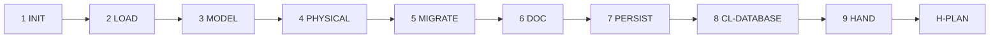

# PB-draft-database — Workflow

| Field | Value |
|-------|-------|
| skill_id | PB-draft-database |
| version | 1.0.0 |
| status | draft |
| document | 03-workflow |

---

## Overview

Nine-step linear workflow: verify ARCH entry → load context → model schema → document DB → validate → hand off at H-PLAN.

---

## Steps

| Step | ID | Action |
|------|-----|--------|
| 1 | INIT | Verify entry criteria; load INDEX, CL-DATABASE, ARCH path from WR |
| 2 | LOAD | Read ARCH + PRD (soft) + CONTEXT slice; set `change_type` |
| 3 | MODEL | Logical entities, relationships, attributes |
| 4 | PHYSICAL | Tables, indexes, constraints; access patterns |
| 5 | MIGRATE | Migration steps, reversibility, rollback when applicable |
| 6 | DOC | Build DB per TP-database; §1.3 ARCH link required |
| 7 | PERSIST | Write DB; update Work Record |
| 8 | VAL | CL-DATABASE (10 checks); recovery ≤3 attempts |
| 9 | HAND | Handoff package; **stop** — await H-PLAN |

---

## Entry Criteria

| # | Criterion |
|---|-----------|
| EC-01 | `work_id` and linked ARCH exist |
| EC-02 | ARCH `status` approved at H-PLAN (or `human_waiver` documented in WR) |
| EC-03 | No prior DB with H-PLAN `approve` unless `mode: revise` |
| EC-04 | `workflow_id` in INDEX.md |
| EC-05 | `project_root` resolvable when ARCH requires it |
| EC-06 | WR records ARCH path in `artifacts[]` |
| EC-07 | PRD linked or `prd_gap: missing \| waiver` documented |

---

## Exit Criteria

| # | Criterion |
|---|-----------|
| XC-01 | OUT-01 DB persisted (or `persist: pending` with human ack) |
| XC-02 | CL-DATABASE `result: pass` |
| XC-03 | OUT-04 handoff includes `gate_id: H-PLAN`, `decision: pending` |
| XC-04 | WR `status: database_pending_review` |

---

## Human Gate — H-PLAN

| Field | Rule |
|-------|------|
| gate_id | `H-PLAN` |
| Agent sets | `decision: pending` only |
| Human options | `approve` \| `revise` \| `reject` |
| On approve | WR `status: plan_approved`; may recommend PB-draft-api or PB-decompose-issues |
| On revise | Re-enter LOAD with `human_revise_notes`; increment `revision` |
| On reject | WR `status: database_rejected` |

**Binding on approve:** table definitions, migration order, and resolved open questions marked sufficient for Implement.

---

## Revise Loop

Human `revise` at H-PLAN → re-enter **LOAD** → increment `revision` → full CL-DATABASE → handoff again.

---

## Recovery

CL-DATABASE fail → fix per `checklists/database.md` recovery table → re-VAL (≤3) → OUT-05 escalation.

---

## Next Playbook Routing (recommend only)

| change_type / workflow | Primary | Alternate |
|------------------------|---------|-----------|
| `new_schema` (WF-FEATURE) | PB-draft-api | PB-decompose-issues |
| `migration` (WF-REFACTOR) | PB-decompose-issues | PB-implement (small scope) |
| `optimization` (WF-PERF) | PB-implement | PB-decompose-issues |
| `migration` (WF-SECURITY) | PB-decompose-issues | PB-draft-api |
| `arch_alignment: requires_arch_revise` | PB-draft-architecture | — |
| API-heavy feature | PB-draft-api | PB-decompose-issues |