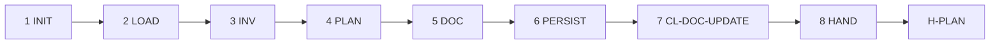

# PB-draft-doc-update — Workflow

| Field | Value |
|-------|-------|
| skill_id | PB-draft-doc-update |
| version | 1.0.0 |
| status | draft |
| document | 03-workflow |

---

## Steps

| Step | ID | Action |
|------|-----|--------|
| 1 | INIT | Verify entry criteria; load INDEX, CL-DOC-UPDATE, INT path from WR |
| 2 | LOAD | Read INT + WR + CONTEXT slice; load quality-chain refs (soft) |
| 3 | INV | Survey doc inventory per 05-context.md; set `doc_scope` and `doc_plan_type` |
| 4 | PLAN | Map DU-* rows: paths, change types, priorities, acceptance signals |
| 5 | DOC | Build DOC-PLAN per TP-doc-plan; standards §6; rollout §7 |
| 6 | PERSIST | Write DOC-PLAN; update Work Record |
| 7 | VAL | CL-DOC-UPDATE (10 checks); recovery ≤3 attempts |
| 8 | HAND | Handoff package; **stop** — await H-PLAN |

---

## Entry Criteria

| # | Criterion |
|---|-----------|
| EC-01 | `work_id` and linked INT exist |
| EC-02 | INT `status` approved at H-INTAKE |
| EC-03 | No prior DOC-PLAN with H-PLAN `approve` unless `mode: revise` |
| EC-04 | `workflow_id: WF-DOCS` in INDEX.md (from INT) |
| EC-05 | INT `work_type: documentation` **or** WR documents quality-chain docs path with waiver |
| EC-06 | Quality-chain artifacts (REVIEW, SEC-REVIEW, PERF-REVIEW) linked **or** `quality_chain_gap: waiver` when INT-only |

---

## Human Gate — H-PLAN

| Field | Rule |
|-------|------|
| gate_id | `H-PLAN` |
| Agent sets | `decision: pending` only |
| Human options | `approve` \| `revise` \| `reject` |
| On approve | WR `status: plan_approved`; human executes §5 planned updates |
| On revise | Re-enter LOAD with `human_revise_notes`; increment `revision` |
| On reject | WR `status: plan_rejected` |

**Binding on approve:** in-scope doc paths, priorities, and acceptance signals marked sufficient for human execution.

**WF-DOCS terminal:** No downstream playbook auto-invoke after H-PLAN. Optional human path: PB-prepare-release when release packaging bundles doc deliverables.

---

## Revise Loop

Human `revise` at H-PLAN → re-enter **LOAD** → increment `revision` → full CL-DOC-UPDATE → handoff again.

---

## Recovery

CL-DOC-UPDATE fail → fix per `checklists/doc-update.md` recovery table → re-VAL (≤3) → OUT-05 escalation.

---

## Next Playbook Routing (recommend only)

| Signal | Primary | Alternate |
|--------|---------|-----------|
| WF-DOCS terminal | *(none — human execution)* | PB-prepare-release when release-bound |
| Docs-only after PERF-REVIEW handoff | PB-draft-doc-update (this skill) | Re-intake as `documentation` if INT missing |

Routing authority lives in orchestrator substrate — playbook outputs name candidates only. WF-DOCS `next_candidates: []` in registry.

---

## Quality-Chain Entry (soft)

When PB-perf-review or PB-security-review handoff recommends `PB-draft-doc-update`:

1. WR MUST link INT (required) — quality-chain artifact is soft context.
2. Agent sets `quality_chain_linked: true` when REVIEW / SEC-REVIEW / PERF-REVIEW present.
3. Agent MUST NOT require CODE or PERF-REVIEW for WF-DOCS INT fixtures.