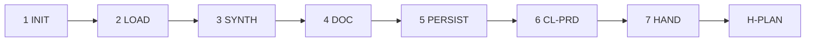

# PB-draft-prd — Workflow

| Field | Value |
|-------|-------|
| skill_id | PB-draft-prd |
| version | 1.0.0 |
| status | active |
| document | 03-workflow |

---

## Steps

| Step | ID | Action |
|------|-----|--------|
| 1 | INIT | Verify entry criteria; load INDEX, CL-PRD, INT path from WR |
| 2 | LOAD | Read INT + DISC (if linked) + CONTEXT slice; set `prd_type` |
| 3 | SYNTH | Map goals, users, FR/NFR from upstream; flag gaps |
| 4 | DOC | Build PRD per TP-prd; technical considerations high-level only |
| 5 | PERSIST | Write PRD; update Work Record |
| 6 | VAL | CL-PRD (10 checks); recovery ≤3 attempts |
| 7 | HAND | Handoff package; **stop** — await H-PLAN |

---

## Entry Criteria

| # | Criterion |
|---|-----------|
| EC-01 | `work_id` and linked INT exist |
| EC-02 | INT `status` approved at H-INTAKE |
| EC-03 | No prior PRD with H-PLAN `approve` unless `mode: revise` |
| EC-04 | `workflow_id` in INDEX.md |
| EC-05 | DISC linked in WR **or** `discovery_gap: waiver` documented (soft) |
| EC-06 | H-FRAME satisfied **or** soft-waived per workflow (e.g. WF-PRD) |

---

## Human Gate — H-PLAN

| Field | Rule |
|-------|------|
| gate_id | `H-PLAN` |
| Agent sets | `decision: pending` only |
| Human options | `approve` \| `revise` \| `reject` |
| On approve | WR `status: plan_approved`; may recommend PB-draft-architecture, PB-decompose-issues, or PB-bootstrap-project |
| On revise | Re-enter LOAD with `human_revise_notes`; increment `revision` |
| On reject | WR `status: plan_rejected` |

**Binding on approve:** in-scope FRs, non-goals, and ACs marked sufficient for architecture/issue decomposition.

---

## Revise Loop

Human `revise` at H-PLAN → re-enter **LOAD** → increment `revision` → full CL-PRD → handoff again.

---

## Recovery

CL-PRD fail → fix per `checklists/prd.md` recovery table → re-VAL (≤3) → OUT-05 escalation.

---

## Next Playbook Routing (recommend only)

| Signal | Primary | Alternate |
|--------|---------|-----------|
| `new_project` | PB-bootstrap-project | PB-draft-architecture |
| `feature` / `enhancement` | PB-draft-architecture | PB-decompose-issues |
| Architecture waived / lite PRD | PB-decompose-issues | PB-draft-feature |

Routing authority lives in orchestrator substrate — playbook outputs name candidates only.