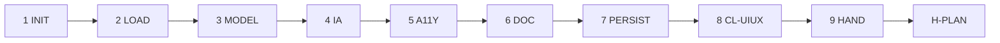

# PB-draft-ui-ux — Workflow

| Field | Value |
|-------|-------|
| skill_id | PB-draft-ui-ux |
| version | 1.0.0 |
| status | draft |
| document | 03-workflow |

---

## Overview

Nine-step linear workflow: verify PRD entry → load context → model journeys and screens → document UIUX → validate → hand off at H-PLAN.

---

## Steps

| Step | ID | Action |
|------|-----|--------|
| 1 | INIT | Verify entry criteria; load INDEX, CL-UIUX, PRD path from WR |
| 2 | LOAD | Read PRD + ARCH (soft) + DISC (soft) + CONTEXT slice; set `change_type`, `uiux_type` |
| 3 | MODEL | User journeys, personas, success metrics in §2 |
| 4 | IA | Information architecture and screen inventory in §3–§4 |
| 5 | A11Y | Interaction states in §5; accessibility targets in §6 |
| 6 | DOC | Build UIUX per TP-uiux; alignment blocks required |
| 7 | PERSIST | Write UIUX; update Work Record |
| 8 | VAL | CL-UIUX (10 checks); recovery ≤3 attempts |
| 9 | HAND | Handoff package; **stop** — await H-PLAN |

---

## Entry Criteria

| # | Criterion |
|---|-----------|
| EC-01 | `work_id` and linked PRD exist |
| EC-02 | PRD `status` approved at H-PLAN (or `human_waiver` documented in WR) |
| EC-03 | No prior UIUX with H-PLAN `approve` unless `mode: revise` |
| EC-04 | `workflow_id` in INDEX.md |
| EC-05 | `project_root` resolvable when PRD requires it |
| EC-06 | WR records PRD path in `artifacts[]` |
| EC-07 | ARCH linked or `arch_gap: missing \| waiver` documented |
| EC-08 | DISC linked or `disc_gap: missing \| waiver` documented |

---

## Exit Criteria

| # | Criterion |
|---|-----------|
| XC-01 | OUT-01 UIUX persisted (or `persist: pending` with human ack) |
| XC-02 | CL-UIUX `result: pass` |
| XC-03 | OUT-04 handoff includes `gate_id: H-PLAN`, `decision: pending` |
| XC-04 | WR `status: uiux_pending_review` |

---

## Human Gate — H-PLAN

| Field | Rule |
|-------|------|
| gate_id | `H-PLAN` |
| Agent sets | `decision: pending` only |
| Human options | `approve` \| `revise` \| `reject` |
| On approve | WR `status: plan_approved`; may recommend PB-implement-frontend or PB-implement-mobile |
| On revise | Re-enter LOAD with `human_revise_notes`; increment `revision` |
| On reject | WR `status: uiux_rejected` |

**Binding on approve:** screen inventory, interaction states, and resolved open questions marked sufficient for Implement.

---

## Revise Loop

Human `revise` at H-PLAN → re-enter **LOAD** → increment `revision` → full CL-UIUX → handoff again.

---

## Recovery

CL-UIUX fail → fix per `checklists/uiux.md` recovery table → re-VAL (≤3) → OUT-05 escalation.

---

## Next Playbook Routing (recommend only)

| change_type / platform | Primary | Alternate |
|------------------------|---------|-----------|
| `new` (WF-FEATURE, web) | PB-implement-frontend | PB-decompose-issues |
| `new` (WF-FEATURE, mobile) | PB-implement-mobile | PB-decompose-issues |
| `additive` (WF-ENHANCEMENT) | PB-implement-frontend | PB-implement-mobile |
| `redesign` (large surface) | PB-decompose-issues | PB-implement-frontend |
| `prd_alignment: requires_prd_revise` | PB-draft-prd | — |
| `arch_alignment: requires_arch_revise` | PB-draft-architecture | — |