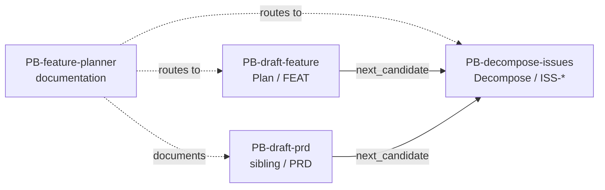

# PB-feature-planner — Responsibilities

| Field | Value |
|-------|-------|
| skill_id | PB-feature-planner |
| name | Feature Planner (umbrella) |
| version | 1.0.0 |
| status | active |
| document | 02-responsibilities |
| type | umbrella |

---

## Overview

Responsibilities here are **documentation and routing-resolution** duties — not agent execution steps producing artifacts. Child playbooks own execution.

---

## Primary Responsibilities (P1–P8)

| ID | Responsibility | Owner | Evidence |
|----|----------------|-------|----------|
| P1 | Maintain umbrella identity: human label vs routing IDs | Maintainer | README, registry.yaml `type: umbrella` |
| P2 | Document when to route to `PB-draft-feature` | This spec | 03-workflow, decision matrix |
| P3 | Document when to route to `PB-decompose-issues` | This spec | 03-workflow, decision matrix |
| P4 | Document build order relative to SKILL-CATALOG | This spec | README, registry.yaml `build_order` |
| P5 | Catalog wrong routing ID anti-patterns | This spec | examples/anti-patterns/, 07-edge-cases |
| P6 | Provide golden routing decision examples | This spec | examples/golden/ |
| P7 | Cross-reference child checklists (CL-DRAFT, CL-DECOMP) | 06-quality | Advisory CL-FEAT-PLAN map |
| P8 | Explicitly forbid orchestrator invocation of umbrella | 09-system-prompt | NEVER list + routing-matrix absence |

---

## Secondary Responsibilities (S1–S4)

| ID | Responsibility | Notes |
|----|----------------|-------|
| S1 | Map WF-FEATURE spine to child sequence | 03-workflow diagram |
| S2 | Note sibling `PB-draft-prd` relationship | Not in routing_ids but common path |
| S3 | Track child promotion status in README | Links to child registry status |
| S4 | Maintain fixtures/decision-matrix.yaml | Machine-readable routing aid |

---

## Optional Responsibilities (O1–O2)

| ID | Responsibility | When |
|----|----------------|------|
| O1 | Consolidated feature-planning narrative across children | Future — if specs merge |
| O2 | Platform adapter alias mapping documentation | When skills/ adapters add business aliases |

---

## Non-Responsibilities (N1–N15)

| ID | Non-responsibility | Owner skill |
|----|-------------------|-------------|
| N1 | Draft PRD | PB-draft-prd |
| N2 | Draft FEAT artifact | PB-draft-feature |
| N3 | Decompose PRD into ISS-* | PB-decompose-issues |
| N4 | Discovery research | PB-discovery-research |
| N5 | Architecture design | PB-draft-architecture |
| N6 | Implementation | PB-implement |
| N7 | Issue spec for bugfix | PB-draft-issue |
| N8 | Orchestrator routing execution | ORCH-PROJECT |
| N9 | Human gate approval | Human at H-PLAN, H-DECOMPOSE |
| N10 | Work Record lifecycle for child runs | Child playbooks |
| N11 | Enforcing CL-DRAFT / CL-DECOMP | Child playbooks |
| N12 | Blocking promotion on CL-FEAT-PLAN | Advisory only — no gate |
| N13 | Appearing in routing-matrix invoke list | Forbidden |
| N14 | Producing OUT-* artifacts | Forbidden |
| N15 | Auto-chaining children without gates | Forbidden |

---

## Human vs Agent Matrix

| Duty | Human | Agent (consulting umbrella) | ORCH-PROJECT |
|------|-------|----------------------------|--------------|
| Read umbrella for routing guidance | ✓ | ✓ | ✓ (internal docs) |
| Invoke PB-feature-planner as skill | ✗ | ✗ | ✗ |
| Choose PB-draft-feature vs PB-decompose-issues | ✓ decides | ✓ recommends | ✓ routes to child |
| Approve H-PLAN / H-DECOMPOSE | ✓ | ✗ | N/A |
| Author child playbook specs | ✓ maintainer | assist | ✗ |
| Run CL-FEAT-PLAN advisory review | ✓ optional | ✓ self-check | ✗ |

---

## Required Dependencies

| Dependency | Type | Purpose |
|------------|------|---------|
| STD-NAMING-001 | Standard | Umbrella naming rule |
| STD-SKILL-001 | Standard | Contract + waivers |
| routing-matrix.yaml | OS artifact | Invokable child SSOT |
| skill-dependency-graph.yaml | OS artifact | Phase and artifact deps |
| PB-draft-feature registry | Child | FEAT path metadata |
| PB-decompose-issues registry | Child | ISS-* path metadata |

No runtime invocation dependencies — umbrella is not executed.

---

## Child Playbook Delegation

Solid arrows are orchestrator execution paths. Dotted lines are documentation-only routing guidance from the umbrella.