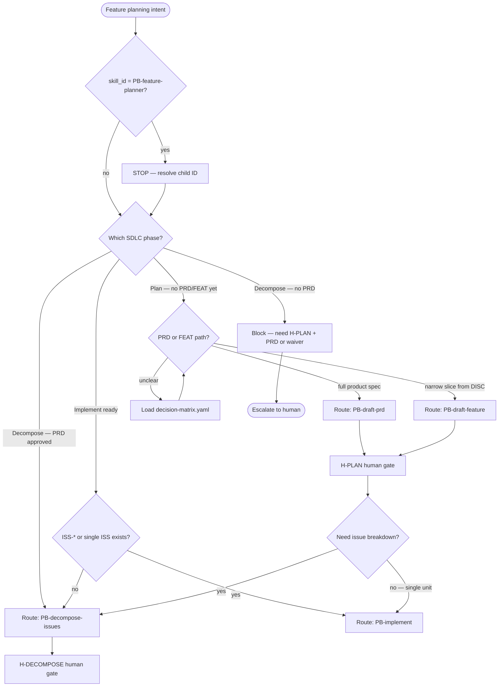
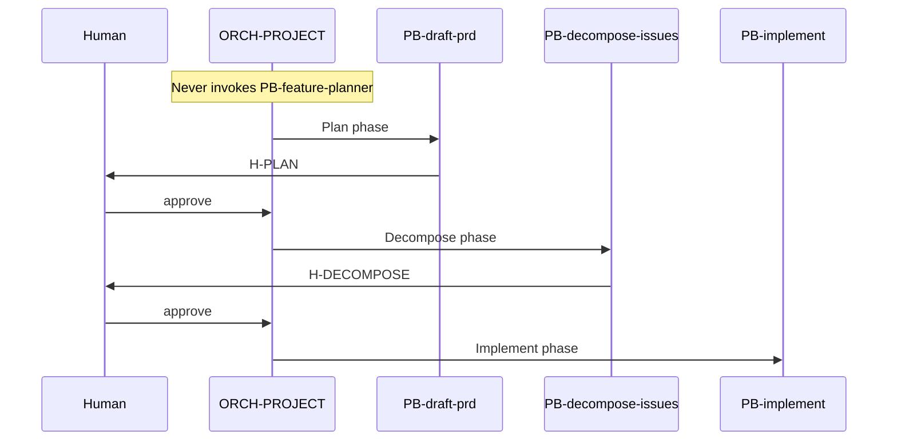

# PB-feature-planner — Routing Workflow

| Field | Value |
|-------|-------|
| skill_id | PB-feature-planner |
| name | Feature Planner (umbrella) |
| version | 1.0.0 |
| status | active |
| document | 03-workflow |
| type | umbrella |

---

## Overview

This document defines the **routing resolution workflow** humans and agents follow when feature planning intent appears. It is **not** an orchestrator-executable skill workflow — no artifacts are produced, no gates are bound.

**Scope:** Translate "Feature Planner" intent → correct `PB-*` routing ID(s).

---

## Workflow Diagram

### Routing resolution (human/agent)



### WF-FEATURE spine (orchestrator reference)



---

## Steps

### Step 1: Reject umbrella invocation

| Check | Action if fail |
|-------|----------------|
| `skill_id` ≠ `PB-feature-planner` for any invoke | Continue |
| `skill_id` = `PB-feature-planner` | **Stop** — emit routing resolution (see 09-system-prompt); never produce artifacts |

### Step 2: Determine phase

| Signal | Phase | Candidate routing IDs |
|--------|-------|----------------------|
| No FEAT, no PRD, DISC may exist | Plan | `PB-draft-prd`, `PB-draft-feature` |
| PRD approved at H-PLAN | Decompose | `PB-decompose-issues` |
| FEAT approved; no ISS-* | Decompose or Implement | Matrix row — may skip decompose |
| ISS-* approved at H-DECOMPOSE | Implement | `PB-implement` |

### Step 3: Plan-path decision (PB-draft-feature vs PB-draft-prd)

| Criterion | Favor PB-draft-feature | Favor PB-draft-prd |
|-----------|------------------------|-------------------|
| Scope | Single feature slice, bounded | Multi-epic product surface |
| Upstream | DISC sufficient | Discovery + stakeholder breadth needed |
| Workflow | Enhancement fast path, narrow WF-FEATURE slice | Full WF-FEATURE, WF-PROJECT-NEW |
| Downstream | May skip decompose if one implementable unit | Requires PB-decompose-issues |
| Artifact | FEAT | PRD |

Load `fixtures/decision-matrix.yaml` when confidence < high.

### Step 4: Decompose-path decision (PB-decompose-issues)

Invoke **PB-decompose-issues** when **all** true:

| Criterion | Required |
|-----------|----------|
| `H-PLAN` approved | Yes |
| PRD artifact exists (or architect waiver documented) | Yes |
| Multiple implementable units OR explicit human request for breakdown | Yes |
| Workflow ∈ {WF-FEATURE, WF-ENHANCEMENT} or decompose not waived | Yes |

**Skip** decompose when:

- `WF-BUGFIX` — use `PB-draft-issue` → `PB-implement`
- Single-issue FEAT with human waiver at H-PLAN
- `single_issue_path` per routing-matrix optional_when

### Step 5: Emit routing recommendation

Output shape (documentation only — not OUT-* contract):

```yaml
routing_resolution:
  umbrella_consulted: PB-feature-planner
  resolved_targets:
    - skill_id: PB-<child>
      phase: Plan | Decompose
      rationale: <one line>
  never_invoke: PB-feature-planner
  routing_confidence: high | medium | low
```

### Step 6: Hand off to child playbook

Agent or orchestrator invokes **resolved child** with standard orchestrator envelope. Umbrella step ends.

---

## Entry Criteria (EC-ENT-*)

| ID | Criterion | Umbrella consult |
|----|-----------|------------------|
| EC-ENT-01 | Feature planning intent present | Yes |
| EC-ENT-02 | `AI_DEV_OS_HOME` resolvable | Yes |
| EC-ENT-03 | INDEX or routing-matrix loadable | Yes |
| EC-ENT-04 | Request is not pure child invocation with valid skill_id | Skip umbrella — invoke child directly |

---

## Exit Criteria

| Criterion | Met when |
|-----------|----------|
| Routing ID resolved | ≥1 child `skill_id` named |
| Umbrella not invoked | `PB-feature-planner` absent from invoke envelope |
| Confidence documented | `routing_confidence` set |
| Blockers listed | If low confidence — gaps explicit |

No human gate binds the umbrella (`exit_gate: none`).

---

## Revise Loop

Not applicable — umbrella produces no approvable artifact. If routing was wrong:

1. Human revises at child gate (H-PLAN or H-DECOMPOSE)
2. Re-consult decision matrix
3. Re-invoke correct child in `revise` mode

---

## Recovery

| Failure | Recovery |
|---------|----------|
| Wrong child invoked | Stop child; re-run routing resolution from Step 2 |
| Decompose without PRD | Block; route to PB-draft-prd or PB-draft-feature first |
| Umbrella invoked by orchestrator | Fail fast per EC-RT-01; redirect |
| Both PRD and FEAT drafted | Human picks SSOT at H-PLAN; deprecate duplicate |

---

## Next-Skill Routing (recommend only)

| From resolved child | Typical next |
|--------------------|--------------|
| PB-draft-feature | PB-decompose-issues (if breakdown needed) |
| PB-draft-prd | PB-draft-architecture, PB-decompose-issues |
| PB-decompose-issues | PB-implement |

Umbrella **recommends** only — orchestrator SSOT is `routing-matrix.yaml`.

---

## Build Order Workflow

For **authors** (SKILL-CATALOG), not runtime:

| Order | Item | Status target |
|-------|------|---------------|
| 1 | PB-draft-prd context available | planned/active |
| 2 | PB-feature-planner umbrella spec | active (this) |
| 3 | PB-draft-feature child spec | promote to active |
| 4 | PB-decompose-issues child spec | promote to active |

Children do not inherit umbrella `active` status automatically.