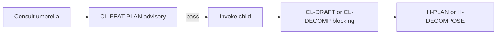

# PB-feature-planner — Quality Standards

| Field | Value |
|-------|-------|
| skill_id | PB-feature-planner |
| name | Feature Planner (umbrella) |
| version | 1.0.0 |
| status | active |
| document | 06-quality |
| type | umbrella |

---

## Overview

Quality standards for **routing-resolution consultations** and **umbrella specification completeness**. The umbrella has **no blocking checklist file** (`checklist_id: null` per registry waiver W-UMB-02).

**CL-FEAT-PLAN** below is **advisory** — fail does not block H-PLAN or H-DECOMPOSE. Child gates use **CL-DRAFT** (`PB-draft-feature`) and **CL-DECOMP** (`PB-decompose-issues`).

---

## Quality Dimensions

| Dimension | Focus |
|-----------|-------|
| Identity accuracy | Umbrella ≠ routing ID |
| Routing correctness | Right child for phase + artifacts |
| Completeness | Blockers explicit when low confidence |
| Consistency | Matches routing-matrix and dependency graph |
| Documentation | Spec 01–11 + examples present |

---

## Acceptance Criteria (AC-*)

| AC ID | Criterion | Measurement | Severity |
|-------|-----------|-------------|----------|
| AC-ID-01 | Response never invokes `PB-feature-planner` | `skill_id` in invoke ≠ umbrella | R |
| AC-ID-02 | `routing-matrix.yaml` has no umbrella invoke row | Grep / manual | R |
| AC-RT-01 | Resolved child ∈ {PB-draft-feature, PB-decompose-issues, PB-draft-prd, PB-draft-issue, PB-implement} | Enum check | R |
| AC-RT-02 | PB-decompose-issues only when H-PLAN + PRD (or waiver) | Artifact + gate check | R |
| AC-RT-03 | PB-draft-feature only when DISC or explicit FEAT path | IN-42 or waiver | R |
| AC-RT-04 | WF-BUGFIX never routes to umbrella children for decompose | workflow_id check | R |
| AC-CMP-01 | Low confidence lists ≥1 blocker | blockers[] non-empty | R |
| AC-CMP-02 | routing_resolution includes rationale per target | Text present | G |
| AC-CON-01 | Recommendation matches decision-matrix row | Row key match | R |
| AC-CON-02 | No simultaneous PRD + FEAT as SSOT without human note | WR audit | R |
| AC-DOC-01 | README identity table present | File check | R |
| AC-DOC-02 | ≥3 anti-patterns documented | examples/anti-patterns/ count | R |
| AC-DOC-03 | ≥1 golden routing example | examples/golden/ count | R |

---

## Advisory Checklist — CL-FEAT-PLAN

**Not persisted in `checklists/`** — advisory rubric for humans and agents consulting the umbrella. **Does not block promotion or gates.**

| # | Item | Pass |
|---|------|------|
| 1 | Confirmed `PB-feature-planner` will NOT be invoked | ☐ |
| 2 | Identified current SDLC phase (Plan / Decompose / Implement) | ☐ |
| 3 | Loaded `fixtures/decision-matrix.yaml` or equivalent rules | ☐ |
| 4 | Checked `routing-matrix.yaml` for invokable children only | ☐ |
| 5 | Verified artifact inventory (DISC / PRD / FEAT / ISS-*) | ☐ |
| 6 | Selected `PB-draft-feature` OR `PB-draft-prd` for Plan — not both without waiver | ☐ |
| 7 | Selected `PB-decompose-issues` only if PRD + breakdown needed | ☐ |
| 8 | Confirmed human gates: H-PLAN before decompose; H-DECOMPOSE before implement | ☐ |
| 9 | Documented `routing_confidence` and blockers if not high | ☐ |
| 10 | Referenced child checklist for execution: CL-DRAFT or CL-DECOMP | ☐ |

### CL-FEAT-PLAN → Child checklist map

| Umbrella decision | Child skill | Blocking checklist (child) |
|-------------------|-------------|---------------------------|
| Plan → FEAT path | PB-draft-feature | CL-DRAFT (`checklists/draft.md`) |
| Plan → PRD path | PB-draft-prd | CL-DRAFT or PRD-specific (when authored) |
| Decompose | PB-decompose-issues | CL-DECOMP (`checklists/decompose.md`) |

---

## Required Pass Scorecard (umbrella promotion)

| Gate | Criteria |
|------|----------|
| Documentation promotion | AC-DOC-* all pass |
| Routing tests | 11-test-plan HT + ET(P0) 100% |
| Identity | AC-ID-* all pass |
| Advisory only | CL-FEAT-PLAN not registered as `checklist_id` |

---

## Quality Gate Summary

| Gate | When | Blocking? |
|------|------|-----------|
| CL-FEAT-PLAN | After routing consultation | **No** — advisory |
| CL-DRAFT | PB-draft-feature execution | Yes — child |
| CL-DECOMP | PB-decompose-issues execution | Yes — child |
| H-PLAN | Plan artifacts | Yes — human |
| H-DECOMPOSE | ISS-* artifacts | Yes — human |