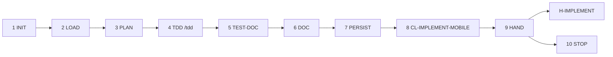

# PB-implement-mobile — Workflow

| Field | Value |
|-------|-------|
| skill_id | PB-implement-mobile |
| version | 1.0.0 |
| status | draft |
| document | 03-workflow |

---

## Overview

Ten-step linear workflow: verify ISS + UIUX entry → load context → implement per issues → document tests → validate → hand off at H-IMPLEMENT. **Never app store submit.**

---

## Steps

| Step | ID | Action |
|------|-----|--------|
| 1 | INIT | Verify entry criteria; load INDEX, CL-IMPLEMENT-MOBILE, ISS + UIUX paths from WR |
| 2 | LOAD | Read ISS/ISS-* + UIUX (soft required) + API (soft) + CONTEXT slice; set `implement_scope` |
| 3 | PLAN | Map each ISS to screens/modules; confirm mobile lane scope |
| 4 | TDD | Load **`/tdd`** skill; per ISS vertical slice: RED → GREEN → refactor — never all-tests-then-all-code |
| 5 | TEST-DOC | Record TDD cycles in §6 Testing Notes (mandatory) |
| 6 | DOC | Build CODE record per OUT-01; uiux_alignment block required when UIUX linked |
| 7 | PERSIST | Write `work/implement/mobile/{work_id}.md`; update WR |
| 8 | VAL | CL-IMPLEMENT-MOBILE (10 checks); recovery ≤3 attempts |
| 9 | HAND | Handoff package; **stop** — await H-IMPLEMENT |
| 10 | STOP | No app store submit, no PB-verify auto-invoke |

---

## Entry Criteria

| # | Criterion |
|---|-----------|
| EC-01 | `work_id` and linked ISS or ISS-* exist |
| EC-02 | H-DECOMPOSE approved (WF-FEATURE path) or H-PLAN (WF-BUGFIX path) |
| EC-03 | No prior CODE with H-IMPLEMENT `approve` unless `mode: revise` |
| EC-04 | `workflow_id` in INDEX.md |
| EC-05 | `project_root` resolvable from WR |
| EC-06 | WR records ISS artifact path(s) in `artifacts[]` |
| EC-07 | UIUX linked or `uiux_gap: missing \| waiver` documented (soft required) |
| EC-08 | API linked or `api_gap: missing \| waiver` documented when data-fetch ISS present |

---

## Exit Criteria

| # | Criterion |
|---|-----------|
| XC-01 | OUT-01 CODE persisted at `work/implement/mobile/{work_id}.md` |
| XC-02 | CL-IMPLEMENT-MOBILE `result: pass` |
| XC-03 | OUT-04 handoff includes `gate_id: H-IMPLEMENT`, `decision: pending` |
| XC-04 | WR `status: implement_mobile_pending_review` |
| XC-05 | §6 Testing Notes non-empty |
| XC-06 | No app store submit or production release actions in output |

---

## Human Gate — H-IMPLEMENT

| Field | Rule |
|-------|------|
| gate_id | `H-IMPLEMENT` |
| Agent sets | `decision: pending` only |
| Human options | `approve` \| `revise` \| `reject` |
| On approve | WR `status: implement_approved`; may recommend PB-verify |
| On revise | Re-enter LOAD with `human_revise_notes`; increment `revision` |
| On reject | WR `status: implement_rejected` |

**Binding on approve:** ISS mapping complete, UIUX states implemented, tests documented, files changed list accurate.

---

## Revise Loop

Human `revise` at H-IMPLEMENT → re-enter **LOAD** → increment `revision` → full CL-IMPLEMENT-MOBILE → handoff again.

---

## Recovery

CL-IMPLEMENT-MOBILE fail → fix per `checklists/implement-mobile.md` recovery table → re-VAL (≤3) → OUT-05 escalation.

---

## Next Playbook Routing (recommend only)

| Signal | Primary | Alternate |
|--------|---------|-----------|
| CODE complete, tests documented | PB-verify | PB-review (parallel after verify) |
| `uiux_alignment: requires_uiux_revise` | PB-draft-ui-ux | — |
| `api_alignment: requires_api_revise` | PB-draft-api | — |
| Missing ISS | PB-decompose-issues | PB-draft-issue |
| Backend scope detected | PB-implement-backend | — |
| Web frontend scope detected | PB-implement-frontend | — |