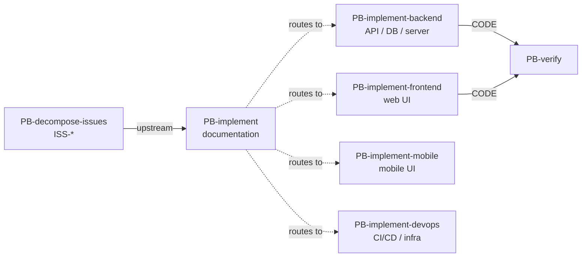

# PB-implement — Responsibilities

| Field | Value |
|-------|-------|
| skill_id | PB-implement |
| name | Implementation (umbrella) |
| version | 1.0.0 |
| status | draft |
| document | 02-responsibilities |
| type | umbrella |

---

## Overview

Responsibilities here are **documentation and lane-routing** duties — not agent execution steps producing CODE. Child playbooks own execution.

---

## Primary Responsibilities (P1–P8)

| ID | Responsibility | Owner | Evidence |
|----|----------------|-------|----------|
| P1 | Maintain umbrella identity: human label vs lane routing IDs | Maintainer | README, registry.yaml `type: umbrella` |
| P2 | Document when to route to `PB-implement-backend` | This spec | 03-workflow, decision matrix |
| P3 | Document when to route to `PB-implement-frontend` | This spec | 03-workflow, decision matrix |
| P4 | Document when to route to `PB-implement-mobile` and `PB-implement-devops` | This spec | 03-workflow, decision matrix |
| P5 | Document build order relative to SKILL-CATALOG / LIFECYCLE | This spec | README, registry.yaml `build_order` |
| P6 | Catalog wrong routing ID anti-patterns | This spec | examples/anti-patterns/, 07-edge-cases |
| P7 | Provide golden lane routing examples | This spec | examples/golden/ |
| P8 | Explicitly forbid orchestrator invocation of umbrella | 09-system-prompt | NEVER list + routing exclusion |

---

## Secondary Responsibilities (S1–S5)

| ID | Responsibility | Notes |
|----|----------------|-------|
| S1 | Map WF-FEATURE implement spine to lane sequence | 03-workflow diagram |
| S2 | Note multi-lane parallel invoke pattern | DM-05 in decision matrix |
| S3 | Track child promotion status in README | Links to child registry when authored |
| S4 | Maintain fixtures/decision-matrix.yaml | Machine-readable lane rules |
| S5 | Document PB-draft-ui-ux prerequisite gate PASS | test-runs/latest-gate.md |

---

## Optional Responsibilities (O1–O2)

| ID | Responsibility | When |
|----|----------------|------|
| O1 | Consolidated implement narrative across lane children | Future — if specs merge |
| O2 | Platform adapter alias mapping documentation | When skills/ adapters add "Implementation" alias |

---

## Non-Responsibilities (N1–N16)

| ID | Non-responsibility | Owner skill |
|----|-------------------|-------------|
| N1 | Write backend handler code | PB-implement-backend |
| N2 | Write frontend component code | PB-implement-frontend |
| N3 | Write mobile screen code | PB-implement-mobile |
| N4 | Write CI/CD or IaC configs | PB-implement-devops |
| N5 | Decompose PRD into ISS-* | PB-decompose-issues |
| N6 | Draft single bugfix ISS | PB-draft-issue |
| N7 | API / DB / UIUX plan authoring | PB-draft-api, PB-draft-database, PB-draft-ui-ux |
| N8 | Orchestrator routing execution | ORCH-PROJECT |
| N9 | Human gate approval | Human at H-DECOMPOSE, H-IMPLEMENT |
| N10 | Work Record lifecycle for child runs | Child playbooks |
| N11 | Enforcing CL-IMPLEMENT on child runs | Child playbooks |
| N12 | Blocking promotion on CL-IMPLEMENT-UMBRELLA | Advisory only — no gate |
| N13 | Appearing in routing-matrix as invokable umbrella | Forbidden |
| N14 | Producing OUT-* CODE artifacts | Forbidden |
| N15 | Auto-chaining lane children without per-lane gates | Forbidden |
| N16 | Skipping ISS entry for implement | Forbidden — see IMP-skip-issues |

---

## Human vs Agent Matrix

| Duty | Human | Agent (consulting umbrella) | ORCH-PROJECT |
|------|-------|----------------------------|--------------|
| Read umbrella for lane guidance | ✓ | ✓ | ✓ (internal docs) |
| Invoke PB-implement as skill | ✗ | ✗ | ✗ |
| Choose implement lane child(ren) | ✓ decides | ✓ recommends | ✓ routes to child |
| Approve H-DECOMPOSE / H-IMPLEMENT | ✓ | ✗ | N/A |
| Author lane playbook specs | ✓ maintainer | assist | ✗ |
| Run CL-IMPLEMENT-UMBRELLA advisory review | ✓ optional | ✓ self-check | ✗ |

---

## Required Dependencies

| Dependency | Type | Purpose |
|------------|------|---------|
| STD-NAMING-001 | Standard | Umbrella naming rule |
| STD-SKILL-001 | Standard | Contract + waivers |
| routing-matrix.yaml | OS artifact | Invokable lane SSOT (when children promoted) |
| skill-dependency-graph.yaml | OS artifact | Phase and artifact deps |
| PB-draft-ui-ux gate PASS | Prerequisite | Engineering chain authorization |
| Lane child registries | Child (planned) | Lane path metadata |

No runtime invocation dependencies — umbrella is not executed.

---

## Child Playbook Delegation

Solid arrows are orchestrator execution paths. Dotted lines are documentation-only routing guidance from the umbrella.