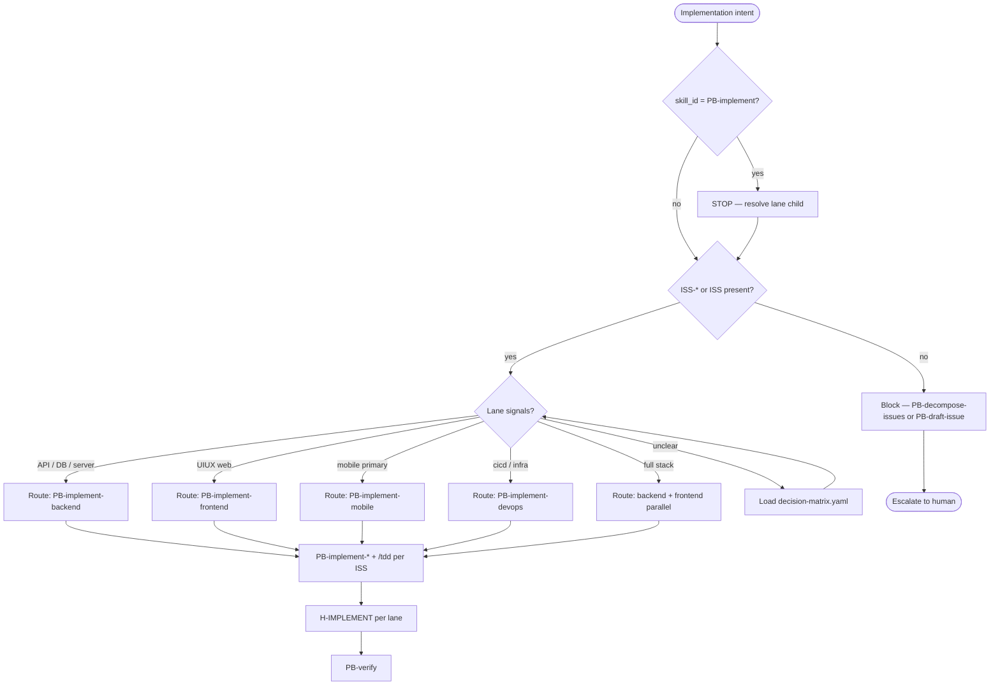
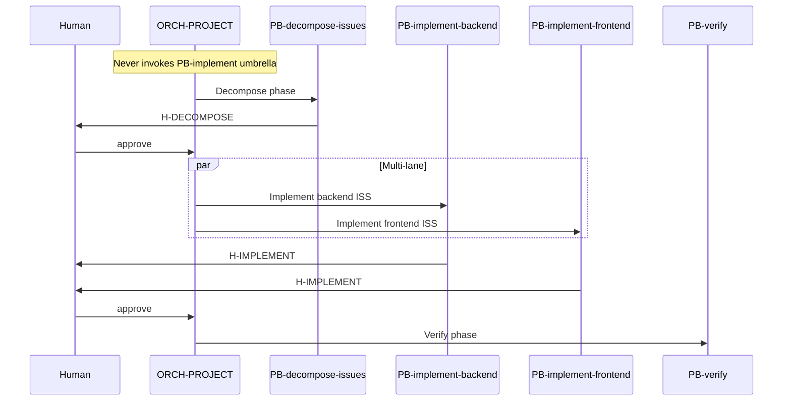

# PB-implement — Lane Routing Workflow

| Field | Value |
|-------|-------|
| skill_id | PB-implement |
| name | Implementation (umbrella) |
| version | 1.0.0 |
| status | draft |
| document | 03-workflow |
| type | umbrella |

---

## Overview

This document defines the **lane routing resolution workflow** humans and agents follow when implementation intent appears. It is **not** an orchestrator-executable skill workflow — no CODE artifacts are produced, no gates are bound.

**Scope:** Translate "Implement" intent → correct `PB-implement-*` routing ID(s).

---

## Workflow Diagram

### Routing resolution (human/agent)



### WF-FEATURE implement spine (orchestrator reference)



---

## Steps

### Step 1: Reject umbrella invocation

| Check | Action if fail |
|-------|----------------|
| `skill_id` ≠ `PB-implement` for any invoke | Continue |
| `skill_id` = `PB-implement` | **Stop** — emit routing resolution (see 09-system-prompt); never produce CODE |

### Step 2: Verify issue entry criteria

| Signal | Required | Action if missing |
|--------|----------|-----------------|
| WF-FEATURE / WF-ENHANCEMENT | ISS-* + H-DECOMPOSE | Block → `PB-decompose-issues` |
| WF-BUGFIX | ISS + H-PLAN | Block → `PB-draft-issue` |
| No issues at all | — | Anti-pattern IMP-skip-issues |

### Step 3: Extract lane signals

| Source | Lane signals |
|--------|--------------|
| ISS-* title / tags / acceptance criteria | `backend`, `frontend`, `mobile`, `devops`, `api`, `ui` |
| Plan artifacts | API → backend; UIUX → frontend/mobile; DB → backend |
| PRD platform field | `web`, `mobile`, `both` |
| WR `recommended_next_skill` | From draft-api / draft-ui-ux |

Load `fixtures/decision-matrix.yaml` when confidence < high.

### Step 4: Lane-path decision

| Criterion | Favor PB-implement-backend | Favor PB-implement-frontend |
|-----------|---------------------------|----------------------------|
| Artifacts | API, DB | UIUX |
| ISS tags | migrations, handlers, services | components, pages, CSS |
| Scope | Server-only change | Web UI change |

| Criterion | Favor PB-implement-mobile | Favor PB-implement-devops |
|-----------|--------------------------|--------------------------|
| Artifacts | UIUX §7 mobile-primary | ISS infra tags |
| ISS tags | native, react-native, screens | cicd, terraform, k8s |
| Scope | Mobile app surface | Pipeline / deployment |

**Multi-lane:** When ISS epic spans backend + frontend, emit **multiple** `resolved_targets` — invoke each lane child separately.

### Step 5: Emit routing recommendation

Output shape (documentation only — not OUT-* contract):

```yaml
routing_resolution:
  umbrella_consulted: PB-implement
  resolved_targets:
    - skill_id: PB-implement-backend
      lane: backend
      rationale: <one line>
  never_invoke: PB-implement
  routing_confidence: high | medium | low
  implement_lane: backend | frontend | mobile | devops | multi_lane
```

### Step 6: Hand off to lane child playbook

Agent or orchestrator invokes **resolved child(ren)** with standard orchestrator envelope. Umbrella step ends.

---

## Entry Criteria (EC-ENT-*)

| ID | Criterion | Umbrella consult |
|----|-----------|------------------|
| EC-ENT-01 | Implementation intent present | Yes |
| EC-ENT-02 | `AI_DEV_OS_HOME` resolvable | Yes |
| EC-ENT-03 | INDEX or routing-matrix loadable | Yes |
| EC-ENT-04 | PB-draft-ui-ux prerequisite gate PASS documented | Yes (engineering chain) |
| EC-ENT-05 | Request is not pure child invocation with valid lane skill_id | Skip umbrella — invoke child directly |

---

## Exit Criteria

| Criterion | Met when |
|-----------|----------|
| Lane routing ID resolved | ≥1 child `skill_id` named |
| Umbrella not invoked | `PB-implement` absent from invoke envelope |
| Confidence documented | `routing_confidence` set |
| Blockers listed | If low confidence — gaps explicit |
| ISS entry verified | ISS-* or ISS path confirmed or redirect issued |

No human gate binds the umbrella (`exit_gate: none`).

---

## Revise Loop

Not applicable — umbrella produces no approvable artifact. If routing was wrong:

1. Human revises at child gate (H-IMPLEMENT) or reopens ISS
2. Re-consult decision matrix
3. Re-invoke correct lane child in `revise` mode

---

## Recovery

| Failure | Recovery |
|---------|----------|
| Wrong lane invoked | Stop child; re-run routing from Step 3 |
| Implement without ISS | Block; route to PB-decompose-issues or PB-draft-issue |
| Umbrella invoked by orchestrator | Fail fast per EC-RT-01; redirect |
| Multi-lane collapsed into one invoke | Split into per-lane child invokes |

---

## Next-Skill Routing (recommend only)

| From resolved lane child | Typical next |
|--------------------------|--------------|
| PB-implement-backend | PB-verify (when CODE complete) |
| PB-implement-frontend | PB-verify |
| PB-implement-mobile | PB-verify |
| PB-implement-devops | PB-verify |
| All lanes CODE + H-IMPLEMENT | PB-review (optional) |

Umbrella **recommends** only — orchestrator SSOT is `routing-matrix.yaml`.

---

## Build Order Workflow

For **authors** (LIFECYCLE.md), not runtime:

| Order | Item | Status target |
|-------|------|---------------|
| 1 | PB-draft-ui-ux gate PASS | active |
| 2 | PB-implement umbrella spec | draft (this) |
| 3 | PB-implement-backend child spec | promote to active |
| 4 | PB-implement-frontend child spec | promote to active |
| 5 | PB-implement-mobile child spec | promote to active |
| 6 | PB-implement-devops child spec | promote to active |

Children do not inherit umbrella `draft` → `active` status automatically.