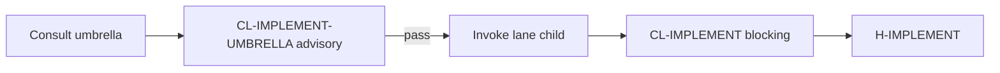

# PB-implement — Quality Standards

| Field | Value |
|-------|-------|
| skill_id | PB-implement |
| name | Implementation (umbrella) |
| version | 1.0.0 |
| status | draft |
| document | 06-quality |
| type | umbrella |

---

## Overview

Quality standards for **lane routing consultations** and **umbrella specification completeness**. The umbrella has **no blocking checklist file** (`checklist_id: null` per registry waiver W-UMB-02).

**CL-IMPLEMENT-UMBRELLA** below is **advisory** — fail does not block H-DECOMPOSE or H-IMPLEMENT. Lane child gates use **CL-IMPLEMENT** (`checklists/implement.md`) when children are promoted.

---

## Quality Dimensions

| Dimension | Focus |
|-----------|-------|
| Identity accuracy | Umbrella ≠ lane routing ID |
| Lane routing correctness | Right child for ISS signals + artifacts |
| Entry integrity | ISS-* present before implement |
| Completeness | Blockers explicit when low confidence |
| Consistency | Matches routing-matrix and dependency graph |
| Documentation | Spec 01–11 + examples present |

---

## Acceptance Criteria (AC-*)

| AC ID | Criterion | Measurement | Severity |
|-------|-----------|-------------|----------|
| AC-ID-01 | Response never invokes `PB-implement` | `skill_id` in invoke ≠ umbrella | R |
| AC-ID-02 | Umbrella not target invoke row (target state) | Grep routing-matrix | R |
| AC-RT-01 | Resolved child ∈ routing_ids + PB-verify | Enum check | R |
| AC-RT-02 | Lane child only when ISS-* or ISS present (or documented waiver) | Artifact check | R |
| AC-RT-03 | PB-implement-backend when API/DB/server signals dominate | Matrix row match | R |
| AC-RT-04 | PB-implement-frontend when UIUX web scope dominates | Matrix row match | R |
| AC-RT-05 | PB-implement-mobile only when mobile-primary scope | PRD/UIUX platform check | R |
| AC-RT-06 | PB-implement-devops when infra/cicd ISS tags | Matrix row match | R |
| AC-RT-07 | WF-BUGFIX uses ISS not ISS-* unless waived | workflow_id check | R |
| AC-CMP-01 | Low confidence lists ≥1 blocker | blockers[] non-empty | R |
| AC-CMP-02 | routing_resolution includes rationale per target | Text present | G |
| AC-CON-01 | Recommendation matches decision-matrix row | Row key match | R |
| AC-CON-02 | Multi-lane emits multiple resolved_targets | Count ≥2 when full_stack | R |
| AC-DOC-01 | README identity table present | File check | R |
| AC-DOC-02 | ≥3 anti-patterns documented | examples/anti-patterns/ count | R |
| AC-DOC-03 | ≥1 golden routing example | examples/golden/ count | R |
| AC-PRQ-01 | PB-draft-ui-ux gate PASS referenced | test-runs/latest-gate.md | R |

---

## Advisory Checklist — CL-IMPLEMENT-UMBRELLA

**Not persisted in `checklists/`** — advisory rubric for humans and agents consulting the umbrella. **Does not block promotion or gates.**

| # | Item | Pass |
|---|------|------|
| 1 | Confirmed `PB-implement` will NOT be invoked | ☐ |
| 2 | Identified current SDLC phase (Decompose vs Implement) | ☐ |
| 3 | Verified ISS-* or ISS entry (anti-pattern IMP-skip-issues avoided) | ☐ |
| 4 | Loaded `fixtures/decision-matrix.yaml` or equivalent rules | ☐ |
| 5 | Checked `routing-matrix.yaml` for invokable lane children only | ☐ |
| 6 | Verified artifact inventory (ISS-*, API, DB, UIUX) | ☐ |
| 7 | Selected correct lane: backend \| frontend \| mobile \| devops | ☐ |
| 8 | Multi-lane scope split into parallel child invokes if needed | ☐ |
| 9 | Documented `routing_confidence` and blockers if not high | ☐ |
| 10 | Referenced child checklist for execution: CL-IMPLEMENT (when child active) | ☐ |
| 11 | Confirmed human gates: H-DECOMPOSE before implement; H-IMPLEMENT per lane | ☐ |
| 12 | PB-draft-ui-ux prerequisite gate PASS acknowledged for engineering chain | ☐ |

### CL-IMPLEMENT-UMBRELLA → Child checklist map

| Umbrella decision | Child skill | Blocking checklist (child) |
|-------------------|-------------|---------------------------|
| Backend lane | PB-implement-backend | CL-IMPLEMENT |
| Frontend lane | PB-implement-frontend | CL-IMPLEMENT |
| Mobile lane | PB-implement-mobile | CL-IMPLEMENT |
| DevOps lane | PB-implement-devops | CL-IMPLEMENT |

---

## Required Pass Scorecard (umbrella promotion)

| Gate | Criteria |
|------|----------|
| Documentation promotion | AC-DOC-* + AC-PRQ-* all pass |
| Routing tests | 11-test-plan HT + ET(P0) 100% |
| Identity | AC-ID-* all pass |
| Advisory only | CL-IMPLEMENT-UMBRELLA not registered as `checklist_id` |

---

## Quality Gate Summary

| Gate | When | Blocking? |
|------|------|-----------|
| CL-IMPLEMENT-UMBRELLA | After routing consultation | **No** — advisory |
| CL-IMPLEMENT | Lane child execution | Yes — child |
| H-DECOMPOSE | ISS-* artifacts | Yes — human |
| H-IMPLEMENT | CODE artifacts per lane | Yes — human |