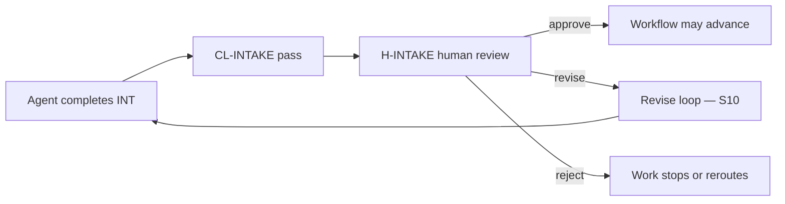

# PB-intake-classify — Responsibilities

| Field | Value |
|-------|-------|
| skill_id | PB-intake-classify |
| name | Intake & Classify Work |
| version | 1.0.0 |
| status | draft |
| document | 02-responsibilities |

---

## Responsibility Model

| Actor | Role at Intake |
|-------|----------------|
| **Agent** | Proposes classification, drafts intake record, self-validates, hands off |
| **Human** | Approves, revises, or rejects at **H-INTAKE**; final authority on work type and workflow |
| **Workflow** | Invokes this skill at Intake phase; advances only after human approval |

---

## Primary Responsibilities

Must execute on every invocation. Failure to complete any primary responsibility blocks handoff.

| # | Responsibility | Agent action | Done when |
|---|----------------|--------------|-----------|
| P1 | **Parse raw input** | Extract title, requester, problem statement, urgency signals from unstructured input | Key fields identified or marked `unknown` with blocker |
| P2 | **Detect entry mode** | Determine `new_project` \| `existing_project` \| `normal` from input + project existence | `entry_mode` proposed with evidence |
| P3 | **Classify work type** | Map input to one SDLC work type (see §Work Type Enum) | `work_type` proposed with rationale |
| P4 | **Select workflow** | Propose `workflow_id` from OS catalog matching work type + entry mode | `workflow_id` proposed; exists in OS index |
| P5 | **Document classification rationale** | Explain why this type/workflow fits; note rejected alternatives | Rationale section complete in intake record |
| P6 | **Declare confidence** | Set `classification_confidence`: `high` \| `medium` \| `low` | Confidence set per §Confidence Rules |
| P7 | **Produce intake record (INT)** | Draft persistable intake artifact linked to Work Record | INT complete per required fields (§Required Documents) |
| P8 | **Define initial scope boundary** | State what this work item appears to cover — intake-level only | In-scope / out-of-scope at classification granularity |
| P9 | **Run self-validation** | Execute `CL-INTAKE` before handoff | Validation record = pass, or escalate (see 11-failure-handling.md) |
| P10 | **Prepare handoff package** | Summary, outputs, open questions, approval block for H-INTAKE | Handoff ready per 10-handoff.md |

### Work Type Enum

Agent must classify to exactly one:

| work_type | Typical workflow_id |
|-----------|---------------------|
| `new_project` | WF-PROJECT-NEW |
| `existing_project` | WF-PROJECT-EXISTING |
| `feature` | WF-FEATURE |
| `enhancement` | WF-ENHANCEMENT |
| `bugfix` | WF-BUGFIX |
| `refactor` | WF-REFACTOR |
| `security` | WF-SECURITY |
| `performance` | WF-PERF |
| `documentation` | WF-DOCS |
| `release` | WF-RELEASE |
| `maintenance` | WF-MAINTENANCE |

### Confidence Rules

| Level | Criteria | Agent obligation |
|-------|----------|----------------|
| `high` | Clear signals; one obvious work type; no conflicting interpretation | Proceed to handoff |
| `medium` | Reasonable fit; one alternative considered and rejected | Document alternative in rationale |
| `low` | Insufficient signal; multiple equally valid types; discovery needed first | List blockers; recommend `PB-discovery-research` or human clarification — **do not guess** |

---

## Secondary Responsibilities

Expected when applicable. Skip only when explicitly N/A with reason recorded in intake record.

| # | Responsibility | When applicable | Agent action |
|---|----------------|-----------------|--------------|
| S1 | **Read project context** | `entry_mode` = `normal` or `existing_project` | Load `CONTEXT.md` index/conventions (T1 only) |
| S2 | **Verify project/repo exists** | `entry_mode` detection needed | Confirm `project_root` reachable; record result |
| S3 | **Extract reproduction signals** | `work_type` = `bugfix` | Note repro steps present / missing / N/A in intake |
| S4 | **Extract security signals** | CVE, audit, vulnerability language in input | Flag `security` type or `security_surface: yes` |
| S5 | **Extract release signals** | Version, changelog, deploy language | Flag `release` type; note version if stated |
| S6 | **Suggest priority** | Any work type | Propose P0–P3 or urgency — **suggestion only** |
| S7 | **Identify missing input** | Required intake fields absent | List gaps; request from human before handoff if blocking |
| S8 | **Recommend next artifacts** | Classification complete | Table of downstream templates (e.g. TP-prd, TP-discovery) — **not** draft them |
| S9 | **Link related work** | Human mentions prior work_id, issue, or PR | Reference in intake; do not merge records |
| S10 | **Handle revise loop** | Human rejected prior intake at H-INTAKE | Incorporate human notes; re-classify; increment revision |

---

## Optional Responsibilities

Agent may perform only when explicitly requested by human or when zero token cost. Never required for handoff.

| # | Responsibility | Trigger | Constraint |
|---|----------------|---------|------------|
| O1 | **Suggest alternate workflow** | Human unsure between two workflows | Present comparison table; human decides |
| O2 | **Pre-check duplicate work** | Human asks "is this already tracked?" | Surface candidate links only — no dedup decision |
| O3 | **Estimate ceremony level** | Human asks "how heavy is this path?" | List expected gates/docs for proposed workflow |
| O4 | **Draft open questions for discovery** | `classification_confidence: low` | Questions list only — discovery execution is other skill |
| O5 | **Note standards likely applicable** | Obvious from work type | Cite STD-* IDs — do not interpret or enforce |
| O6 | **Propose work_id format** | New Work Record | Suggest ID; human or system assigns final |

---

## Explicit Non-Responsibilities

Forbidden actions. Performing any of these is a skill violation.

### Planning & Design

| # | Non-responsibility | Owner |
|---|-------------------|-------|
| N1 | Write PRD or PRD-lite | PB-draft-prd |
| N2 | Write Discovery document | PB-discovery-research |
| N3 | Write architecture, database, or API specs | PB-draft-architecture / templates |
| N4 | Write feature specification | PB-draft-feature |
| N5 | Choose technology stack | Human + Plan phase / PB-bootstrap-project |
| N6 | Decompose into implementation issues | PB-decompose-issues |

### Execution & Verification

| # | Non-responsibility | Owner |
|---|-------------------|-------|
| N7 | Write or modify application code | PB-implement |
| N8 | Run tests, CI, or linters | PB-verify / CI pipeline |
| N9 | Perform code or security review | PB-review |
| N10 | Execute release or deployment | WF-RELEASE / ops |
| N11 | Execute project onboarding | PB-onboard-project |

### Governance & Orchestration

| # | Non-responsibility | Owner |
|---|-------------------|-------|
| N12 | Approve intake or any gate | Human at H-INTAKE |
| N13 | Advance workflow to next phase | Workflow orchestrator |
| N14 | Invoke next skill automatically | Human approves first |
| N15 | Waive standards or constraints | Human with documented waiver |
| N16 | Modify OS files (standards, playbooks, templates) | OS maintainer |

### Research & Analysis

| # | Non-responsibility | Owner |
|---|-------------------|-------|
| N17 | Deep codebase survey | PB-survey-codebase |
| N18 | Stakeholder interviews | Human |
| N19 | As-is architecture analysis | PB-discovery-research / TP-architecture |
| N20 | Root cause analysis for bugs | PB-diagnose-bug |

### Data & Memory

| # | Non-responsibility | Owner |
|---|-------------------|-------|
| N21 | Update `CONTEXT.md` | PB-onboard-project / human-approved doc skills |
| N22 | Store decisions only in chat | Must persist to INT artifact |
| N23 | Rely on vendor AI memory as SSOT | Project artifacts are authoritative |

---

## Agent vs Human Responsibility Matrix

| Task | Agent | Human |
|------|-------|-------|
| Parse raw input | proposes | may correct at review |
| Classify work type | proposes | **approves / revises / rejects** |
| Select workflow | proposes | **approves / revises / rejects** |
| Set entry mode | proposes | **approves / revises / rejects** |
| Assign final priority | suggests (S6) | **decides** |
| Accept `low` confidence routing | recommends discovery | **decides** proceed or discover |
| Complete INT artifact | drafts | **approves** at H-INTAKE |
| Self-validation (CL-INTAKE) | executes | reviews evidence |
| Advance to next workflow step | never | after H-INTAKE approval |

---

## Required Dependencies

Must be available or resolvable before skill starts. If a **required** dependency is missing, stop and escalate — do not proceed with assumptions.

### OS Dependencies (global path)

| ID | Dependency | Path / ref | Required |
|----|------------|----------|----------|
| D-OS-01 | AI Dev OS home | `AI_DEV_OS_HOME` or `/data/project/ai-development-system` | yes |
| D-OS-02 | Workflow catalog | `INDEX.md` or `workflows/README.md` | yes |
| D-OS-03 | Intake checklist | `checklists/CL-INTAKE` (or `checklists/intake.md` when created) | yes |
| D-OS-04 | SDLC intake router | SDLC §15 work type matrix | yes |
| D-OS-05 | Skill spec (self) | `playbooks/intake-classify/` | yes |
| D-OS-06 | Context conventions | `docs/architecture/context-management.md` | yes |

### Input Dependencies

| ID | Dependency | Source | Required |
|----|------------|--------|----------|
| D-IN-01 | Raw work request | Human | yes |
| D-IN-02 | Project root path | Human or session context | yes for `normal` / `existing_project`; optional for `new_project` |
| D-IN-03 | Prior human revise notes | Human | required on revise loop only |

### Project Dependencies

| ID | Dependency | Path | Required |
|----|------------|------|----------|
| D-PR-01 | Project context | `<project>/CONTEXT.md` | no — required when project exists; absent triggers `new_project` signal |
| D-PR-02 | Existing Work Record | Work Record path | no — absent means new intake; present unapproved means revise |

### Tool Dependencies (abstract)

| ID | Capability | Purpose |
|----|------------|---------|
| D-TL-01 | `read_file` | Load CONTEXT.md, INDEX, checklists |
| D-TL-02 | `list_dir` / existence check | Detect project/repo presence |
| D-TL-03 | `write_file` | Persist INT artifact to project |

### Downstream Dependencies (produced for)

| ID | Consumer | Requires from this skill |
|----|----------|--------------------------|
| D-DN-01 | All workflows | Approved `work_type`, `workflow_id`, `entry_mode` |
| D-DN-02 | PB-discovery-research | `classification_confidence: low` + blockers |
| D-DN-03 | Context router | Work type for T2 bundle selection |

---

## Required Documents

### Documents the skill READS

| Doc ID | Template | When | Required |
|--------|----------|------|----------|
| — | `INDEX.md` / workflow catalog | Start | yes |
| CTX | Project `CONTEXT.md` | Project exists | yes if `normal` or `existing_project` |
| — | `CL-INTAKE` | Before handoff | yes |
| WR | Existing Work Record | Revise loop only | if exists |

### Documents the skill CREATES or UPDATES

| Doc ID | Template | Action | Required |
|--------|----------|--------|----------|
| **INT** | Intake record (TP-intake — pending; interim: SDLC §16 INT fields) | create | **yes** — primary output |
| WR | Work Record metadata | create or update | **yes** — link INT, set status `intake_pending` |

### INT Minimum Fields (agent must populate)

| Field | Required |
|-------|----------|
| `title` | yes |
| `work_id` | yes |
| `requester` | yes |
| `work_type` | yes |
| `workflow_id` | yes |
| `entry_mode` | yes |
| `problem_statement` | yes |
| `classification_rationale` | yes |
| `classification_confidence` | yes |
| `urgency` / suggested priority | yes |
| `in_scope_summary` | yes |
| `out_of_scope_summary` | yes |
| `recommended_next_artifacts` | yes |
| `open_questions` | yes if any |
| `blockers` | yes if confidence `low` |

### Documents explicitly NOT created by this skill

| Doc ID | Reason |
|--------|--------|
| TP-discovery | Discovery phase — separate skill |
| TP-prd | Plan phase |
| TP-architecture | Plan phase |
| TP-feature | Decompose phase |
| TP-testing | Implement/Verify phase |
| ISS (issue spec) | Decompose phase |

---

## Required Approvals

### Approval flow

### Gate table

| Gate | Actor | Required | Blocks |
|------|-------|----------|--------|
| **CL-INTAKE** (agent self-check) | Agent | yes | Handoff to human if fail |
| **H-INTAKE** (human approval) | Human | yes | Any workflow phase advance |
| H-FRAME | Human | no | Next phase gate — not this skill |
| H-PLAN | Human | no | Downstream |

### H-INTAKE approval record (required fields)

| Field | Set by |
|-------|--------|
| `gate_id` = `H-INTAKE` | Agent in approval block |
| `decision` = `approve` \| `revise` \| `reject` | **Human only** |
| `approver` | Human |
| `date` | Human |
| `notes` | Human (required on revise/reject) |
| `confirmed_work_type` | Human |
| `confirmed_workflow_id` | Human |

**Rules**

- Agent must never set `decision: approve`.
- On `revise`, human notes become required input (D-IN-03) for S10.
- On `reject`, Work Record status = `intake_rejected`; no downstream skill runs.
- On `approve`, Work Record status = `intake_approved`; workflow may load next skill.

### Waiver path (exceptional)

| Situation | Waiver |
|-----------|--------|
| Trivial bugfix skips full intake | Human pre-waiver **before** skill invoked — skill not run |
| Re-classification after approval | Human explicit waiver in Work Record — otherwise forbidden |

---

## Responsibility Completion Checklist

Before marking skill complete, agent confirms:

- [ ] All P1–P10 primary responsibilities executed
- [ ] Applicable S1–S10 secondary responsibilities executed or marked N/A
- [ ] No N1–N23 non-responsibilities violated
- [ ] Required dependencies D-OS-* and D-IN-01 satisfied
- [ ] INT and Work Record drafts complete
- [ ] CL-INTAKE passed
- [ ] Handoff package ready for H-INTAKE
- [ ] No workflow advance initiated

---

## Cross-References

| Document | Relationship |
|----------|--------------|
| [01-purpose.md](./01-purpose.md) | Why these responsibilities exist |
| [04-io-contract.md](./04-io-contract.md) | Inputs, outputs, INT schema |
| 05-dependencies.md | Full dependency graph |
| 06-required-documents.md | INT template alignment |
| 09-quality-gates.md | H-INTAKE detail |
| 10-handoff.md | Handoff package spec |
| 11-failure-handling.md | Low confidence and missing deps |

---

## Revision History

| Version | Date | Summary |
|---------|------|---------|
| 1.0.0 | 2026-06-18 | Initial responsibilities definition |