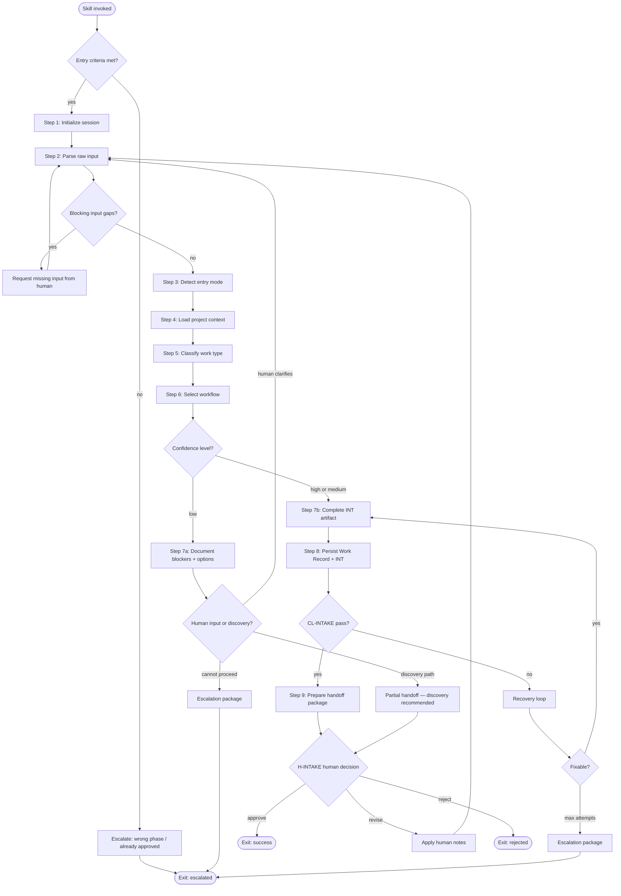
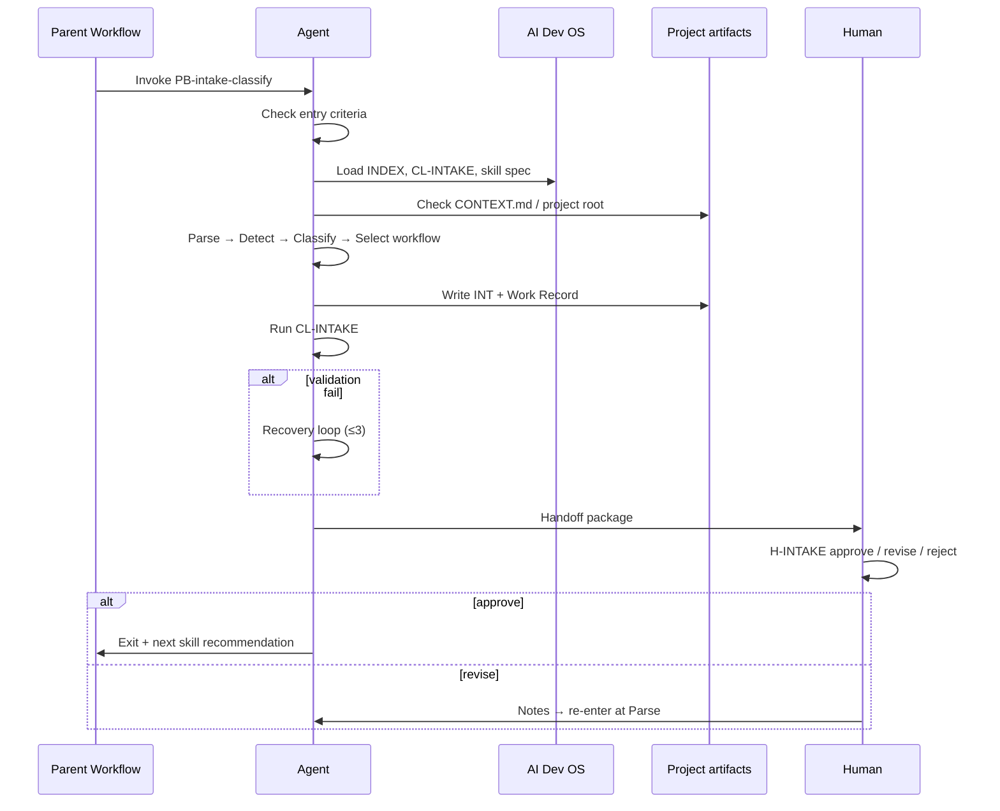
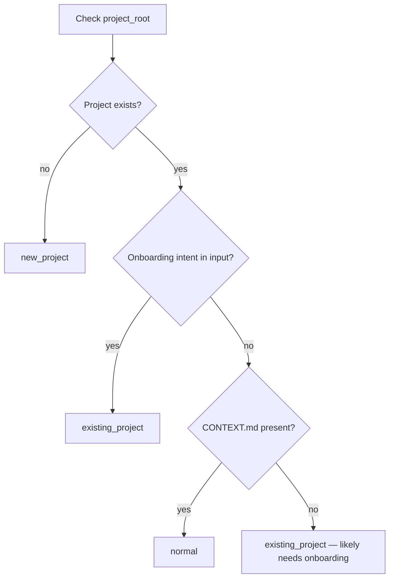
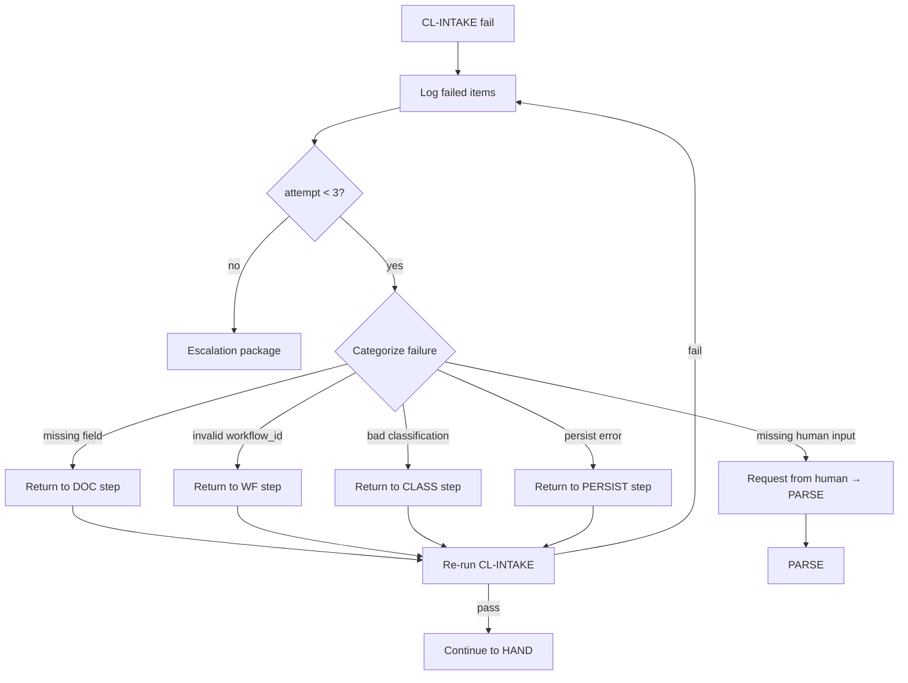

# PB-intake-classify — Internal Workflow

| Field | Value |
|-------|-------|
| skill_id | PB-intake-classify |
| name | Intake & Classify Work |
| version | 1.0.0 |
| status | draft |
| document | 03-workflow |

---

## Overview

This document defines the **internal execution workflow** for PB-intake-classify — the ordered steps, decisions, validations, and recovery paths the agent follows from invocation through handoff.

**Scope:** Inside this skill only. Parent workflow (SDLC spine) remains at Intake phase until **H-INTAKE** is human-approved.

---

## Workflow Diagram

### High-level flow



### Step sequence (linear reference)



---

## Entry Criteria

All criteria must be **true** to enter the workflow. If any fail, do not proceed — escalate immediately.

| ID | Criterion | Verification |
|----|-----------|--------------|
| EC-01 | Parent workflow phase = **Intake** (pre-H-INTAKE) | Work Record status ∉ `intake_approved`, `implement`, `verify`, `closed` |
| EC-02 | No human-approved classification exists | No `H-INTAKE` approval with `decision: approve` unless revise loop (EC-06) |
| EC-03 | Raw work request present | Non-empty input from human |
| EC-04 | `AI_DEV_OS_HOME` resolvable | Path exists |
| EC-05 | OS catalog loadable | `INDEX.md` or `workflows/README.md` readable |
| EC-06 | **Revise loop only:** human revise notes present | Prior H-INTAKE = `revise` with notes |
| EC-07 | **Not informational-only** | Human intent is trackable work, not a question |

### Entry rejection outcomes

| Failed criterion | Exit | Action |
|------------------|------|--------|
| EC-01, EC-02 | `EXIT_ESC` | Inform human: wrong phase; route to active phase skill |
| EC-03 | `EXIT_ESC` | Request raw input |
| EC-04, EC-05 | `EXIT_ESC` | Report environment/OS dependency failure |
| EC-07 | `EXIT_ESC` | Answer question directly; do not run intake |

---

## Processing Steps

### Step 1: Initialize session

| Field | Value |
|-------|-------|
| step_id | `INIT` |
| maps_to | Context T0/T1 assembly |
| blocking | yes |

**Actions**

1. Build T0 task envelope (`skill_id`, `work_id`, `project_root`, `workflow_phase: Intake`).
2. Create or open Work Record; set status `intake_in_progress`.
3. Load OS bundles: skill spec, `CL-INTAKE`, workflow catalog.
4. Record `revision` count (0 new; increment on revise loop).
5. Write Context Plan (optional log to `artifacts/context-logs/`).

**Output:** Session context ready; Work Record exists.

---

### Step 2: Parse raw input

| Field | Value |
|-------|-------|
| step_id | `PARSE` |
| maps_to | P1, S7 |
| blocking | yes |

**Actions**

1. Extract: `title`, `requester`, `problem_statement`, `urgency`, keywords.
2. Detect signals: bug language, CVE, release version, greenfield, onboarding.
3. If revise loop: merge human notes as authoritative overrides.
4. List missing **blocking** fields (see decision point DP-01).

**Output:** Parsed input struct; gap list (may be empty).

---

### Step 3: Detect entry mode

| Field | Value |
|-------|-------|
| step_id | `DETECT` |
| maps_to | P2, S2 |
| blocking | yes |

**Actions**

1. Check `project_root` exists and contains project markers (code, `CONTEXT.md`, git).
2. Apply decision tree DP-02 for `entry_mode`.
3. Record evidence for detection (path checked, files found).

**Output:** Proposed `entry_mode`: `new_project` \| `existing_project` \| `normal`.

---

### Step 4: Load project context

| Field | Value |
|-------|-------|
| step_id | `CTX` |
| maps_to | S1 |
| blocking | no (skip if `new_project`) |

**Actions**

1. If `normal` or `existing_project`: load `CONTEXT.md` (full or digest per token budget).
2. Extract module index and conventions relevant to classification only.
3. Do **not** deep-read codebase.

**Output:** Context notes attached to session; or `N/A — new_project`.

---

### Step 5: Classify work type

| Field | Value |
|-------|-------|
| step_id | `CLASS` |
| maps_to | P3, S3, S4, S5 |
| blocking | yes |

**Actions**

1. Apply decision tree DP-03 to select exactly one `work_type`.
2. Apply type-specific signal extraction (repro, CVE, version).
3. Document rejected alternative types in rationale draft.
4. Compute `classification_confidence` per DP-04.

**Output:** Proposed `work_type` + confidence + rationale draft.

---

### Step 6: Select workflow

| Field | Value |
|-------|-------|
| step_id | `WF` |
| maps_to | P4 |
| blocking | yes |

**Actions**

1. Map `work_type` + `entry_mode` → `workflow_id` via OS catalog.
2. Verify `workflow_id` exists in `INDEX.md`.
3. If multiple workflows fit: prefer simplest (STD-ARCH-004 KISS); document choice.

**Output:** Proposed `workflow_id`.

---

### Step 7a: Low-confidence path

| Field | Value |
|-------|-------|
| step_id | `LOW` |
| maps_to | P6, O4 |
| blocking | conditional |
| trigger | `classification_confidence: low` |

**Actions**

1. Populate `blockers` and `open_questions` in INT.
2. Present options to human: clarify, run discovery first, or force classification.
3. **Do not guess** work type to pass validation.
4. Prepare partial INT — sufficient for human decision at H-INTAKE.

**Output:** Partial or complete INT with explicit low confidence; discovery recommendation.

---

### Step 7b: Complete INT artifact

| Field | Value |
|-------|-------|
| step_id | `DOC` |
| maps_to | P5, P7, P8, S6, S8, S9 |
| blocking | yes |
| trigger | confidence `high` or `medium` |

**Actions**

1. Fill all INT required fields (see 02-responsibilities.md §Required Documents).
2. Write `classification_rationale` with rejected alternatives.
3. Set `in_scope_summary` and `out_of_scope_summary` at intake granularity.
4. Build `recommended_next_artifacts` table (templates only — no drafts).
5. Suggest priority (non-binding).

**Output:** Complete INT draft.

---

### Step 8: Persist Work Record + INT

| Field | Value |
|-------|-------|
| step_id | `PERSIST` |
| maps_to | P7, Work Record update |
| blocking | yes |

**Actions**

1. Write INT to project artifact path (linked in Work Record).
2. Update Work Record: `work_type`, `workflow_id`, `entry_mode`, `artifacts[]`, `status: intake_pending_review`.
3. Append revision history entry if revise loop.

**Output:** Persisted, linkable artifacts.

---

### Step 9: Prepare handoff package

| Field | Value |
|-------|-------|
| step_id | `HAND` |
| maps_to | P10 |
| blocking | yes |

**Actions**

1. Attach validation record from Step VAL.
2. Write ≤10-line summary.
3. List decisions needed at H-INTAKE.
4. Include approval block (decision = `pending`).
5. Include **recommended next skill** (see §Handoff) — name only, do not invoke.

**Output:** Handoff package ready for human.

---

## Decision Points

### DP-01: Blocking input gaps?

| Condition | Path |
|-----------|------|
| `title` or `problem_statement` missing and not inferable | → `REQ` request human → return to `PARSE` |
| `requester` missing | Set `requester: unknown`; note in INT — not blocking |
| `project_root` missing for `normal` work | Request path — blocking |

---

### DP-02: Entry mode detection



| entry_mode | Signals |
|------------|---------|
| `new_project` | No repo; greenfield language; "start from scratch" |
| `existing_project` | "Adopt OS", "onboard repo", no CONTEXT.md, first OS use |
| `normal` | Known project; ongoing work |

---

### DP-03: Work type classification

Priority-ordered decision (first strong match wins; else medium confidence; else low):

| Priority | Signal | work_type |
|----------|--------|-----------|
| 1 | CVE, vulnerability, security audit | `security` |
| 2 | Version tag, release notes, "ship vX" | `release` |
| 3 | Scheduled hygiene, dependency batch | `maintenance` |
| 4 | "Docs only", README, documentation | `documentation` |
| 5 | Repro steps, broken behavior, regression | `bugfix` |
| 6 | Perf metrics, latency, SLO | `performance` |
| 7 | Refactor, no behavior change, structure only | `refactor` |
| 8 | Improve existing capability, delta | `enhancement` |
| 9 | New capability, greenfield feature | `feature` |
| 10 | No project + build intent | `new_project` |
| 11 | Onboard/adopt OS on existing repo | `existing_project` |

**Tie-break:** Prefer simpler type (bugfix over feature; enhancement over feature) per STD-ARCH-004.

---

### DP-04: Confidence level

| Level | Condition |
|-------|-----------|
| `high` | Single clear match at DP-03; entry mode certain |
| `medium` | Match with one viable alternative rejected in rationale |
| `low` | Multiple equal matches; critical field missing; conflicting signals |

---

### DP-05: Human decision at H-INTAKE

| Decision | Next path |
|----------|-----------|
| `approve` | `EXIT` success → recommend next skill |
| `revise` | `REV` → `PARSE` with human notes |
| `reject` | `EXIT_REJ` → Work Record `intake_rejected` |

---

## Validation Checkpoints

### Checkpoint map

| ID | After step | Type | Checklist / gate | Blocks |
|----|------------|------|------------------|--------|
| VC-01 | `INIT` | structural | OS paths resolvable | Step 2 |
| VC-02 | `DETECT` | semantic | `entry_mode` has evidence | Step 5 |
| VC-03 | `WF` | semantic | `workflow_id` in INDEX | Step 7 |
| VC-04 | `PERSIST` | structural | INT file exists; Work Record linked | Step VAL |
| VC-05 | `PERSIST` | **CL-INTAKE** | Full agent self-check | Step HAND |
| VC-06 | `HAND` | structural | Approval block present; decision = `pending` | Human handoff |
| VC-07 | H-INTAKE | **human gate** | Human `approve` | Parent workflow advance |

### CL-INTAKE (VC-05) — minimum items

| # | Check |
|---|-------|
| 1 | `work_type` set (or `low` confidence path documented) |
| 2 | `workflow_id` exists in catalog |
| 3 | `entry_mode` set with evidence |
| 4 | `classification_rationale` non-empty |
| 5 | `problem_statement` present |
| 6 | `in_scope` and `out_of_scope` present |
| 7 | `recommended_next_artifacts` listed |
| 8 | No downstream doc drafts (PRD, discovery, issues) in output |
| 9 | Work Record status = `intake_pending_review` |
| 10 | No self-approval at H-INTAKE |

---

## Exit Criteria

### Success exit (`EXIT`)

All must be true:

| # | Criterion |
|---|-----------|
| E1 | CL-INTAKE passed (VC-05) |
| E2 | INT persisted and linked (VC-04) |
| E3 | Handoff package complete (VC-06) |
| E4 | Human H-INTAKE = `approve` (VC-07) |
| E5 | Work Record status = `intake_approved` |
| E6 | No non-responsibilities violated |

### Reject exit (`EXIT_REJ`)

| # | Criterion |
|---|-----------|
| R1 | Human H-INTAKE = `reject` |
| R2 | Work Record status = `intake_rejected` |
| R3 | Rejection notes recorded |

### Escalation exit (`EXIT_ESC`)

| # | Criterion |
|---|-----------|
| X1 | Entry criteria failed, or |
| X2 | Recovery max attempts exceeded, or |
| X3 | Irrecoverable ambiguity after human clarification |

Escalation package required (see §Recovery).

### Partial success (low confidence)

| # | Criterion |
|---|-----------|
| P1 | INT documents blockers and options |
| P2 | Discovery or clarification recommended |
| P3 | Human H-INTAKE still required before any workflow advance |

---

## Handoff to the Next Skill

**Rule:** This skill **recommends** only. It does **not** invoke the next skill. Parent workflow or human triggers next step after H-INTAKE approval.

### Handoff package contents

| Item | Required |
|------|----------|
| Approved INT path | yes |
| Confirmed `work_type`, `workflow_id`, `entry_mode` | yes |
| `recommended_next_skill` | yes |
| `recommended_next_artifacts` | yes |
| Context reload list for next session | yes |

### Next skill routing

**SSOT:** `playbooks/intake-classify/registry.yaml` → `intake_next_skill`. Orchestrator validation: `workflows/project-orchestrator/routing-matrix.yaml`.

Conditional branches (e.g. discovery already approved → `PB-bootstrap-project`) are resolved by orchestrator ROUTE step from artifact presence — not embedded tables here.

### Low-confidence handoff

| Situation | Next skill | Parent workflow |
|-----------|------------|-----------------|
| `classification_confidence: low` + human approves discovery first | `PB-discovery-research` | Stays Intake/Frame until re-intake |
| Human provides clarification at H-INTAKE | Re-run `PB-intake-classify` | Revise loop |

### Handoff message template

```markdown
## Handoff — PB-intake-classify → {{next_skill}}
- work_id: {{work_id}}
- approved_work_type: {{work_type}}
- approved_workflow: {{workflow_id}}
- entry_mode: {{entry_mode}}
- INT: {{path}}
- next_skill: {{recommended_next_skill}} (not auto-started)
- context_to_reload: [INT, CONTEXT.md, Work Record]
- parent_gate_passed: H-INTAKE
```

---

## Recovery Flow When Validation Fails

### Recovery overview



### Recovery parameters

| Parameter | Value |
|-----------|-------|
| `max_revision_attempts` | 3 per invocation |
| `attempt_counter` | Increment on each CL-INTAKE fail |
| `escalation_target` | Human |

### Failure categories and return steps

| Category | CL-INTAKE symptom | Return step | Fix action |
|----------|-------------------|-------------|------------|
| `FIELD_MISSING` | Required INT field empty | `DOC` | Fill field |
| `INVALID_WORKFLOW` | workflow_id not in INDEX | `WF` | Re-select from catalog |
| `WEAK_RATIONALE` | Rationale empty or circular | `CLASS` | Re-classify with alternatives |
| `SCOPE_MISSING` | in/out scope absent | `DOC` | Add scope summaries |
| `SCOPE_VIOLATION` | PRD/discovery/issues drafted | `DOC` | Remove forbidden content |
| `PERSIST_FAIL` | File not written | `PERSIST` | Retry write; check path |
| `INPUT_REQUIRED` | Blocking gap | `PARSE` via `REQ` | Wait for human |
| `SELF_APPROVAL` | decision = approve set by agent | `HAND` | Reset to pending |

### Escalation package (max attempts or irrecoverable)

```markdown
## Escalation — PB-intake-classify
- work_id:
- failure_mode: validation_exhausted | irrecoverable_ambiguity
- attempts: 3
- failed_checklist_items: []
- partial_outputs: [INT path if exists]
- blocker_description:
- recommended_action: human_classify | run_discovery | split_request | waive_intake
```

Human decides next action. Agent does not auto-retry without new instruction.

### Revise loop (human-driven recovery)

Separate from validation recovery — triggered by H-INTAKE = `revise`:

1. Load human notes as required input (D-IN-03).
2. Increment `revision` on Work Record.
3. Re-enter at `PARSE` (not `INIT` — preserve Work Record).
4. Full CL-INTAKE required before second handoff.

---

## Step-to-Responsibility Map

| Step | Primary | Secondary |
|------|---------|-----------|
| INIT | — | Context assembly |
| PARSE | P1 | S7, S10 |
| DETECT | P2 | S2 |
| CTX | — | S1 |
| CLASS | P3, P6 | S3, S4, S5 |
| WF | P4 | — |
| LOW | P6 | O4 |
| DOC | P5, P7, P8 | S6, S8, S9 |
| PERSIST | P7 | — |
| VAL | P9 | — |
| HAND | P10 | — |

---

## Cross-References

| Document | Relationship |
|----------|--------------|
| [01-purpose.md](./01-purpose.md) | Why workflow exists |
| [02-responsibilities.md](./02-responsibilities.md) | P/S/O responsibilities, gates |
| [04-io-contract.md](./04-io-contract.md) | Full I/O contract per step |
| 08-validation.md | CL-INTAKE full definition |
| 10-handoff.md | Handoff package detail |
| 11-failure-handling.md | Escalation policy |

---

## Revision History

| Version | Date | Summary |
|---------|------|---------|
| 1.0.0 | 2026-06-18 | Initial internal workflow definition |