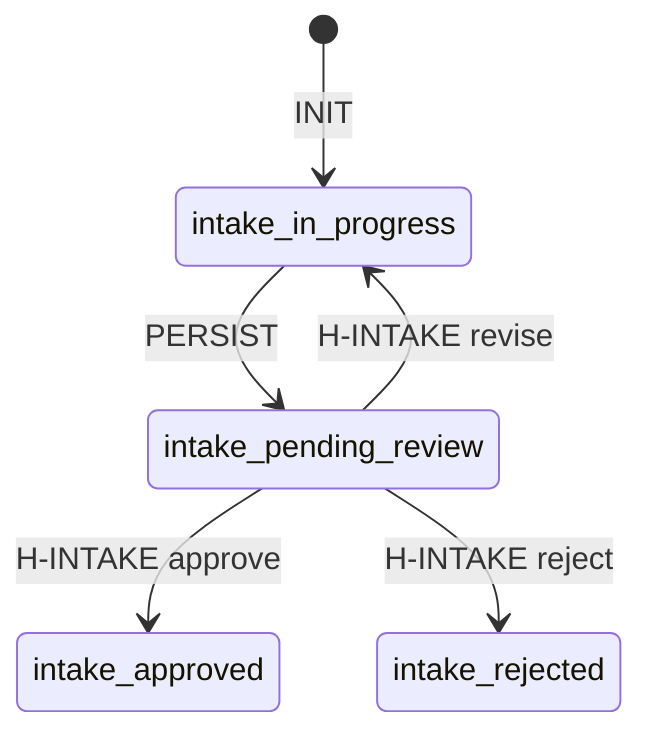
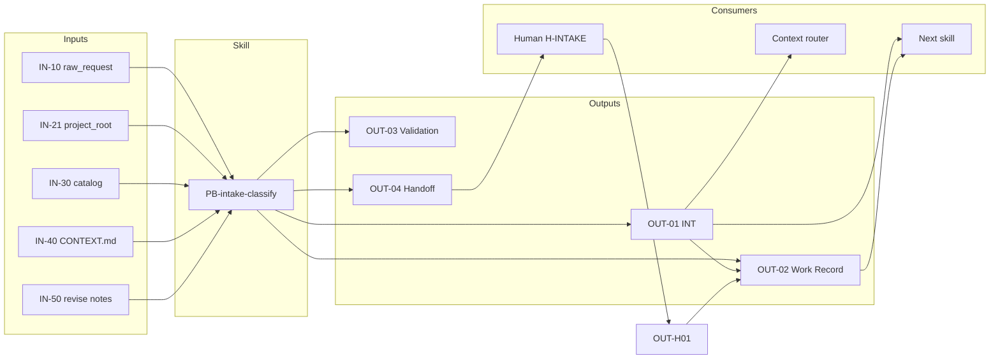

# PB-intake-classify — I/O Contract

| Field | Value |
|-------|-------|
| skill_id | PB-intake-classify |
| name | Intake & Classify Work |
| version | 1.0.0 |
| status | draft |
| document | 04-io-contract |

---

## Overview

Canonical **inputs** and **outputs** for PB-intake-classify. All workflow steps (03-workflow.md) consume and produce subsets of this contract.

**Contract rule:** Agent must not rely on inputs or outputs not listed here. Undocumented I/O is forbidden.

---

## Input Summary

| Category | Count | Required inputs |
|----------|-------|-----------------|
| Invocation | 4 | 3 |
| Human request | 6 | 2 |
| Environment | 3 | 2 |
| OS artifacts (read) | 4 | 4 |
| Project artifacts (read) | 2 | 0–2 conditional |
| Revise loop | 2 | 0–2 conditional |

---

## Inputs — Invocation

### IN-01: `skill_invocation`

| Attribute | Value |
|-----------|-------|
| **Required** | yes |
| **Source** | Parent workflow or human direct invoke |
| **Format** | Structured invoke or explicit chat intent to start intake |

**Validation rules**

- `skill_id` must equal `PB-intake-classify`
- Parent phase must be Intake (EC-01) unless revise loop

**Default behavior**

- If invoked without explicit `skill_id`, accept when human intent clearly starts new work intake and entry criteria pass

---

### IN-02: `work_id`

| Attribute | Value |
|-----------|-------|
| **Required** | optional (new) / yes (revise) |
| **Source** | Human, Work Record, or session context |
| **Format** | String — `WR-###` or project convention |

**Validation rules**

- If provided: must match existing Work Record on revise loop
- If absent: agent proposes new `work_id` in output WR-01

**Default behavior**

- Generate proposed `work_id` from title slug + sequence (e.g. `WR-042-auth-bug`)
- Human confirms at H-INTAKE

---

### IN-03: `revision`

| Attribute | Value |
|-----------|-------|
| **Required** | optional |
| **Source** | Work Record |
| **Format** | Integer ≥ 0 |

**Validation rules**

- On revise loop: must equal prior revision + 1

**Default behavior**

- `0` for new intake
- Increment on each H-INTAKE `revise`

---

### IN-04: `parent_workflow_id`

| Attribute | Value |
|-----------|-------|
| **Required** | optional |
| **Source** | Parent workflow / session T0 |
| **Format** | `WF-*` or `standalone` |

**Validation rules**

- If present: informational only at intake; does not override classified workflow

**Default behavior**

- `standalone` when human invokes skill directly without parent workflow

---

## Inputs — Human Request

### IN-10: `raw_request`

| Attribute | Value |
|-----------|-------|
| **Required** | **yes** |
| **Source** | Human |
| **Format** | Unstructured text, ticket body, pasted report, or file path to request doc |

**Validation rules**

- Non-empty after trim
- Must describe actionable work (EC-07) — not question-only

**Default behavior**

- If multiple requests in one message: agent asks human to split unless clearly one work item

---

### IN-11: `title`

| Attribute | Value |
|-----------|-------|
| **Required** | optional |
| **Source** | Human or derived from `raw_request` |
| **Format** | String, ≤ 120 chars recommended |

**Validation rules**

- If absent: derivable from first sentence of `raw_request`
- If absent and not derivable: **blocking** — request from human (DP-01)

**Default behavior**

- Extract concise title from `raw_request` first line

---

### IN-12: `problem_statement`

| Attribute | Value |
|-----------|-------|
| **Required** | optional |
| **Source** | Human or derived from `raw_request` |
| **Format** | Markdown plain text, 1–3 paragraphs |

**Validation rules**

- If absent: must be inferable from `raw_request`
- If absent and not inferable: **blocking**

**Default behavior**

- Use `raw_request` as problem statement if not separately provided

---

### IN-13: `requester`

| Attribute | Value |
|-----------|-------|
| **Required** | optional |
| **Source** | Human or session identity |
| **Format** | String (name, handle, email) |

**Validation rules**

- None — never blocking

**Default behavior**

- `unknown` with note in INT; flag at handoff for human to fill

---

### IN-14: `urgency_hint`

| Attribute | Value |
|-----------|-------|
| **Required** | optional |
| **Source** | Human |
| **Format** | `P0` \| `P1` \| `P2` \| `P3` \| descriptive text |

**Validation rules**

- If descriptive only: agent maps to suggested priority

**Default behavior**

- `P2` (normal) if no signal; document assumption in INT

---

### IN-15: `work_type_hint`

| Attribute | Value |
|-----------|-------|
| **Required** | optional |
| **Source** | Human |
| **Format** | Work type enum value (see 02-responsibilities.md) |

**Validation rules**

- If present: must be valid enum member
- Hint is non-binding — agent must still classify and may disagree with rationale

**Default behavior**

- Ignore if invalid; treat valid hint as high-priority signal in DP-03

---

## Inputs — Environment

### IN-20: `ai_dev_os_home`

| Attribute | Value |
|-----------|-------|
| **Required** | **yes** |
| **Source** | Environment variable `AI_DEV_OS_HOME` or default global path |
| **Format** | Absolute filesystem path |

**Validation rules**

- Path exists and is readable
- Contains `INDEX.md` or `workflows/README.md`

**Default behavior**

- Fallback: `/data/project/ai-development-system`

---

### IN-21: `project_root`

| Attribute | Value |
|-----------|-------|
| **Required** | conditional |
| **Source** | Human or session context |
| **Format** | Absolute filesystem path |

**Validation rules**

- **Required** when expected `entry_mode` is `normal` or `existing_project`
- Path must exist for `normal`; may exist without `CONTEXT.md` for `existing_project`
- If absent and signals suggest existing project: **blocking** — request from human

**Default behavior**

- If absent and greenfield signals: assume `new_project`; `project_root` = `null` in outputs

---

### IN-22: `session_context`

| Attribute | Value |
|-----------|-------|
| **Required** | optional |
| **Source** | Session T0 envelope |
| **Format** | YAML/JSON object |

**Validation rules**

- If present: must include `token_budget_total` if context planning enabled

**Default behavior**

- Build minimal T0 from invocation inputs if not provided

**Typical fields**

```yaml
provider: generic
token_budget_total: 128000
correlation_id: optional
```

---

## Inputs — OS Artifacts (Read)

### IN-30: `workflow_catalog`

| Attribute | Value |
|-----------|-------|
| **Required** | **yes** |
| **Source** | `{ai_dev_os_home}/INDEX.md` or `workflows/README.md` |
| **Format** | Markdown index |

**Validation rules**

- Must list `workflow_id` values used in output

**Default behavior**

- Load at INIT; cache for session duration only

---

### IN-31: `checklist_intake`

| Attribute | Value |
|-----------|-------|
| **Required** | **yes** |
| **Source** | `{ai_dev_os_home}/checklists/intake.md` or `CL-INTAKE` |
| **Format** | Markdown checklist |

**Validation rules**

- File must exist or use embedded CL-INTAKE minimum items from 03-workflow.md VC-05

**Default behavior**

- If checklist file missing: use VC-05 embedded items; log warning in validation record

---

### IN-32: `skill_spec`

| Attribute | Value |
|-----------|-------|
| **Required** | **yes** |
| **Source** | `{ai_dev_os_home}/playbooks/intake-classify/` |
| **Format** | Markdown spec files |

**Validation rules**

- At minimum `01-purpose.md`, `02-responsibilities.md`, `03-workflow.md` readable

**Default behavior**

- Load on demand per step (progressive disclosure)

---

### IN-33: `sdlc_work_type_matrix`

| Attribute | Value |
|-----------|-------|
| **Required** | **yes** |
| **Source** | OS SDLC documentation / embedded in skill spec |
| **Format** | work_type → workflow_id mapping |

**Validation rules**

- Output `workflow_id` must resolve against this matrix and IN-30

**Default behavior**

- Use enum table from 02-responsibilities.md §Work Type Enum

---

## Inputs — Project Artifacts (Read)

### IN-40: `context_md`

| Attribute | Value |
|-----------|-------|
| **Required** | conditional |
| **Source** | `{project_root}/CONTEXT.md` |
| **Format** | Markdown |

**Validation rules**

- **Required read** when `entry_mode` ∈ `normal`, `existing_project`
- Absent `CONTEXT.md` on existing repo: strengthens `existing_project` classification

**Default behavior**

- Skip read when `new_project`
- Use digest if file exceeds token budget (context strategy)

---

### IN-41: `existing_work_record`

| Attribute | Value |
|-----------|-------|
| **Required** | conditional |
| **Source** | `{project_root}/work/{work_id}.md` or project convention |
| **Format** | Markdown / YAML frontmatter |

**Validation rules**

- **Required** on revise loop (EC-06)
- Must not have `H-INTAKE: approve` unless human waiver documented

**Default behavior**

- If absent on new intake: create new in output WR-01

---

## Inputs — Revise Loop

### IN-50: `human_revise_notes`

| Attribute | Value |
|-----------|-------|
| **Required** | conditional — **yes** on revise loop |
| **Source** | Human via H-INTAKE |
| **Format** | Markdown text |

**Validation rules**

- Non-empty on `decision: revise`
- Authoritative over agent's prior classification where they conflict

**Default behavior**

- N/A outside revise loop

---

### IN-51: `prior_intake_artifact`

| Attribute | Value |
|-----------|-------|
| **Required** | conditional — yes on revise loop |
| **Source** | Prior OUT-01 INT path from Work Record |
| **Format** | Markdown (INT) |

**Validation rules**

- Must exist and be readable on revise loop

**Default behavior**

- Agent updates in place; increments revision; preserves approval history

---

## Input Dependency Matrix (by entry mode)

| Input | new_project | existing_project | normal | revise loop |
|-------|-------------|------------------|--------|-------------|
| IN-10 raw_request | R | R | R | R |
| IN-21 project_root | O | R | R | R |
| IN-40 context_md | — | R | R | O |
| IN-41 work_record | O | O | O | R |
| IN-50 revise_notes | — | — | — | R |
| IN-51 prior_intake | — | — | — | R |

`R` = required · `O` = optional · `—` = skip

---

## Output Summary

| ID | Name | Required | On failure |
|----|------|----------|------------|
| OUT-01 | INT artifact | yes | partial allowed on low confidence |
| OUT-02 | Work Record | yes | no handoff without |
| OUT-03 | Validation Record | yes | blocks handoff if fail |
| OUT-04 | Handoff Package | yes | no |
| OUT-05 | Escalation Package | conditional | on EXIT_ESC |
| OUT-06 | Context Plan | optional | — |
| OUT-07 | Context Log | optional | — |

---

## Outputs — Primary Artifacts

### OUT-01: `intake_artifact` (INT)

| Attribute | Value |
|-----------|-------|
| **Format** | Markdown file with YAML frontmatter |
| **Destination** | `{project_root}/work/intake/{work_id}.md` or project convention |
| **Consumer skill** | All downstream skills via Work Record reference |
| **Also consumed by** | Human at H-INTAKE; context router (T1) |

**Required frontmatter fields**

```yaml
document_id: INT-{work_id}
work_id: WR-###
work_type: <enum>
workflow_id: WF-*
entry_mode: new_project | existing_project | normal
classification_confidence: high | medium | low
status: draft | pending_review | approved | rejected
revision: 0
created: ISO-8601
```

**Required body sections**

| Section | Quality requirement |
|---------|---------------------|
| Title | Matches IN-11 or derived; unique per work_id |
| Problem statement | Testable description of need; no solution presupposition |
| Classification rationale | ≥ 2 sentences; cites input signals; lists 1 rejected alternative if medium confidence |
| In-scope summary | Intake-level boundaries only — no implementation tasks |
| Out-of-scope summary | Explicit exclusions for this work type |
| Suggested priority | P0–P3 with one-line justification |
| Recommended next artifacts | Table: template ID + why — no drafted content |
| Open questions | Empty section allowed only if confidence high |
| Blockers | Required if confidence low; each blocker actionable |
| Human approval block | `decision: pending` only |

**Quality requirements**

| Rule | |
|------|--|
| No PRD, discovery, issue, or code content | CL-INTAKE item 8 |
| All enum fields valid | Verified against IN-30, IN-33 |
| `workflow_id` exists in catalog | CL-INTAKE item 2 |
| Citations | Signals reference `raw_request` quotes or `CONTEXT.md` sections |
| SSOT | This file is authoritative intake — no duplicate intake in chat only |

**Low-confidence variant**

- `work_type` may be `proposed` with alternatives list
- `blockers` mandatory
- `recommended_next_skill` = `PB-discovery-research` likely

---

### OUT-02: `work_record`

| Attribute | Value |
|-----------|-------|
| **Format** | Markdown + YAML frontmatter |
| **Destination** | `{project_root}/work/{work_id}.md` |
| **Consumer skill** | All workflows and skills for this work item |
| **Also consumed by** | Session handoff; context router T1 |

**Required fields (minimum)**

```yaml
work_id: WR-###
status: intake_in_progress | intake_pending_review | intake_approved | intake_rejected
work_type: <enum>
workflow_id: WF-*
entry_mode: <enum>
artifacts:
  - type: INT
    path: <OUT-01 path>
    sha: optional
approvals: []
revision: 0
os_refs:
  skill: PB-intake-classify
  workflow_phase: Intake
```

**Quality requirements**

| Rule | |
|------|--|
| `artifacts[]` links to OUT-01 path | Required before handoff |
| `status` transitions valid | See state machine below |
| `approvals[]` append-only | Never delete prior approval entries |

**Status state machine**



---

### OUT-03: `validation_record`

| Attribute | Value |
|-----------|-------|
| **Format** | Markdown block (embedded in handoff or separate snippet) |
| **Destination** | Handoff package; optional copy in Work Record |
| **Consumer skill** | Human reviewer; PB-intake-classify recovery loop |
| **Also consumed by** | Audit / session trace |

**Required fields**

```yaml
checklist_id: CL-INTAKE
result: pass | fail
failed_items: []
evidence_links: []
attempt: 1-3
agent_confidence: high | medium | low
timestamp: ISO-8601
```

**Quality requirements**

| Rule | |
|------|--|
| `result: pass` required before OUT-04 | Blocks handoff |
| `failed_items` non-empty when fail | Each maps to VC-05 item |
| `attempt` increments on recovery | Max 3 |

---

### OUT-04: `handoff_package`

| Attribute | Value |
|-----------|-------|
| **Format** | Markdown message + structured summary |
| **Destination** | Human review channel (chat / PR comment / issue comment) |
| **Consumer skill** | **None auto-invoked** — human + parent workflow |
| **Informs** | Next skill recommendation (see routing table) |

**Required sections**

| Section | Content |
|---------|---------|
| Summary | ≤ 10 lines |
| Outputs | Links to OUT-01, OUT-02 |
| Validation Record | OUT-03 embed |
| Decisions needed | Explicit questions for H-INTAKE |
| Open questions | From INT |
| Recommended next skill | Single primary + optional alternates |
| Approval block | `gate_id: H-INTAKE`, `decision: pending` |
| Context reload list | `[INT, Work Record, CONTEXT.md?]` |

**Quality requirements**

| Rule | |
|------|--|
| `recommended_next_skill` matches approved routing (03-workflow.md) | After human approve |
| Must not invoke next skill | Name only |
| All claims cite OUT-01 or inputs | No hallucinated workflow IDs |

**Next skill routing (post-approve reference)**

| work_type | Primary consumer skill |
|-----------|------------------------|
| `new_project` | `PB-discovery-research` |
| `existing_project` | `PB-onboard-project` |
| `feature` | `PB-draft-prd` or `PB-discovery-research` |
| `enhancement` | `PB-draft-prd` |
| `bugfix` | `PB-draft-issue` |
| `refactor` | `PB-draft-architecture` |
| `security` | `PB-security-assess` |
| `performance` | `PB-perf-baseline` |
| `documentation` | `PB-draft-doc-update` |
| `release` | `PB-prepare-release` |
| `maintenance` | `PB-maintenance-triage` |

---

## Outputs — Failure & Optional

### OUT-05: `escalation_package`

| Attribute | Value |
|-----------|-------|
| **Format** | Markdown per 03-workflow.md template |
| **Destination** | Human + Work Record note |
| **Consumer skill** | Human decision; may re-invoke PB-intake-classify |
| **Trigger** | EXIT_ESC — entry fail, max validation attempts, irrecoverable ambiguity |

**Quality requirements**

- `recommended_action` ∈ `human_classify | run_discovery | split_request | waive_intake`
- `partial_outputs` lists OUT-01 path if exists

---

### OUT-06: `context_plan`

| Attribute | Value |
|-----------|-------|
| **Format** | Markdown table |
| **Destination** | `{project_root}/artifacts/context-logs/{work_id}-{timestamp}.md` |
| **Consumer skill** | None — diagnostic |
| **Required** | optional |

**Quality requirements**

- Lists T0/T1/T2 bundles loaded with estimated tokens
- Produced at INIT when diagnostic mode or human requests

---

### OUT-07: `context_log`

| Attribute | Value |
|-----------|-------|
| **Format** | Markdown append-only entries |
| **Destination** | Same as OUT-06 or session append |
| **Consumer skill** | None — audit |
| **Required** | optional |

**Quality requirements**

- Records files read during DETECT/CTX only
- No full file contents — paths and line ranges only

---

## Outputs — Human-Generated (Downstream of OUT-04)

These are **not produced by the agent** but complete the I/O contract at H-INTAKE:

### OUT-H01: `human_approval_record`

| Attribute | Value |
|-----------|-------|
| **Format** | Fields appended to Work Record `approvals[]` |
| **Destination** | OUT-02 Work Record |
| **Consumer skill** | Parent workflow; all downstream skills |
| **Producer** | **Human only** |

**Required on approve**

```yaml
gate_id: H-INTAKE
decision: approve
approver: <human>
date: ISO-8601
confirmed_work_type: <enum>
confirmed_workflow_id: WF-*
notes: optional
```

---

## I/O Flow Diagram



---

## Field-Level I/O Map (INT ↔ Inputs)

| INT field | Source input(s) | Transform |
|-----------|-----------------|-----------|
| `title` | IN-11, IN-10 | extract or copy |
| `problem_statement` | IN-12, IN-10 | copy or summarize |
| `requester` | IN-13 | copy or `unknown` |
| `work_type` | IN-10, IN-15, IN-40, DP-03 | classify |
| `workflow_id` | work_type + IN-30 | map |
| `entry_mode` | IN-21, IN-40, IN-10, DP-02 | detect |
| `urgency` | IN-14, IN-10 | map to P0–P3 |
| `classification_rationale` | all above | synthesize |
| `classification_confidence` | DP-04 | compute |
| `in_scope_summary` | IN-10 | bound at intake level |
| `out_of_scope_summary` | work_type defaults + IN-10 | infer |
| `recommended_next_artifacts` | work_type + workflow | template lookup |
| `open_questions` | gaps in inputs | list |
| `blockers` | DP-01, DP-04 | list |

---

## Contract Violations

| Violation | Detection | Response |
|-----------|-----------|----------|
| Missing required input | EC / DP-01 | Request human; do not guess |
| Output without validation pass | VC-05 | Recovery loop |
| INT missing required field | CL-INTAKE | Return to DOC |
| Chat-only output, no OUT-01 | VC-04 | Fail validation |
| Agent sets OUT-H01 | CL-INTAKE #10 | Reset; escalate if repeated |

---

## Cross-References

| Document | Relationship |
|----------|--------------|
| [02-responsibilities.md](./02-responsibilities.md) | INT required fields |
| [03-workflow.md](./03-workflow.md) | Step I/O timing |
| [05-context.md](./05-context.md) | Knowledge loading & summarization |
| 06-dependencies.md | Extended dependency graph |
| 09-validation.md | CL-INTAKE full checklist |
| 11-handoff.md | Handoff package expansion |

---

## Revision History

| Version | Date | Summary |
|---------|------|---------|
| 1.0.0 | 2026-06-18 | Initial I/O contract |