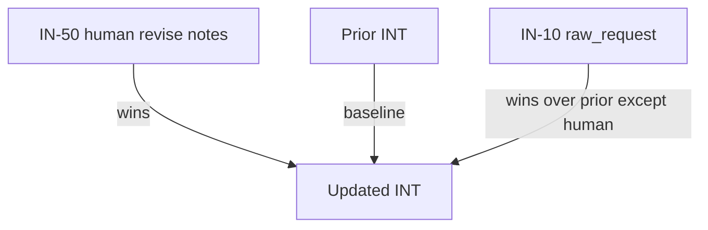
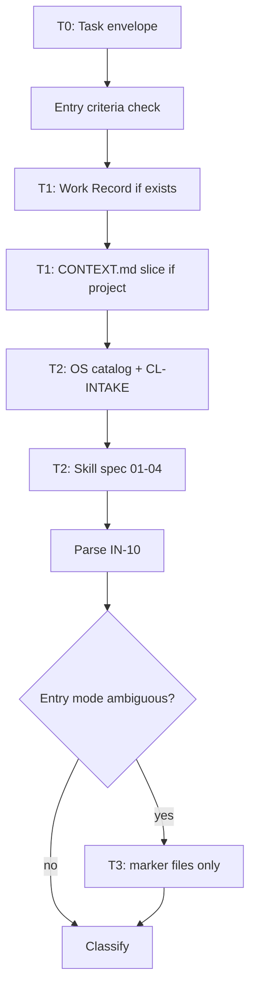

# PB-intake-classify — Context & Knowledge Requirements

| Field | Value |
|-------|-------|
| skill_id | PB-intake-classify |
| name | Intake & Classify Work |
| version | 1.0.0 |
| status | draft |
| document | 05-context |

---

## Overview

Defines **what knowledge** PB-intake-classify may load, what it must not load, and how context is assembled, summarized, and persisted.

**Design principle:** Intake classification needs **routing signals**, not implementation truth. Load the minimum knowledge to propose `work_type`, `workflow_id`, and `entry_mode` with evidence.

Aligns with OS context strategy: T0 + T1 default; T2 for OS skill bundles; T3 only for entry-mode detection — never for architecture comprehension.

---

## Context Budget

| Layer | Budget share | This skill |
|-------|--------------|------------|
| T0 Task envelope | ~5% | Always |
| T1 Project + work | ~15% | Always (when project exists) |
| T2 Skill bundles | ~50% | OS spec + checklist + catalog |
| T3 Deep read | ~30% | **Restricted** — see §Code Context |

**Hard cap:** Total loaded context ≤ 12% of session budget for this skill under normal path. Exceed only on revise loop or T3 entry-mode detection (log in OUT-07).

---

## Required Project Documents

### Must load

| Doc ID | Path | When | Sections only | Purpose |
|--------|------|------|---------------|---------|
| **CTX** | `{project_root}/CONTEXT.md` | `entry_mode` ∈ `normal`, `existing_project` | `#domain-glossary` (optional), `#module-map`, `#conventions` (first § only) | Detect project maturity; disambiguate work type |
| **WR** | `{project_root}/work/{work_id}.md` | Revise loop | Full | Prior status, approvals, artifact links |

### Conditionally load

| Doc ID | Path | When | Max load |
|--------|------|------|----------|
| **INT** (prior) | Path from WR `artifacts[]` | Revise loop | Full prior INT only |
| **README** | `{project_root}/README.md` | `existing_project` onboarding signals | First 50 lines — project purpose detection only |

### Explicitly must NOT load

| Doc ID | Reason |
|--------|--------|
| TP-prd / PRD files | Plan phase — biases classification toward feature |
| TP-architecture / DSN | Architecture phase — unnecessary depth |
| TP-api, TP-database | Design phase |
| TP-feature, ISS | Decompose / implement phase |
| ADRs | Decision history — not needed for routing |
| TP-testing, review artifacts | Verify phase |
| `prompts/` | Derived, not canonical |
| Closed Work Records | Hallucination noise — link only if human cites (IN-09) |

### Absent document behavior

| Missing doc | Inference | Record in INT |
|-------------|-----------|---------------|
| No `CONTEXT.md` + repo exists | Strengthen `existing_project` | `context_gap: CONTEXT.md missing` |
| No `project_root` | Strengthen `new_project` | `entry_mode evidence: no repo` |
| No WR on new intake | Create new | — |

---

## Required Code Context

**Default: none.** This skill does not require source code to classify most work types.

### Permitted T3 code access (entry-mode detection only)

| Access | Path scope | Max files | Purpose |
|--------|------------|-----------|---------|
| Existence check | `{project_root}` top level | list only | Confirm repo is a software project |
| Marker read | `package.json`, `Cargo.toml`, `go.mod`, `pyproject.toml`, `pom.xml`, `.git/HEAD` | 1–2 files | Stack hint for onboarding — **not** for architecture |
| **Forbidden** | `src/**`, `lib/**`, `app/**`, test files | 0 | No implementation survey |

### Work-type-specific code rules

| work_type signal | Code access |
|------------------|-------------|
| `bugfix` | **None** — rely on human repro in `raw_request` |
| `refactor` | **None** at intake — defer to Plan |
| `security` | **None** — rely on CVE/advisory text in request |
| `existing_project` | Marker files only (above) |
| `new_project` | No `project_root` — no code access |

### T3 trigger and logging

T3 code access allowed only when:

1. `entry_mode` ambiguous after IN-10 + IN-21 + IN-40, **and**
2. Human has not provided clarifying notes, **and**
3. Each read logged to OUT-07 with path + reason

If T3 still insufficient → `classification_confidence: low` — do not expand code read.

---

## Business Context

Knowledge about **why** the work matters — intake-level only.

### Sources (priority order)

| Source | ID | Required | Extract |
|--------|-----|----------|---------|
| Human `raw_request` | IN-10 | yes | Problem, users affected, urgency, business keywords |
| Human `urgency_hint` | IN-14 | optional | Priority mapping |
| `CONTEXT.md` domain glossary | CTX | conditional | Domain terms for title/disambiguation |
| Prior INT / WR | revise loop | conditional | Prior framing — superseded by IN-50 on conflict |

### Must extract (when present in sources)

| Business signal | Used for |
|-----------------|----------|
| User / customer impact | `bugfix` vs `enhancement` vs `feature` |
| Revenue / compliance / deadline language | `urgency`, `security`, `release` |
| "New product" / "new service" | `new_project`, `feature` |
| "Improve existing" | `enhancement` |
| Regulatory / audit | `security`, `documentation` |

### Must NOT extract or infer at this skill

| Forbidden inference | Owner |
|---------------------|-------|
| Market sizing, ROI analysis | Discovery / PRD skills |
| Stakeholder map | PB-discovery-research |
| Success metrics targets | PB-draft-prd |
| Competitive landscape | Discovery |
| Financial approval status | Human |

### Business context quality rule

Every business claim in INT must cite **IN-10 quote** or **CTX section** — label `inference:` if extrapolated (reduces to `medium`/`low` confidence).

---

## Architecture Context

**Default: none.** Intake does not need system design knowledge.

### Permitted architecture knowledge

| Source | When | Sections |
|--------|------|----------|
| `CONTEXT.md` `#module-map` | `normal` / `existing_project` | Module name → one-line purpose only |
| `CONTEXT.md` `#known-traps` | optional | Flag if request touches named trap — classification hint only |
| Human request | always | Explicit system names mentioned in `raw_request` |

### Forbidden architecture knowledge

| Source | Reason |
|--------|--------|
| DSN / architecture docs | Defers scope to Plan — creates false precision |
| ADRs | Not routing inputs |
| Code structure survey | PB-survey-codebase |
| Dependency graphs | Plan / refactor phase |
| API specs | Plan phase |

### Architecture mentions in output

INT may reference module names **only** if:

1. Named in `raw_request`, or
2. Listed in `CONTEXT.md` module-map

Do not infer affected components beyond citation evidence.

---

## Previous Workflow Outputs

### From parent SDLC spine (Intake phase)

| Prior output | Available? | Use |
|--------------|------------|-----|
| None (first skill) | typical | — |
| Session Summary | optional T1 | Reload `work_id`, pending gate, open questions |
| Context Plan (OUT-06) | optional | Skip reload of already-listed bundles |

### From prior invocation of this skill (revise loop)

| Output | Path | Use |
|--------|------|-----|
| OUT-01 INT | WR-linked | Baseline to update — not discard |
| OUT-02 Work Record | `work/{work_id}.md` | `revision`, `approvals[]` history |
| OUT-H01 revise record | WR `approvals[]` | IN-50 authoritative overrides |
| OUT-03 Validation Record | last handoff | Avoid repeat failures |

### From other skills (must NOT depend on)

| Output | Rule |
|--------|------|
| Discovery, PRD, issues | **Not loaded** — if they exist prematurely, flag as anomaly; do not use for classification |
| Approved H-INTAKE | **Blocks re-entry** unless revise waiver |

### Previous output precedence (revise loop)



1. **IN-50** overrides all prior classification fields
2. **IN-10** overrides prior INT where human did not comment
3. Prior INT provides default for unchanged fields

---

## Memory Strategy

### What constitutes memory for this skill

| Tier | Artifact | Written by this skill? | Read by this skill? |
|------|----------|------------------------|---------------------|
| Ephemeral | Chat | no | **never rely on** |
| Session | Context Plan, Context Log | optional OUT-06/07 | optional reload |
| Work | INT, Work Record | **yes** OUT-01/02 | revise loop |
| Project | `CONTEXT.md` | **no** | read slices only |
| OS | Standards, playbooks | no | T2 bundles |

### Write policy (anti context-loss)

| Event | Persist to |
|-------|------------|
| Classification draft complete | OUT-01 INT |
| Work item anchored | OUT-02 WR |
| Self-check complete | OUT-03 in handoff |
| Session interrupted | Recommend Session Summary (parent workflow) — skill may draft reload list in OUT-04 |
| Human approve / revise / reject | OUT-H01 → WR `approvals[]` — **human writes decision** |

### Must NOT persist as memory

| Data | Why |
|------|-----|
| Full `CONTEXT.md` copy in INT | SSOT violation — cite sections only |
| Code file contents | Use paths in OUT-07 only |
| Chat transcript as sole record | Artifacts required |
| Vendor AI memory | Project artifacts authoritative |

### Revise loop memory

- Increment `revision` on WR — never reset to 0
- Append to `approvals[]` — never delete history
- INT updated in place at same path — preserve `document_id`

---

## Context Loading Strategy

### Load sequence (mandatory order)



### Step → bundle map

| Workflow step | Bundles loaded | IN/OUT ref |
|---------------|----------------|------------|
| INIT | T0, IN-20, IN-30, IN-31, IN-32 | OUT-06 optional |
| PARSE | IN-10, IN-11–15 | — |
| DETECT | IN-21, T3 markers if needed | OUT-07 |
| CTX | IN-40 sections only | — |
| CLASS | IN-33 matrix, IN-40 glossary | — |
| REVISE | IN-50, IN-51, WR, prior INT | — |

### `context_bundles[]` declaration

```yaml
context_bundles:
  required:
    - id: T0-envelope
      source: session
    - id: OS-workflow-catalog
      path: "{ai_dev_os_home}/INDEX.md"
    - id: OS-checklist-intake
      path: "{ai_dev_os_home}/checklists/intake.md"
    - id: OS-skill-spec
      path: "{ai_dev_os_home}/playbooks/intake-classify/04-io-contract.md"
  conditional:
    - id: project-context-index
      path: "{project_root}/CONTEXT.md"
      sections: [module-map, conventions]
      when: entry_mode in [normal, existing_project]
    - id: work-record
      path: "{project_root}/work/{work_id}.md"
      when: revise_loop or work_id provided
    - id: prior-int
      path: from work-record artifacts
      when: revise_loop
  forbidden:
    - src/**
    - docs/architecture/**
    - docs/prd/**
    - prompts/**
```

### Provider adaptation (LCD mode)

| Profile | Adjustment |
|---------|--------------|
| `generic` | CONTEXT.md digest mandatory if > 2 KB |
| `claude` / `grok` / `cursor` | Per `docs/adapters/{provider}.md` — same bundles, different packaging |
| Low token budget | Skip CTX conventions §; module-map only |

---

## Context Summarization Strategy

### When to summarize (not load full source)

| Source | Threshold | Method |
|--------|-----------|--------|
| `CONTEXT.md` | > 2 KB | **Digest** — `artifacts/digests/{work_id}-ctx.md` |
| `raw_request` | > 1 KB | Extract § only — link full input in WR |
| Prior INT | > 1 KB on revise | Diff against IN-50 — load changed sections + human notes |
| OS INDEX.md | > 4 KB | Workflow table extract only |

### Digest schema (CONTEXT.md)

```markdown
## Digest
- source: CONTEXT.md
- source_sha: {{sha}}
- skill: PB-intake-classify
- scope: module-map, conventions-summary
- expires_when: source_sha changes

### Module map (extract)
| module | purpose |
|--------|---------|

### Conventions (≤5 bullets)
-

### Omitted — load full if needed
- deployment, deep architecture, ADR index
```

### When NOT to summarize

| Source | Rule |
|--------|------|
| IN-10 `raw_request` | Never summarize away repro steps, CVE IDs, version numbers |
| IN-50 human revise notes | **Verbatim** — no summarization |
| CL-INTAKE checklist | Full load — small file |
| Workflow catalog row for selected `workflow_id` | Full row — verify ID exists |

### Summarization and confidence interaction

| Action | Confidence impact |
|--------|-------------------|
| CLASS used digest only (no full CTX) | Max `medium` unless classification signals are strong in IN-10 |
| T3 marker read used | Note in rationale — does not lower confidence |
| Full CTX read | Allows `high` if signals align |

### Stale digest handling

Before using digest:

1. Compute current `CONTEXT.md` sha
2. If ≠ `source_sha` → reload full module-map section or regenerate digest
3. Never classify `existing_project` onboarding on stale digest alone

---

## Context by Entry Mode

| Knowledge area | new_project | existing_project | normal | revise |
|----------------|---------------|------------------|--------|--------|
| Project docs | — | README (50 lines), CTX if present | CTX slices | WR + prior INT |
| Code context | — | markers only | — | — |
| Business context | IN-10 only | IN-10 + README | IN-10 + CTX glossary | IN-50 + IN-10 |
| Architecture context | — | CTX module-map | CTX module-map | prior INT |
| OS docs | full T2 | full T2 | full T2 | full T2 |

---

## Context Validation (pre-handoff)

Before OUT-04, confirm:

| # | Check |
|---|-------|
| C1 | No forbidden docs loaded (grep session log) |
| C2 | No `src/**` reads unless T3 logged |
| C3 | Business claims in INT cite IN-10 or CTX |
| C4 | Digest sha current if digest used |
| C5 | Revise loop loaded IN-50 verbatim |
| C6 | Context budget ≤ 12% normal path (or justify in OUT-07) |

Failures → treat as CL-INTAKE structural fail; recovery per 03-workflow.md.

---

## Knowledge Gaps → Skill Behavior

| Gap | Behavior | Output field |
|-----|----------|--------------|
| No business problem in IN-10 | Request human — blocking | — |
| Ambiguous work type | `classification_confidence: low` | `blockers`, `open_questions` |
| No CONTEXT on existing repo | Classify `existing_project`; note gap | `context_gap` in INT |
| Cannot resolve entry mode | T3 markers once; then low confidence | `blockers` |
| Human cites related WR | Link only — do not load unless needed | `related_work[]` |

---

## Cross-References

| Document | Relationship |
|----------|--------------|
| [03-workflow.md](./03-workflow.md) | Step timing for loads |
| [04-io-contract.md](./04-io-contract.md) | IN-* / OUT-* artifacts |
| OS `docs/architecture/context-management.md` | Global T0–T3 model |
| 08-validation.md | CL-INTAKE + context checks |
| 11-failure-handling.md | Low confidence / missing context |

---

## Revision History

| Version | Date | Summary |
|---------|------|---------|
| 1.0.0 | 2026-06-18 | Initial context requirements |