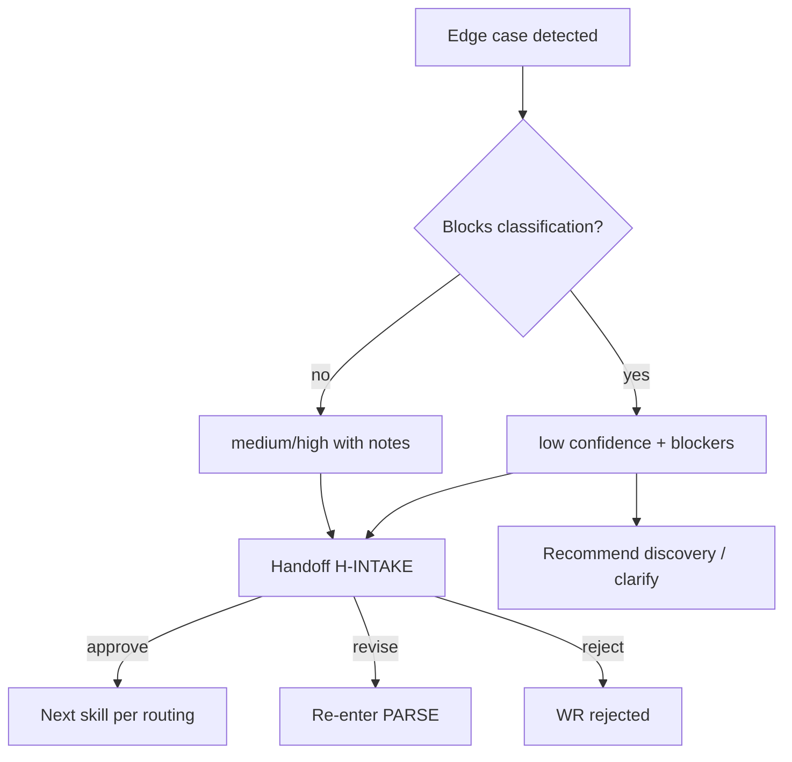

# PB-intake-classify — Edge Cases & Failure Scenarios

| Field | Value |
|-------|-------|
| skill_id | PB-intake-classify |
| name | Intake & Classify Work |
| version | 1.0.0 |
| status | draft |
| document | 07-edge-cases |

---

## Overview

Realistic edge cases and failure scenarios for skill execution. Each entry is actionable — agent behavior is prescribed, not improvised.

**Legend — Human intervention**

| Code | Meaning |
|------|---------|
| **Y** | Human action required before progress |
| **N** | Agent recovers autonomously within skill rules |
| **O** | Optional — human may accelerate or decide |

---

## Category Index

| Category | ID range | Count |
|----------|----------|-------|
| Incomplete information | EC-INC-01 – 08 | 8 |
| Conflicting requirements | EC-CON-01 – 06 | 6 |
| Ambiguous requests | EC-AMB-01 – 08 | 8 |
| Outdated documentation | EC-DOC-01 – 05 | 5 |
| Context limitations | EC-CTX-01 – 07 | 7 |
| Entry & environment | EC-ENV-01 – 06 | 6 |
| Classification traps | EC-CLS-01 – 07 | 7 |
| Validation & recovery | EC-VAL-01 – 05 | 5 |
| Human & process | EC-HUM-01 – 06 | 6 |
| Security & sensitive data | EC-SEC-01 – 04 | 4 |
| Multi-item & scope | EC-MUL-01 – 04 | 4 |

---

## 1. Incomplete Information

### EC-INC-01: Empty or one-line request

| Field | Value |
|-------|-------|
| **Trigger** | IN-10 is `"fix it"`, `"help"`, or &lt;10 words with no problem statement |
| **Impact** | Cannot classify; high false-positive rate |
| **Expected behavior** | Do not classify; set `classification_confidence: low`; list blocking gaps in `blockers` |
| **Recovery strategy** | REQ step: ask human for problem, expected vs actual (if bug), or goal (if feature) |
| **Human intervention** | **Y** |

---

### EC-INC-02: Missing project_root for normal work

| Field | Value |
|-------|-------|
| **Trigger** | Signals suggest existing project; IN-21 absent |
| **Impact** | Cannot load CTX; entry_mode uncertain |
| **Expected behavior** | Block at DP-01; do not assume path |
| **Recovery strategy** | Request `project_root`; if human says greenfield → re-DETECT as `new_project` |
| **Human intervention** | **Y** |

---

### EC-INC-03: Bug report without reproduction steps

| Field | Value |
|-------|-------|
| **Trigger** | Classified or suspected `bugfix`; no repro in IN-10 |
| **Impact** | Premature bugfix workflow; weak downstream issue spec |
| **Expected behavior** | May propose `bugfix` at `medium` confidence max; note `repro: missing` in INT |
| **Recovery strategy** | Handoff with open question: repro required before implement; or human waives at H-INTAKE |
| **Human intervention** | **O** |

---

### EC-INC-04: Security report without CVE/advisory ID

| Field | Value |
|-------|-------|
| **Trigger** | "Security issue" with no identifier, component, or advisory link |
| **Impact** | Cannot confirm security vs generic bug |
| **Expected behavior** | Propose `security` only at `low`/`medium`; list blockers |
| **Recovery strategy** | Request component + advisory; recommend `PB-security-assess` after intake |
| **Human intervention** | **Y** for high-confidence security routing |

---

### EC-INC-05: Release request without version

| Field | Value |
|-------|-------|
| **Trigger** | "Ship it" / "release" without version or scope |
| **Impact** | WF-RELEASE scoped incorrectly |
| **Expected behavior** | Propose `release` at `medium`; `open_questions`: target version, scope freeze |
| **Recovery strategy** | Human supplies version at H-INTAKE or revise |
| **Human intervention** | **O** |

---

### EC-INC-06: Missing requester

| Field | Value |
|-------|-------|
| **Trigger** | IN-13 absent |
| **Impact** | Low — ownership unclear |
| **Expected behavior** | Default `requester: unknown` per IN-13; flag in handoff |
| **Recovery strategy** | None blocking |
| **Human intervention** | **N** |

---

### EC-INC-07: Partial CONTEXT.md (no module map)

| Field | Value |
|-------|-------|
| **Trigger** | IN-40 loads but `#module-map` section absent |
| **Impact** | Weaker architecture hints; onboarding detection harder |
| **Expected behavior** | Proceed; note `context_gap: module-map missing` in INT |
| **Recovery strategy** | Recommend `PB-onboard-project` update CONTEXT if `existing_project` |
| **Human intervention** | **N** |

---

### EC-INC-08: Session interrupted mid-skill

| Field | Value |
|-------|-------|
| **Trigger** | Skill stops after PERSIST but before HAND, or during DOC |
| **Impact** | Partial INT/WR; human lacks handoff |
| **Expected behavior** | Next session: reload WR + INT; resume from last incomplete step |
| **Recovery strategy** | If `status: intake_in_progress` → complete validation + handoff; do not restart from INIT if WR exists |
| **Human intervention** | **O** |

---

## 2. Conflicting Requirements

### EC-CON-01: Human work_type_hint disagrees with signals

| Field | Value |
|-------|-------|
| **Trigger** | IN-15 says `feature`; IN-10 describes regression / broken behavior |
| **Impact** | Wrong workflow if hint followed blindly |
| **Expected behavior** | Classify from signals; document conflict in rationale; cite both sources |
| **Recovery strategy** | Propose `bugfix` (KISS tie-break); human resolves at H-INTAKE |
| **Human intervention** | **Y** |

---

### EC-CON-02: Revise notes contradict raw_request

| Field | Value |
|-------|-------|
| **Trigger** | IN-50 changes work_type; IN-10 unchanged and incompatible |
| **Impact** | Stale problem statement |
| **Expected behavior** | IN-50 wins for classification; flag problem_statement mismatch in `open_questions` |
| **Recovery strategy** | Ask human to confirm updated problem statement or revise IN-10 |
| **Human intervention** | **Y** |

---

### EC-CON-03: CONTEXT.md conventions conflict with request

| Field | Value |
|-------|-------|
| **Trigger** | CTX says "no drive-by refactors"; request is large refactor + feature mix |
| **Impact** | Single work_type insufficient |
| **Expected behavior** | Classify primary type; `out_of_scope`: secondary concern; recommend split |
| **Recovery strategy** | `recommended_action: split_request` in handoff questions |
| **Human intervention** | **Y** |

---

### EC-CON-04: Prior approved H-INTAKE vs new classification

| Field | Value |
|-------|-------|
| **Trigger** | Agent re-invoked without revise waiver; WR shows `intake_approved` |
| **Impact** | Duplicate intake; scope reset risk |
| **Expected behavior** | EC-02 fail → EXIT_ESC; do not reclassify |
| **Recovery strategy** | Human documents waiver or amends WR explicitly |
| **Human intervention** | **Y** |

---

### EC-CON-05: workflow_id valid but wrong for entry_mode

| Field | Value |
|-------|-------|
| **Trigger** | `WF-FEATURE` proposed while `entry_mode: new_project` without project bootstrap |
| **Impact** | AC-ACC-03 fail |
| **Expected behavior** | Re-map: `new_project` → `WF-PROJECT-NEW` first |
| **Recovery strategy** | Auto-correct at WF step; document correction in rationale |
| **Human intervention** | **N** |

---

### EC-CON-06: Urgency P0 vs low-impact wording

| Field | Value |
|-------|-------|
| **Trigger** | IN-14 P0 but problem is cosmetic docs typo |
| **Impact** | Mis-prioritized backlog |
| **Expected behavior** | Suggest P2/P3 with rationale; note conflict with hint |
| **Recovery strategy** | Human confirms priority at H-INTAKE |
| **Human intervention** | **O** |

---

## 3. Ambiguous Requests

### EC-AMB-01: Feature vs enhancement

| Field | Value |
|-------|-------|
| **Trigger** | "Add login" on existing app — new capability or improve auth? |
| **Impact** | Wrong ceremony level (full PRD vs lite) |
| **Expected behavior** | `medium` confidence; prefer `enhancement` if auth exists per CTX/README hint |
| **Recovery strategy** | Document rejected `feature`; human decides |
| **Human intervention** | **O** |

---

### EC-AMB-02: Bugfix vs performance

| Field | Value |
|-------|-------|
| **Trigger** | "App is slow" — defect or optimization? |
| **Impact** | Wrong workflow (WF-BUGFIX vs WF-PERF) |
| **Expected behavior** | If no baseline/regression: propose `performance` at `medium`; ask if behavior regressed |
| **Recovery strategy** | Open question in INT |
| **Human intervention** | **O** |

---

### EC-AMB-03: Refactor vs feature creep

| Field | Value |
|-------|-------|
| **Trigger** | "Clean up auth module and add OAuth" |
| **Impact** | Single work_type invalid |
| **Expected behavior** | Classify primary (`feature` for OAuth); out-of-scope refactor; recommend split |
| **Recovery strategy** | `split_request` recommendation |
| **Human intervention** | **Y** |

---

### EC-AMB-04: New project vs feature on empty repo

| Field | Value |
|-------|-------|
| **Trigger** | Empty repo; "build auth service" |
| **Impact** | `new_project` vs `feature` |
| **Expected behavior** | `new_project` if no MVP/scaffold; `feature` only if bootstrap already approved |
| **Recovery strategy** | Check WR history + README; default `new_project` |
| **Human intervention** | **O** |

---

### EC-AMB-05: Maintenance batch vs single item

| Field | Value |
|-------|-------|
| **Trigger** | "Upgrade dependencies and fix two bugs" |
| **Impact** | WF-MAINTENANCE vs separate items |
| **Expected behavior** | Propose `maintenance` parent + note child splits in `open_questions` |
| **Recovery strategy** | Human confirms batch vs split at H-INTAKE |
| **Human intervention** | **Y** |

---

### EC-AMB-06: Documentation vs feature (user-facing docs)

| Field | Value |
|-------|-------|
| **Trigger** | "Update API docs for new endpoint" — endpoint exists or planned? |
| **Impact** | WF-DOCS vs WF-FEATURE chain |
| **Expected behavior** | If endpoint not shipped: `low` confidence; blockers clarify dependency |
| **Recovery strategy** | Recommend feature first or doc-only if endpoint live |
| **Human intervention** | **Y** |

---

### EC-AMB-07: Informational question disguised as work

| Field | Value |
|-------|-------|
| **Trigger** | "How does our auth work?" — no change requested |
| **Impact** | Unnecessary intake artifact |
| **Expected behavior** | EC-07 fail → EXIT_ESC; answer from CTX if available |
| **Recovery strategy** | No INT; direct response |
| **Human intervention** | **N** |

---

### EC-AMB-08: Multiple equal work types (DP-04 low)

| Field | Value |
|-------|-------|
| **Trigger** | Security + release + bugfix signals equally strong |
| **Impact** | Wrong routing if guessed |
| **Expected behavior** | `classification_confidence: low`; list alternatives; apply DP-03 priority only as **suggestion**, not final |
| **Recovery strategy** | Partial handoff; `PB-discovery-research` or human pick |
| **Human intervention** | **Y** |

---

## 4. Outdated Documentation

### EC-DOC-01: Stale CONTEXT digest

| Field | Value |
|-------|-------|
| **Trigger** | Digest `source_sha` ≠ current CONTEXT.md |
| **Impact** | Wrong module map; misclassification |
| **Expected behavior** | Regenerate digest or load full module-map; max `medium` until refreshed |
| **Recovery strategy** | Per 05-context.md stale digest handling |
| **Human intervention** | **N** |

---

### EC-DOC-02: CONTEXT.md contradicts repo reality

| Field | Value |
|-------|-------|
| **Trigger** | CTX lists module `billing/`; directory absent (T3 list confirms) |
| **Impact** | Inaccurate rationale citations |
| **Expected behavior** | Trust repo check over CTX; note `context_drift` in INT |
| **Recovery strategy** | Recommend CONTEXT update via onboarding/doc skill — not during intake |
| **Human intervention** | **O** |

---

### EC-DOC-03: OS INDEX missing new workflow

| Field | Value |
|-------|-------|
| **Trigger** | Matrix maps to `WF-FOO`; not in IN-30 |
| **Impact** | AC-ACC-01 fail |
| **Expected behavior** | Do not invent ID; escalate ENV-03 pattern |
| **Recovery strategy** | Pick nearest valid workflow from INDEX; note OS gap; OUT-05 if unresolvable |
| **Human intervention** | **Y** if no valid substitute |

---

### EC-DOC-04: Prior INT outdated after CONTEXT major update

| Field | Value |
|-------|-------|
| **Trigger** | Revise loop; CTX changed since prior INT |
| **Impact** | Stale entry_mode or work_type |
| **Expected behavior** | Re-run DETECT + CLASS; do not copy prior classification blindly |
| **Recovery strategy** | Full PARSE–CLASS path with IN-50 |
| **Human intervention** | **O** |

---

### EC-DOC-05: Premature PRD/issue exists in repo

| Field | Value |
|-------|-------|
| **Trigger** | `docs/prd/foo.md` exists; intake not yet approved |
| **Impact** | Agent tempted to use for classification |
| **Expected behavior** | **Do not load** (05-context forbidden); flag `anomaly: premature PRD` |
| **Recovery strategy** | Classify from IN-10 only; human reconciles at H-INTAKE |
| **Human intervention** | **O** |

---

## 5. Context Limitations

### EC-CTX-01: Token budget exceeded

| Field | Value |
|-------|-------|
| **Trigger** | Full CTX + large IN-10 exceeds 12% budget |
| **Impact** | Provider truncation; hallucination risk |
| **Expected behavior** | Force digest; never silent truncate |
| **Recovery strategy** | OUT-06 digest; AC-PER-01 log; max `medium` if business-critical text in omitted sections |
| **Human intervention** | **N** |

---

### EC-CTX-02: CONTEXT.md unavailable (permissions)

| Field | Value |
|-------|-------|
| **Trigger** | IN-40 read fails (permissions / path error) |
| **Impact** | Missing T1 context |
| **Expected behavior** | Proceed with IN-10 only; `context_gap: CONTEXT unreadable` |
| **Recovery strategy** | Request human fix path or paste conventions excerpt |
| **Human intervention** | **Y** for `normal` mode classification at high confidence |

---

### EC-CTX-03: AI_DEV_OS_HOME incomplete

| Field | Value |
|-------|-------|
| **Trigger** | Path exists but INDEX/checklist missing |
| **Impact** | Cannot validate workflow_id |
| **Expected behavior** | EXIT_ESC; OUT-05 `failure_mode: os_incomplete` |
| **Recovery strategy** | Human repairs OS install |
| **Human intervention** | **Y** |

---

### EC-CTX-04: Provider has no file access

| Field | Value |
|-------|-------|
| **Trigger** | Chat-only agent; cannot read IN-40 or write OUT-01 |
| **Impact** | Contract violation |
| **Expected behavior** | Produce INT content in chat **and** explicit instruction that human must persist files; mark `persist: pending` |
| **Recovery strategy** | Human copies artifacts to paths; re-run CL-INTAKE after persist |
| **Human intervention** | **Y** |

---

### EC-CTX-05: Non-English or mixed-language request

| Field | Value |
|-------|-------|
| **Trigger** | IN-10 in language not matched by agent capability |
| **Impact** | Misparse problem_statement |
| **Expected behavior** | `low` confidence; preserve original text; do not translate without confirmation |
| **Recovery strategy** | Ask human for English summary or confirm classification in native language |
| **Human intervention** | **Y** |

---

### EC-CTX-06: Huge pasted log / stack trace

| Field | Value |
|-------|-------|
| **Trigger** | IN-10 &gt;10KB logs |
| **Impact** | Token exhaustion |
| **Expected behavior** | Extract error signature + first/last 20 lines; link full paste path if saved to file |
| **Recovery strategy** | Human saves to `artifacts/`; agent reads slice only |
| **Human intervention** | **O** |

---

### EC-CTX-07: Vendor AI "memory" contradicts WR

| Field | Value |
|-------|-------|
| **Trigger** | Chat memory says approved; WR says `intake_pending_review` |
| **Impact** | Skip intake or double approve |
| **Expected behavior** | **WR wins**; ignore vendor memory |
| **Recovery strategy** | Reload WR; proceed per status |
| **Human intervention** | **N** |

---

## 6. Entry & Environment

### EC-ENV-01: Skill invoked mid-implement phase

| Field | Value |
|-------|-------|
| **Trigger** | WR `status: implement` |
| **Impact** | Scope reset |
| **Expected behavior** | EC-01 fail → EXIT_ESC |
| **Recovery strategy** | Route to implement-phase skill |
| **Human intervention** | **Y** to reset work item |

---

### EC-ENV-02: Duplicate work_id collision

| Field | Value |
|-------|-------|
| **Trigger** | Proposed WR-042 already exists for different work |
| **Impact** | Overwrite risk |
| **Expected behavior** | Do not overwrite; pick new work_id |
| **Recovery strategy** | Increment suffix; note in handoff |
| **Human intervention** | **N** |

---

### EC-ENV-03: Workflow catalog empty or corrupt

| Field | Value |
|-------|-------|
| **Trigger** | IN-30 parse yields zero workflows |
| **Impact** | Cannot satisfy AC-ACC-01 |
| **Expected behavior** | EXIT_ESC immediately |
| **Recovery strategy** | Fix OS INDEX; retry |
| **Human intervention** | **Y** |

---

### EC-ENV-04: project_root is OS repo by mistake

| Field | Value |
|-------|-------|
| **Trigger** | IN-21 points at `ai-development-system` not app project |
| **Impact** | Meta-work classified as app work |
| **Expected behavior** | Detect if path matches `AI_DEV_OS_HOME`; warn in INT |
| **Recovery strategy** | Request correct project path |
| **Human intervention** | **Y** |

---

### EC-ENV-05: Read-only filesystem

| Field | Value |
|-------|-------|
| **Trigger** | PERSIST fails (AC-PRD-01) |
| **Impact** | Chat-only outputs |
| **Expected behavior** | `PERSIST_FAIL` recovery ×3 then escalate |
| **Recovery strategy** | OUT-05; human persists manually (EC-CTX-04) |
| **Human intervention** | **Y** |

---

### EC-ENV-06: Standalone invoke without parent workflow

| Field | Value |
|-------|-------|
| **Trigger** | IN-04 `standalone` |
| **Impact** | No parent to advance |
| **Expected behavior** | Normal skill path; handoff notes standalone context |
| **Recovery strategy** | Human picks next skill from routing table |
| **Human intervention** | **O** |

---

## 7. Classification Traps

### EC-CLS-01: Everything classified as feature

| Field | Value |
|-------|-------|
| **Trigger** | Agent defaults to `feature` for all requests |
| **Impact** | Ceremony bloat |
| **Expected behavior** | DP-03 priority order mandatory; KISS tie-break |
| **Recovery strategy** | CL-INTAKE fail WEAK_RATIONALE; re-CLASS |
| **Human intervention** | **N** |

---

### EC-CLS-02: Security under-classified as bugfix

| Field | Value |
|-------|-------|
| **Trigger** | CVE in request missed |
| **Impact** | Missing security workflow |
| **Expected behavior** | CVE pattern scan on IN-10 → elevate to `security` |
| **Recovery strategy** | Re-classify; if missed until human review → revise loop |
| **Human intervention** | **O** at H-INTAKE |

---

### EC-CLS-03: Refactor labeled feature for visibility

| Field | Value |
|-------|-------|
| **Trigger** | Human says "feature: refactor auth" |
| **Impact** | Wrong templates downstream |
| **Expected behavior** | Classify `refactor` from behavior signals; note naming in rationale |
| **Recovery strategy** | Human approve or revise |
| **Human intervention** | **O** |

---

### EC-CLS-04: existing_project loop (repeated onboarding)

| Field | Value |
|-------|-------|
| **Trigger** | Third intake for same repo still `existing_project` |
| **Impact** | Stuck in onboarding |
| **Expected behavior** | If CONTEXT still missing after 2 cycles: flag `onboarding_stall` |
| **Recovery strategy** | Recommend force `PB-onboard-project` before more intake |
| **Human intervention** | **Y** |

---

### EC-CLS-05: Trivial task over-processed

| Field | Value |
|-------|-------|
| **Trigger** | Typo fix; full INT with 12 fields |
| **Impact** | Waste |
| **Expected behavior** | Still run skill if invoked; suggest waiver path in handoff |
| **Recovery strategy** | Human pre-waiver next time; may fast-approve |
| **Human intervention** | **O** |

---

### EC-CLS-06: Agent self-approves at H-INTAKE

| Field | Value |
|-------|-------|
| **Trigger** | `decision: approve` set by agent |
| **Impact** | Governance violation |
| **Expected behavior** | SELF_APPROVAL recovery; reset to `pending` |
| **Recovery strategy** | If repeated → escalate |
| **Human intervention** | **Y** before any advance |

---

### EC-CLS-07: Auto-start next skill in handoff

| Field | Value |
|-------|-------|
| **Trigger** | Agent begins PB-draft-prd after HAND |
| **Impact** | Skips H-INTAKE |
| **Expected behavior** | **Forbidden** — name only in OUT-04 |
| **Recovery strategy** | Stop; revert workflow state |
| **Human intervention** | **Y** if advance occurred |

---

## 8. Validation & Recovery

### EC-VAL-01: CL-INTAKE fails once — transient

| Field | Value |
|-------|-------|
| **Trigger** | Single missing field |
| **Impact** | Delayed handoff |
| **Expected behavior** | Recovery loop attempt 1 → DOC → pass |
| **Recovery strategy** | Per 03-workflow.md |
| **Human intervention** | **N** |

---

### EC-VAL-02: Three validation failures

| Field | Value |
|-------|-------|
| **Trigger** | `attempt` = 3; still fail |
| **Impact** | No handoff |
| **Expected behavior** | OUT-05 escalation package |
| **Recovery strategy** | Human picks: `human_classify`, `run_discovery`, `split_request`, `waive_intake` |
| **Human intervention** | **Y** |

---

### EC-VAL-03: Circular rationale

| Field | Value |
|-------|-------|
| **Trigger** | "Classified as bugfix because it is a bugfix" |
| **Impact** | AC-MNT-02 fail |
| **Expected behavior** | WEAK_RATIONALE → re-CLASS |
| **Recovery strategy** | Cite IN-10 signals explicitly |
| **Human intervention** | **N** |

---

### EC-VAL-04: Quality AC fail (06-quality.md)

| Field | Value |
|-------|-------|
| **Trigger** | Required AC e.g. AC-SEC-01 fail |
| **Impact** | Blocks handoff |
| **Expected behavior** | Treat as CL-INTAKE fail |
| **Recovery strategy** | Fix category (redact secrets, etc.) |
| **Human intervention** | **N** unless unfixable (embedded secret in request) |

---

### EC-VAL-05: Persist succeeds but wrong path

| Field | Value |
|-------|-------|
| **Trigger** | INT written outside `project_root` |
| **Impact** | AC-SEC-03 fail |
| **Expected behavior** | PERSIST_FAIL recovery; delete orphan if safe |
| **Recovery strategy** | Rewrite to correct path |
| **Human intervention** | **N** |

---

## 9. Human & Process

### EC-HUM-01: Human revise without specifics

| Field | Value |
|-------|-------|
| **Trigger** | IN-50: "try again" |
| **Impact** | Infinite revise loop |
| **Expected behavior** | Request clarifying questions before re-CLASS |
| **Recovery strategy** | Handoff with explicit multiple-choice for human |
| **Human intervention** | **Y** |

---

### EC-HUM-02: Human rejects without reason

| Field | Value |
|-------|-------|
| **Trigger** | H-INTAKE reject; empty notes |
| **Impact** | No learning; dead work item |
| **Expected behavior** | Accept reject; WR `intake_rejected`; request notes optional |
| **Recovery strategy** | New work_id for fresh intake if human retries |
| **Human intervention** | **O** |

---

### EC-HUM-03: Human approves low-confidence intake

| Field | Value |
|-------|-------|
| **Trigger** | `classification_confidence: low`; H-INTAKE approve |
| **Impact** | Downstream rework likely |
| **Expected behavior** | Accept human authority; record confirmed types in OUT-H01 |
| **Recovery strategy** | Next skill may still fail — downstream handles |
| **Human intervention** | **Y** (already intervened) |

---

### EC-HUM-04: Human waives intake entirely

| Field | Value |
|-------|-------|
| **Trigger** | Pre-waiver: skip PB-intake-classify |
| **Impact** | No INT SSOT |
| **Expected behavior** | Skill not run; WR notes waiver |
| **Recovery strategy** | Direct workflow entry with human-owned classification |
| **Human intervention** | **Y** |

---

### EC-HUM-05: Rubber-stamp H-INTAKE

| Field | Value |
|-------|-------|
| **Trigger** | Human approves without reading |
| **Impact** | Process risk — outside agent control |
| **Expected behavior** | Agent still produces full handoff |
| **Recovery strategy** | None — advisory OS |
| **Human intervention** | **Y** (quality of review) |

---

### EC-HUM-06: Long delay between handoff and H-INTAKE

| Field | Value |
|-------|-------|
| **Trigger** | Days between OUT-04 and human review |
| **Impact** | Stale classification |
| **Expected behavior** | Human reviews `open_questions` + context_drift flags |
| **Recovery strategy** | Re-run intake if repo/CONTEXT changed materially |
| **Human intervention** | **O** |

---

## 10. Security & Sensitive Data

### EC-SEC-01: API key in raw_request

| Field | Value |
|-------|-------|
| **Trigger** | IN-10 contains `sk-...` or similar |
| **Impact** | Secret in INT if copied verbatim |
| **Expected behavior** | Redact in INT; AC-SEC-02 |
| **Recovery strategy** | Warn human to rotate credential |
| **Human intervention** | **Y** (rotation) |

---

### EC-SEC-02: PII in bug report

| Field | Value |
|-------|-------|
| **Trigger** | User emails, SSN in IN-10 |
| **Impact** | Compliance risk in persisted INT |
| **Expected behavior** | Redact or pseudonymize in INT; keep detail level minimal |
| **Recovery strategy** | Human provides redacted version |
| **Human intervention** | **O** |

---

### EC-SEC-03: Security intake with exploit PoC

| Field | Value |
|-------|-------|
| **Trigger** | Full exploit steps in IN-10 |
| **Impact** | AC-SEC-04 violation if copied to INT |
| **Expected behavior** | Summarize vulnerability class only; no PoC in INT |
| **Recovery strategy** | Reference secure storage for full report |
| **Human intervention** | **O** |

---

### EC-SEC-04: Path traversal in project_root

| Field | Value |
|-------|-------|
| **Trigger** | IN-21 `../../etc` |
| **Impact** | Unauthorized reads |
| **Expected behavior** | Reject path; AC-SEC-03 |
| **Recovery strategy** | Request valid project_root under workspace |
| **Human intervention** | **Y** |

---

## 11. Multi-Item & Scope

### EC-MUL-01: Multiple unrelated requests in one message

| Field | Value |
|-------|-------|
| **Trigger** | "Fix bug A and add feature B and release v2" |
| **Impact** | Single work_type invalid |
| **Expected behavior** | Classify dominant item or `low` confidence; recommend split |
| **Recovery strategy** | `split_request`; up to 3 items listed in open_questions |
| **Human intervention** | **Y** |

---

### EC-MUL-02: Parent/child work_id confusion

| Field | Value |
|-------|-------|
| **Trigger** | Human references WR-100 as parent; new work is child |
| **Impact** | Wrong linking |
| **Expected behavior** | New work_id; `related_work: [WR-100]` only |
| **Recovery strategy** | Do not merge Work Records |
| **Human intervention** | **N** |

---

### EC-MUL-03: Scope creep during same invocation

| Field | Value |
|-------|-------|
| **Trigger** | Human adds requirements mid-skill in chat |
| **Impact** | INT incomplete vs chat |
| **Expected behavior** | Merge into IN-10 equivalent; re-PARSE |
| **Recovery strategy** | Single invocation ends with one INT reflecting all merged input |
| **Human intervention** | **O** |

---

### EC-MUL-04: Epic-level request

| Field | Value |
|-------|-------|
| **Trigger** | "Rebuild platform" |
| **Impact** | Too large for single intake |
| **Expected behavior** | `new_project` or `feature` at `medium`; out_of_scope: entire epic breakdown |
| **Recovery strategy** | Recommend discovery + later decompose — not in this skill |
| **Human intervention** | **O** |

---

## Decision Matrix (Quick Reference)

---

## Escalation Action Catalog

| recommended_action | When | Human |
|--------------------|------|-------|
| `human_classify` | VAL exhausted; EC-AMB-08 | **Y** |
| `run_discovery` | EC-INC-01, EC-AMB-08, low confidence | **O** |
| `split_request` | EC-MUL-01, EC-AMB-03, EC-CON-03 | **Y** |
| `waive_intake` | EC-CLS-05 trivial | **Y** |
| `fix_os` | EC-CTX-03, EC-ENV-03 | **Y** |
| `fix_persist` | EC-ENV-05, EC-CTX-04 | **Y** |

---

## Cross-References

| Document | Relationship |
|----------|--------------|
| [03-workflow.md](./03-workflow.md) | Recovery loops, DP-01–05 |
| [04-io-contract.md](./04-io-contract.md) | Input/output contracts |
| [05-context.md](./05-context.md) | Context limits, stale digest |
| [06-quality.md](./06-quality.md) | AC failures |
| 13-failure-handling.md | Expanded escalation (pending) |
| 14-examples.md | Golden + anti-pattern scenarios (pending) |

---

## Revision History

| Version | Date | Summary |
|---------|------|---------|
| 1.0.0 | 2026-06-18 | Initial edge case catalog (66 scenarios) |