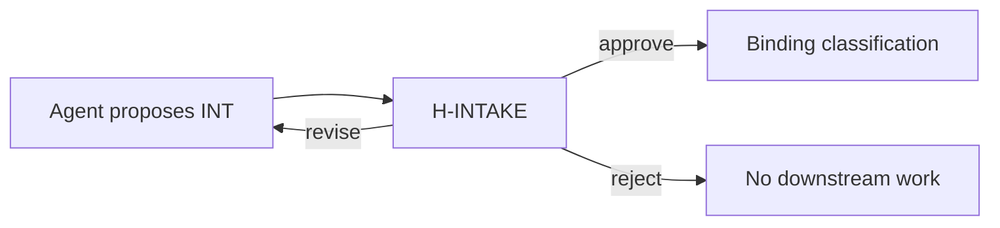

# PB-intake-classify — Limitations

| Field | Value |
|-------|-------|
| skill_id | PB-intake-classify |
| name | Intake & Classify Work |
| version | 1.0.0 |
| status | draft |
| document | 08-limitations |

---

## Overview

Explicit boundaries of PB-intake-classify. Limits are **by design** — not bugs. Agents and humans must not expect behavior outside this document.

**Scope reminder:** Classify work → produce INT → hand off for H-INTAKE. Stop.

---

## 1. What It Cannot Reliably Do

### Classification & judgment

| Limitation | Why | Alternative |
|------------|-----|-------------|
| **Guarantee correct work type** | Ambiguous input, missing repro, mixed requests (EC-AMB-*) | Human H-INTAKE; discovery first if `low` confidence |
| **Detect duplicate backlog items** | No backlog scan by design (N20 rejected) | `PB-dedupe-check` (optional, future) |
| **Infer priority from business impact alone** | No ROI/stakeholder data at intake | Human sets priority; PB-discovery-research |
| **Distinguish enhancement vs feature with high confidence** without CTX | Requires product baseline knowledge | Load CTX; human confirm |
| **Classify security vs bugfix** without advisory/CVE text | Cannot run vuln scanners | Human provides CVE; `PB-security-assess` |
| **Determine root cause** | Not diagnosis | `PB-diagnose-bug` |
| **Validate that work is worth doing** | Business judgment | Human / PRD phase |

### Technical & project truth

| Limitation | Why | Alternative |
|------------|-----|-------------|
| **Verify codebase behavior** | No `src/**` reads (05-context.md) | Tests, human, implement-phase skills |
| **Confirm architecture claims** | No DSN/ADR load | `PB-survey-codebase`, architecture docs |
| **Know if CONTEXT.md is accurate** | Only detects drift signals (EC-DOC-02) | `PB-onboard-project`, human |
| **Resolve outdated OS workflow catalog** | Read-only consumer of INDEX | OS maintainer fixes INDEX |
| **Persist artifacts** on file-less agents | Tooling constraint (EC-CTX-04) | Human persists files manually |

### Process & orchestration

| Limitation | Why | Alternative |
|------------|-----|-------------|
| **Advance parent workflow** | Orchestrator role | Parent workflow after H-INTAKE |
| **Invoke next skill** | Approval model (EC-CLS-07) | Human + workflow trigger |
| **Skip intake when ceremony excessive** | Skill runs if invoked | Human pre-waiver (EC-HUM-04) |
| **Merge multiple requests into one correct type** | Single `work_type` enum | `split_request` (EC-MUL-01) |
| **Re-classify after H-INTAKE approve** | EC-02 blocks | Human waiver + new work or amend |

### Output quality ceilings

| Limitation | Why | Mitigation |
|------------|-----|------------|
| **Perfect INT on first pass** | Revise loops expected | S10, EC-HUM-01 |
| **Zero false positives on `bugfix`** | Repro often missing | `medium` max; open questions |
| **Complete `recommended_next_artifacts`** for novel work types | Template matrix static | Human supplements at Plan |

---

## 2. What Requires Human Approval

### Mandatory (blocking)

| Item | Gate | Agent may not |
|------|------|---------------|
| **Work type confirmation** | H-INTAKE | Set `confirmed_work_type` |
| **Workflow confirmation** | H-INTAKE | Set `confirmed_workflow_id` |
| **Entry mode confirmation** | H-INTAKE | Treat proposed mode as final |
| **Intake artifact acceptance** | H-INTAKE | Set `decision: approve` |
| **Progression to next phase** | H-INTAKE | Start downstream skills |
| **Re-classification after approve** | Human waiver | Re-run without waiver |

### Strongly expected (advisory fail if ignored)

| Item | When | Default if skipped |
|------|------|-------------------|
| **Priority / urgency final value** | H-INTAKE | Agent suggestion only — not backlog truth |
| **Low-confidence routing** | confidence = `low` | Human must approve or send to discovery |
| **Split vs single work item** | EC-MUL-01, EC-AMB-03 | Human chooses |
| **Waivers for guideline AC failures** | 06-quality.md G items | Document in WR |

### Human-only inputs that override agent

| Input | Precedence |
|-------|------------|
| IN-50 revise notes | Wins over prior INT |
| H-INTAKE `reject` / `revise` | Wins over agent handoff |
| Pre-waiver to skip intake | Skill not invoked |
| Explicit work_type at H-INTAKE | Wins over agent proposal if different |

**Nothing in this skill is self-approving.** CL-INTAKE is agent self-check only — not a substitute for human approval.

---

## 3. What Must Be Delegated to Another Skill

Agent **must not** perform these; name delegate in INT `recommended_next_skill` only.

### By workflow phase

| Need | Delegate skill | Trigger |
|------|----------------|---------|
| Deep discovery research | `PB-discovery-research` | `low` confidence; new feature; new_project |
| Project onboarding execution | `PB-onboard-project` | `existing_project` approved |
| Project bootstrap / scaffold | `PB-bootstrap-project` | `new_project` post-discovery |
| PRD authoring | `PB-draft-prd` | `feature` / `enhancement` post-intake |
| Architecture doc | `PB-draft-architecture` | `refactor`, complex feature |
| Issue / spec drafting | `PB-draft-issue` | `bugfix`, post-decompose path |
| Security assessment | `PB-security-assess` | `security` approved |
| Performance baseline | `PB-perf-baseline` | `performance` approved |
| Documentation update | `PB-draft-doc-update` | `documentation` approved |
| Release preparation | `PB-prepare-release` | `release` approved |
| Maintenance batch triage | `PB-maintenance-triage` | `maintenance` approved |
| Codebase survey | `PB-survey-codebase` | Never at intake — only if human explicitly requests pre-step |
| Bug diagnosis | `PB-diagnose-bug` | Repro unclear after intake |
| Implementation | `PB-implement` | After decompose — never from intake |
| Verification / review | `PB-review`, `PB-verify` | Verify phase |

### By artifact type

| Artifact | Owner skill | This skill |
|----------|-------------|------------|
| TP-discovery | PB-discovery-research | **Never creates** |
| TP-prd | PB-draft-prd | **Never creates** |
| TP-architecture | PB-draft-architecture | **Never creates** |
| TP-feature / ISS | PB-decompose-issues / PB-draft-issue | **Never creates** |
| TP-testing | Implement/verify skills | **Never creates** |
| `CONTEXT.md` updates | PB-onboard-project / human-approved doc skills | **Never writes** |

### Delegation rule

> If the task takes more than **classification + INT draft + self-check**, it belongs to another skill.

---

## 4. AI Limitations

Inherent limits of non-deterministic agents running this skill.

### Reasoning & consistency

| Limitation | Manifestation | Mitigation |
|------------|---------------|------------|
| **Non-determinism** | Same input → different `work_type` across sessions | Persist INT; human H-INTAKE; enum + matrix |
| **Overconfidence** | `high` when should be `low` | DP-04 rules; EC-AMB-08; CL-INTAKE |
| **Default to feature** | Ceremony-heavy path | EC-CLS-01; DP-03 priority order |
| **Narrative bias** | Follow user's framing vs signals | KISS tie-break; cite IN-10 quotes |
| **Instruction drift** | Skip CL-INTAKE or self-approve | EC-CLS-06; VC-05 |

### Grounding & hallucination

| Limitation | Manifestation | Mitigation |
|------------|---------------|------------|
| **Invented workflow IDs** | `WF-FOO` not in INDEX | AC-ACC-01; IN-30 load |
| **Invented CVE/version/repro** | Not in IN-10 | AC-ACC-08 |
| **Fabricated CONTEXT content** | Module not in file | AC-ACC-04; citation required |
| **Chat-as-memory** | Decisions only in conversation | OUT-01/02 persist; EC-CTX-07 |
| **Stale training priors** | Wrong OS paths or conventions | `AI_DEV_OS_HOME`; skill spec SSOT |

### Tooling & provider variance

| Limitation | Manifestation | Mitigation |
|------------|---------------|------------|
| **No file access** | EC-CTX-04 | Human persist; `persist: pending` |
| **Truncated context window** | EC-CTX-01 | Digest; 12% budget (05-context.md) |
| **Cannot run CI/tests/scanners** | Security/bug confirmation | Delegate; human evidence |
| **Subagent inconsistency** | If platform uses subagents | LCD `generic` profile; single sequential path |
| **Vendor memory conflicts** | EC-CTX-07 | WR is authoritative |

### Language & communication

| Limitation | Manifestation | Mitigation |
|------------|---------------|------------|
| **Non-English input** | EC-CTX-05 | `low` confidence; human summary |
| **Ambiguous pronouns** | "Fix it" | EC-INC-01 |
| **Huge pasted logs** | EC-CTX-06 | Extract signature only |

---

## 5. Context Limitations

What this skill **cannot see** or **must not load** — per 05-context.md.

### Hard context boundaries

| Boundary | Limit | Consequence |
|----------|-------|-------------|
| **Code** | No `src/**`; ≤2 marker files T3 | Cannot classify from implementation truth |
| **Architecture docs** | No DSN/ADR/API/DB specs | Cannot assess technical complexity |
| **Downstream artifacts** | No PRD/issues/discovery | Cannot use premature docs (EC-DOC-05) |
| **Full CONTEXT.md** | Slices + digest only; >2KB → digest | May miss conventions in omitted sections |
| **Closed work history** | No bulk backlog load | Cannot detect duplicates |
| **OS prompts/** | Forbidden | No prompt-based behavior |
| **Chat history** | Not SSOT | Session reload needs WR + INT |

### Token & load budgets

| Constraint | Value | Effect |
|------------|-------|--------|
| Normal path budget | ≤12% session tokens | Incomplete CTX read |
| T3 reads | ≤2 files | Limited entry-mode detection |
| Digest confidence cap | max `medium` without strong IN-10 | EC-DOC-01 interaction |
| Progressive disclosure | T2 skill bundles only | No full playbook tree in one load |

### Context freshness

| Limitation | Effect |
|------------|--------|
| Stale digest | Misleading module map until refresh |
| CONTEXT drift vs repo | EC-DOC-02 — agent notes, cannot fix |
| Delayed H-INTAKE | EC-HUM-06 — classification may age |
| OS INDEX out of date | EC-DOC-03 — workflow mapping fails |

### What context cannot replace

| Missing context | Cannot be invented — must |
|-----------------|---------------------------|
| Reproduction steps | Ask human (EC-INC-03) |
| CVE / advisory | Ask human (EC-INC-04) |
| project_root | Ask human (EC-INC-02) |
| Business approval | Human H-INTAKE |
| Correct work type under ambiguity | Human or discovery |

---

## 6. Limitation Summary Matrix

| Area | Reliable | Unreliable | Never |
|------|----------|------------|-------|
| Propose work_type | medium/high input | low input, mixed requests | 100% without human |
| Propose workflow_id | when INDEX current | corrupt INDEX | invent IDs |
| Draft INT | with complete inputs | chat-only persist | skip INT |
| Detect entry_mode | clear repo signals | hybrid monorepo edge cases | read full codebase |
| Suggest next skill | routing table match | novel workflows | auto-invoke |
| Enforce quality | CL-INTAKE R ACs | human review quality | waive R ACs |

---

## 7. When to Stop and Escalate (Limitation Breach)

Stop skill execution and escalate (OUT-05) when:

1. **Cannot classify** without guessing — `low` + blockers exhausted (EC-AMB-08)
2. **Cannot persist** after 3 attempts (EC-ENV-05)
3. **OS dependencies broken** (EC-CTX-03, EC-ENV-03)
4. **Entry criteria fail** and cannot remediate in-session (EC-ENV-01)
5. **Validation exhausted** (EC-VAL-02)
6. **Security/path violation** unfixable (EC-SEC-04)

Do **not** compensate by absorbing delegated skills' work.

---

## 8. Implications for Humans

| Expectation | Reality |
|-------------|---------|
| "Agent will know what I mean" | Needs explicit problem statement |
| "Agent read the codebase" | It did not — by design |
| "Intake replaces planning" | Intake routes only |
| "Approved by agent check" | Only human H-INTAKE binds |
| "One message = one correct type" | Splits and revise common |

---

## Cross-References

| Document | Relationship |
|----------|--------------|
| [01-purpose.md](./01-purpose.md) | Out of scope |
| [02-responsibilities.md](./02-responsibilities.md) | Non-responsibilities N1–N23 |
| [05-context.md](./05-context.md) | Context boundaries |
| [06-quality.md](./06-quality.md) | Quality ceilings |
| [07-edge-cases.md](./07-edge-cases.md) | Scenario-level limits |
| 14-failure-handling.md | Escalation detail (pending) |

---

## Revision History

| Version | Date | Summary |
|---------|------|---------|
| 1.0.0 | 2026-06-18 | Initial limitations definition |