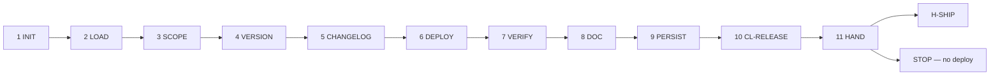

# PB-prepare-release — Workflow

| Field | Value |
|-------|-------|
| skill_id | PB-prepare-release |
| version | 1.0.0 |
| status | draft |
| document | 03-workflow |

---

## Overview

Eleven-step linear workflow: verify entry → load upstream artifacts → define scope → version → changelog → deployment plan → verification mapping → persist REL → validate → hand off. **Never deploy or approve H-SHIP.**

---

## Steps

| Step | ID | Action |
|------|-----|--------|
| 1 | INIT | Verify entry criteria; load INDEX, CL-RELEASE, artifact paths from WR |
| 2 | LOAD | Read CODE + TEST-RPT (soft) + REVIEW/SEC/PERF (soft) + WR + CONTEXT slice |
| 3 | SCOPE | Populate §2 Included Work from WR `artifacts[]`; §2.2 exclusions |
| 4 | VERSION | Set semver, `release_type`, §3 bump rationale |
| 5 | CHANGELOG | Build §4 from CODE §4 files, ISS AC, PRD scope |
| 6 | DEPLOY | Document §7 deployment steps and rollback — plan only |
| 7 | VERIFY | Map TEST-RPT to §8.1; note waivers for WF-RELEASE |
| 8 | DOC | Build REL per OUT-01; open items in §11 |
| 9 | PERSIST | Write `work/release/{work_id}.md`; update WR |
| 10 | VAL | CL-RELEASE (10 checks); recovery ≤3 attempts |
| 11 | HAND | Handoff package; **stop** — await human H-SHIP |

---

## Entry Criteria

| # | Criterion |
|---|-----------|
| EC-ENT-01 | `work_id` and resolvable `project_root` from WR |
| EC-ENT-02 | `workflow_id` in INDEX.md |
| EC-ENT-03 | CODE linked in WR `artifacts[]` |
| EC-ENT-04 | TEST-RPT linked or `WF-RELEASE` waiver documented (soft) |
| EC-ENT-05 | H-VERIFY approved when full verify chain required (soft — waived `WF-RELEASE`) |
| EC-ENT-06 | No prior REL with H-SHIP `approve` unless `mode: revise` |
| EC-ENT-07 | WR records CODE path in `artifacts[]` |
| EC-ENT-08 | Quality chain upstream skills noted or waived in WR |

---

## Exit Criteria

| # | Criterion |
|---|-----------|
| XC-01 | OUT-01 REL persisted at `work/release/{work_id}.md` |
| XC-02 | CL-RELEASE `result: pass` |
| XC-03 | OUT-04 handoff includes `gate_id: H-SHIP`, `decision: pending` |
| XC-04 | WR `status: release_pending` |
| XC-05 | `release_type` in document metadata |
| XC-06 | §8.1 Pre-Release Checks populated or waiver cited |
| XC-07 | No deploy commands executed by agent |

---

## Human Gate — H-SHIP

| Field | Rule |
|-------|------|
| gate_id | `H-SHIP` |
| binds | REL artifact per `WF-RELEASE.yaml` |
| Agent sets | `decision: pending` |
| Human options | `approve` \| `revise` \| `reject` |
| On approve | WR `status: release_approved`; human may execute deploy; recommend H-OPERATE |
| On revise | Re-enter LOAD with `human_revise_notes`; increment `revision` |
| On reject | WR `status: release_rejected`; route PB-implement-* or PB-verify |

**Binding on release handoff:** Changelog grounded in CODE; §11 blockers documented; no production commands.

---

## Quality Chain Prerequisite (last skill)

| Skill | Status | Rule |
|-------|--------|------|
| PB-test-plan | draft | TEST-PLAN chain context (soft) |
| PB-test-generate | planned | Test code chain (soft) |
| PB-review | draft | REVIEW when linked (soft) |
| PB-security-review | draft | SEC-REVIEW when linked (soft) |
| PB-perf-review | draft | PERF-REVIEW when linked (soft) |
| PB-draft-doc-update | planned | DOC-PLAN when linked (soft) |
| PB-verify | planned | TEST-RPT at `work/testing/{work_id}.md` (soft; hard for WF-FEATURE) |

Sequential gate note: PB-prepare-release P0 spec complete at `status: draft`; promotion to `active` pending upstream quality skills and automated RT evidence.

---

## Revise Loop

Human `revise` → re-enter **LOAD** → increment `revision` → full CL-RELEASE → handoff again.

---

## Recovery

CL-RELEASE fail → fix per `checklists/release.md` recovery table → re-VAL (≤3) → OUT-05 escalation.

---

## Next Playbook Routing (recommend only)

| Signal | Primary | Alternate |
|--------|---------|-----------|
| REL complete, no §11 blockers | PB-maintenance-triage (post H-SHIP) | Human deploy pipeline |
| §11 P0 blocker | PB-implement-* or PB-verify | — |
| Missing TEST-RPT on WF-FEATURE | PB-verify | — |
| `WF-RELEASE` version-only | Human H-SHIP after REL | — |