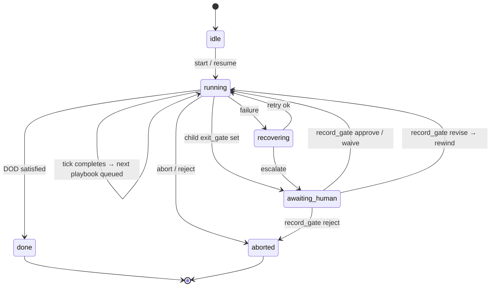
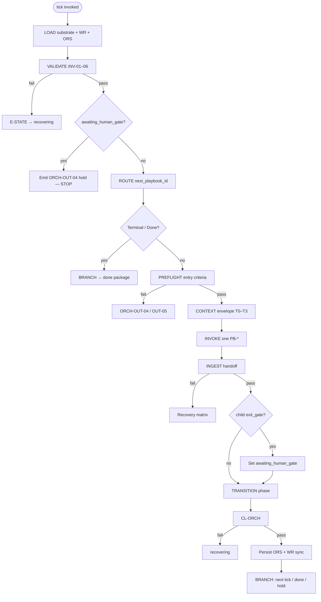
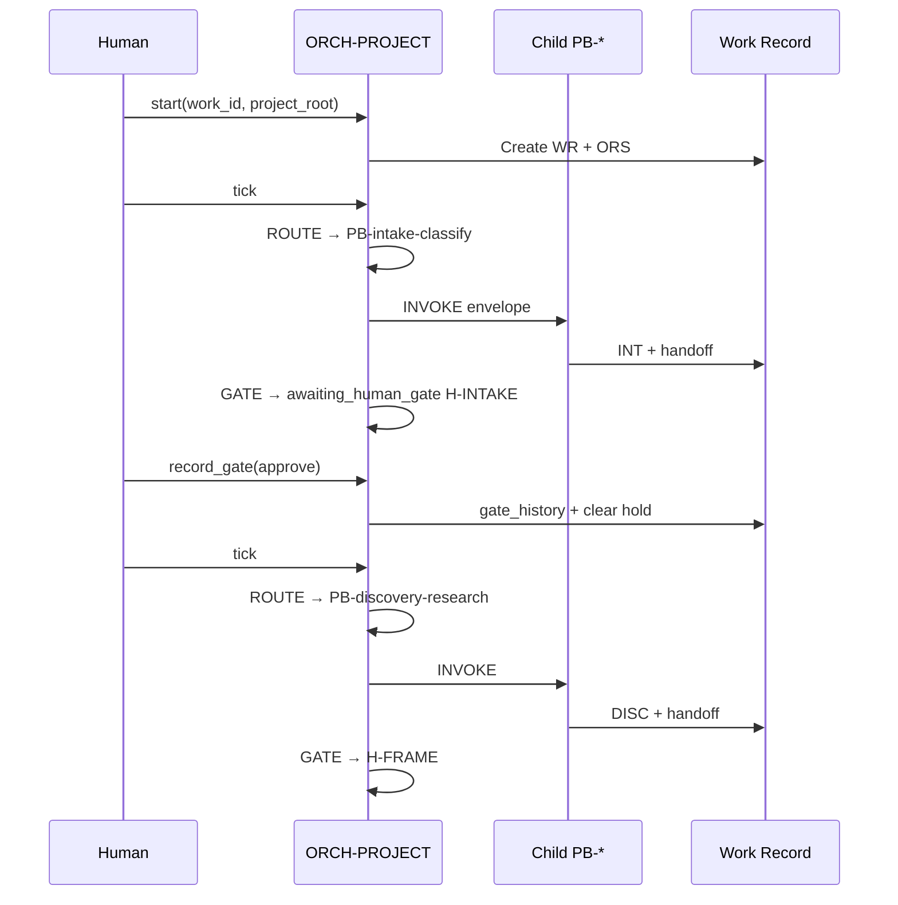
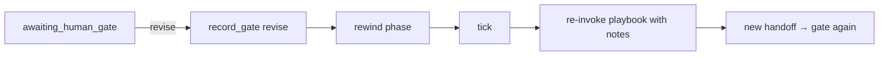
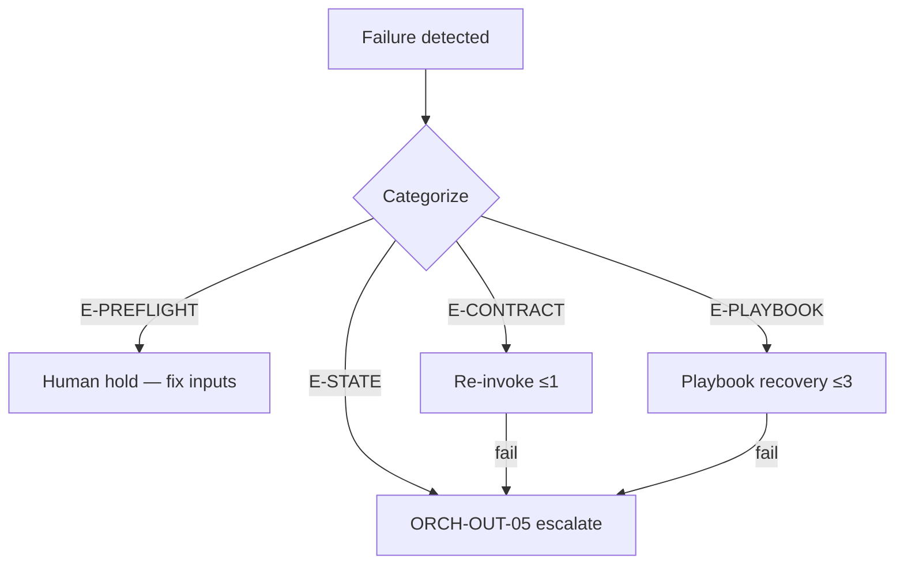

# PB-project-orchestrator — Workflow

| Field | Value |
|-------|-------|
| skill_id | PB-project-orchestrator |
| orchestrator_id | ORCH-PROJECT |
| name | Project Orchestrator |
| version | 0.2.0 |
| status | active |
| document | 03-workflow |
| normative_ref | `workflows/project-orchestrator/DESIGN.md` §3 |

---

## Overview

This document defines the **internal execution workflow** for ORCH-PROJECT — commands, tick steps, phase progression, gate handling, rewind, and recovery.

**Scope:** Coordination only. Child playbooks execute domain steps; this skill never substitutes for them.

**Unit of work:** One `work_id` per ORS. One mutating child playbook per `tick`.

On conflict, `DESIGN.md` §3 wins.

---

## Commands

| Command | Purpose | Typical caller |
|---------|---------|----------------|
| `start` | Create WR + ORS; begin run at Intake | Human |
| `resume` | Load ORS + WR; reconcile if needed; ready for `tick` | Human |
| `tick` | Execute one orchestrator cycle (may invoke one `PB-*`) | Human or automation |
| `record_gate` | Append human gate decision; unblock or rewind | **Human only** |
| `abort` | Terminate run `aborted` | Human |
| `rewind` | Reset `current_phase` to named phase (no artifact delete) | Human |

Commands are mutually exclusive per invocation envelope — one `command` per call.

---

## Workflow Diagrams

### Macro run lifecycle



### Tick flow (one cycle)



### Command sequence (reference)



---

## Entry Criteria

All must be true for the given command unless noted.

| ID | Criterion | Applies to | Verification |
|----|-----------|------------|--------------|
| EC-ENT-01 | `AI_DEV_OS_HOME` resolvable | all | Path exists; INDEX readable |
| EC-ENT-02 | Machine substrate loadable | `tick`, `resume` | routing-matrix, gates.yaml, integrations.md |
| EC-ENT-03 | `project_root` valid | all except orphan `start` | Directory exists or creatable |
| EC-ENT-04 | `work_id` present | `resume`, `tick`, `record_gate`, `abort`, `rewind` | Non-empty ID |
| EC-ENT-05 | ORS exists | `resume`, `tick`, `record_gate`, `abort`, `rewind` | `work/orchestrator/{work_id}.ors.md` |
| EC-ENT-06 | WR exists | `resume`, `tick`, `record_gate` | `work/{work_id}.md` |
| EC-ENT-07 | `run_status` ≠ `aborted` | `tick` | Unless explicit recovery command |
| EC-ENT-08 | `workflow_id` bound | `tick` after Intake | H-INTAKE approved; INT linked in WR |
| EC-ENT-09 | `phases.yaml` exists | `tick` post-bind | `workflows/{workflow_id}/phases.yaml` |
| EC-ENT-10 | `record_gate` payload complete | `record_gate` | `gate_id`, `decision`, `approver` |
| EC-ENT-11 | `rewind` target legal | `rewind` | Phase in workflow spine |
| EC-ENT-12 | Not informational-only | `start` | Human intent is trackable work |

### Entry rejection

| Failed EC | Action |
|-----------|--------|
| EC-ENT-01–03 | ORCH-OUT-05; do not create ORS |
| EC-ENT-05–06 on `tick` | Suggest `start` or `resume` |
| EC-ENT-07 | Inform run aborted; require new `start` |
| EC-ENT-08 | ROUTE only PB-intake-classify until H-INTAKE |
| EC-ENT-10 | Reject `record_gate`; request fields |

---

## Command Workflows

### `start`

| Step | Action |
|------|--------|
| S1 | Validate EC-ENT-01, 03, 12 |
| S2 | Allocate or accept `work_id` |
| S3 | Create WR from TP-WR — `status: intake_in_progress`, `orchestrator.run_status: running` |
| S4 | Create ORS — `current_phase: Intake`, `run_id` new, histories empty |
| S5 | Emit summary; **do not** auto-`tick` (human triggers next) |

### `resume`

| Step | Action |
|------|--------|
| R1 | LOAD WR + ORS; validate EC-ENT-04–06 |
| R2 | If ORCH-O5 reconcile needed: rebuild `playbook_history` from WR `artifacts[]` |
| R3 | VALIDATE invariants; fix `run_status` if idle with pending gate |
| R4 | Return hold summary if `awaiting_human_gate`; else ready for `tick` |

### `tick`

Execute the **11-step tick** (see Processing Steps). Stops early at RESOLVE if gate pending.

### `record_gate`

| Step | Action |
|------|--------|
| G1 | Validate EC-ENT-10; `gate_id` ∈ `gates.yaml` |
| G2 | Match `gate_id` to `awaiting_human_gate` (or E-STATE) |
| G3 | Append `gate_history` + WR `approvals[]` |
| G4 | Branch on `decision` (see Human Gate) |
| G5 | Persist ORS; **do not** invoke child in same command |

### `abort`

| Step | Action |
|------|--------|
| A1 | Set `run_status: aborted`; clear `awaiting_human_gate` |
| A2 | Append gate_history note if mid-gate |
| A3 | Emit human summary; preserve artifacts |

### `rewind`

| Step | Action |
|------|--------|
| W1 | Set `current_phase` to target; clear `awaiting_human_gate` |
| W2 | Do **not** delete WR artifacts (ORCH-N15) |
| W3 | Log rewind in `phase_history` |

---

## Processing Steps (tick)

| Step | ID | Action | Stop condition |
|------|-----|--------|----------------|
| 1 | LOAD | ORS, WR, INDEX, routing-matrix, gates.yaml, `phases.yaml`, artifact files | Missing D-ORCH → E-PREFLIGHT |
| 2 | VALIDATE | INV-01–06 | Fail → E-STATE |
| 3 | RESOLVE | If `awaiting_human_gate` → ORCH-OUT-04; **return** | Gate pending |
| 4 | ROUTE | `next_playbook_id` from phase DAG + matrix + `gate_history` | Terminal → BRANCH done |
| 5 | PREFLIGHT | Skill status, entry criteria, required artifacts, prior gates | Fail → hold |
| 6 | CONTEXT | Build T0–T3 envelope per child `05-context.md` | E-CONTEXT → degrade (ORCH-S6) |
| 7 | INVOKE | Dispatch exactly one child playbook | INV-01 |
| 8 | INGEST | Validate OUT-*; update WR `artifacts[]` | Fail → recovery |
| 9 | GATE | If child `exit_gate` ≠ `none` → set `awaiting_human_gate` | — |
| 10 | TRANSITION | Update `current_phase` per phases.yaml | INV-03 |
| 11 | BRANCH | CL-ORCH → persist ORS → done / hold / suggest next `tick` | — |

### ROUTE algorithm (summary)

1. Read `execution_sequence` from `workflows/{workflow_id}/phases.yaml`
2. Find index after last completed step in `playbook_history` + approved gates
3. Next step if `PB-*` → candidate `next_playbook_id`
4. If next step is `H-*` and not approved → set hold (should not reach INVOKE)
5. Validate candidate against `routing-matrix.yaml` entry for `workflow_id`
6. Ignore child `recommended_next_skill` unless ∈ `next_candidates` (INV-R4)

---

## Phase Model

Workflow-specific DAG from `phases.yaml`. Canonical spine:

| Phase | Typical playbooks | Gate after |
|-------|-------------------|------------|
| Intake | PB-intake-classify | H-INTAKE |
| Frame | PB-discovery-research, PB-onboard-project | H-FRAME |
| Plan | PB-draft-prd, PB-draft-architecture, … | H-PLAN |
| Decompose | PB-decompose-issues | H-DECOMPOSE |
| Implement | PB-implement | H-IMPLEMENT (advisory) |
| Verify | PB-verify, PB-review | H-VERIFY |
| Ship | PB-prepare-release | H-SHIP |
| Operate | PB-maintenance-triage | H-OPERATE |

`current_phase` in ORS tracks position; transitions only via TRANSITION step after valid gate or waivable skip.

---

## Exit Criteria

### Per-tick success

| ID | Criterion |
|----|-----------|
| EC-EXIT-01 | CL-ORCH passed when ORS mutated |
| EC-EXIT-02 | ORS persisted if state changed |
| EC-EXIT-03 | At most one playbook invoked |
| EC-EXIT-04 | `awaiting_human_gate` consistent with child `exit_gate` |
| EC-EXIT-05 | Hold package emitted if tick stopped at RESOLVE |

### Run terminal (Definition of Done)

All must be true for `run_status: done` (DOD-01–07):

| ID | Criterion |
|----|-----------|
| DOD-01 | Terminal phase/step per `phases.yaml` `terminal_gate` |
| DOD-02 | Required gates for workflow have `approve` or documented `waive` |
| DOD-03 | Required artifacts in WR per workflow spec |
| DOD-04 | `awaiting_human_gate` is null |
| DOD-05 | No child playbook `in_progress` in ORS |
| DOD-06 | `run_status: done` |
| DOD-07 | Human acknowledgment (final `record_gate` or explicit Done command) |

### Workflow terminal gates (reference)

| workflow_id | Terminal gate |
|-------------|---------------|
| WF-FEATURE | H-SHIP |
| WF-PROJECT-NEW | H-PLAN |
| WF-PROJECT-EXISTING | H-FRAME |
| WF-BUGFIX | H-VERIFY |
| WF-RELEASE | H-OPERATE |
| WF-MAINTENANCE | H-OPERATE |

Full list: `workflows/specs/WF-*.yaml` + `WORKFLOW-REGISTRY.yaml`.

---

## Human Gate

Orchestrator **surfaces** gates; humans **decide** via `record_gate` (**docs/GOVERNANCE.md**).

### Gate registry (reference)

| gate_id | After phase | Binds |
|---------|-------------|-------|
| H-INTAKE | Intake | INT |
| H-FRAME | Frame | DISC, ONBOARD |
| H-PLAN | Plan | PRD, FEAT, ARCH, … |
| H-DECOMPOSE | Decompose | ISS-* |
| H-IMPLEMENT | Implement | CODE (advisory) |
| H-VERIFY | Verify | TEST-RPT, REVIEW |
| H-SHIP | Ship | REL |
| H-OPERATE | Operate | MAINT |

SSOT: `workflows/project-orchestrator/gates.yaml`.

### `record_gate` behaviour

| decision | Orchestrator action |
|----------|---------------------|
| `approve` | Append history; clear `awaiting_human_gate`; `run_status: running` |
| `waive` | Require `waiver_reason`; check `waivable_gates` for `workflow_id` |
| `revise` | Append history; **rewind** to same-phase playbook with notes |
| `reject` | `run_status: aborted` or hold per notes |

### Hold package (ORCH-OUT-04)

Must include: `work_id`, `gate_id`, bound artifact path(s), summary, allowed decisions, WR link.

---

## Revise Loop

| Trigger | Rewind target | Re-invoke |
|---------|---------------|-----------|
| H-INTAKE `revise` | Intake | PB-intake-classify (`mode: revise`) |
| H-FRAME `revise` | Frame | PB-discovery-research or PB-onboard-project |
| H-PLAN `revise` | Plan | Plan-phase playbook that produced bound artifact |
| DISC `alignment: requires_re_intake` | Intake | PB-intake-classify (ORCH-S2) |
| Human `rewind` command | Named phase | Next `tick` selects playbook for phase |

Revise does **not** delete prior artifacts — new revision appended; WR `revision` incremented.



---

## Recovery

### Failure taxonomy

| Code | Source | First action |
|------|--------|--------------|
| E-PREFLIGHT | ORCH | Hold; list missing artifacts/criteria |
| E-CONTRACT | ORCH | Re-invoke child once |
| E-PLAYBOOK | Child OUT-05 | Delegate to playbook recovery ≤3 |
| E-GATE | Human reject | Abort or hold |
| E-STATE | Invariant break | `recovering`; ORCH-OUT-05 |
| E-CONTEXT | Budget | ORCH-S6 degrade; retry ≤2 |
| E-TOOL | Persist fail | Retry ≤3 |
| E-WF-PLANNED | `status: planned` | ORCH-S7 block |

### Recovery flow



### Escalation package (ORCH-OUT-05)

Include: `run_id`, `work_id`, failure code, last playbook, last handoff excerpt, suggested actions (`resume`, `rewind`, `abort`, manual playbook run). **Never** auto-fix domain content.

### Retry state (ORS)

```yaml
retry_state:
  playbook_id: PB-*
  attempt: 1
  max_attempts: 3
  failure_code: E-*
  next_action: reinvoke | rewind | escalate
```

---

## Next-Skill Routing (recommend only)

| Rule | Description |
|------|-------------|
| NSR-01 | ROUTE step is authoritative — not child handoff |
| NSR-02 | Child `recommended_next_skill` is a **hint** (INV-R4) |
| NSR-03 | Orchestrator MAY include `suggested_next_tick` in tick summary — non-binding |
| NSR-04 | Done package MAY suggest new `work_id` — does not auto-`start` |
| NSR-05 | Routing SSOT: `routing-matrix.yaml` + `phases.yaml` — never embed matrix in output |

After successful `tick` without hold:

```yaml
suggested_next:
  command: tick | record_gate
  reason: "H-FRAME pending" | "PB-draft-prd eligible"
  playbook_hint: PB-*  # optional; ROUTE validates on next tick
```

---

## Idempotency

| Operation | Key | Duplicate behaviour |
|-----------|-----|---------------------|
| `tick` | `run_id` + `ors.revision` | Same revision → no-op or safe re-emit |
| `record_gate` | `gate_id` + `work_id` + content hash | Same → no-op; conflict → E-STATE |
| Child re-invoke | `work_id` + `mode` + playbook revision | Revise loop only |

---

## Cross-References

| Document | Relationship |
|----------|--------------|
| [01-purpose.md](./01-purpose.md) | When to use orchestrator |
| [02-responsibilities.md](./02-responsibilities.md) | ORCH-P/S/N ownership |
| [04-io-contract.md](./04-io-contract.md) | ORCH-IN-* / ORCH-OUT-* |
| `workflows/project-orchestrator/DESIGN.md` | Normative tick + recovery |
| `checklists/orchestrator.md` | CL-ORCH |
| `workflows/specs/WF-*.yaml` | Terminal gates, failure recovery |

---

## Revision History

| Version | Date | Summary |
|---------|------|---------|
| 0.2.0 | 2026-06-18 | Full workflow per STD-SKILL-001 §4.1 |
| 0.1.0 | 2026-06-18 | Tick step stub |