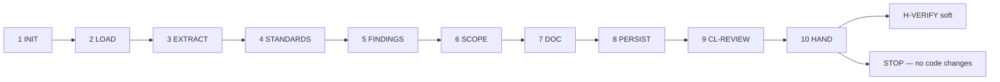

# PB-review — Workflow

| Field | Value |
|-------|-------|
| skill_id | PB-review |
| version | 1.0.0 |
| status | draft |
| document | 03-workflow |

---

## Overview

Ten-step linear workflow: verify entry → load upstream artifacts → extract AC → evaluate standards → document findings → assess scope → persist review → validate → hand off. **Never modify code or execute tests.**

---

## Steps

| Step | ID | Action |
|------|-----|--------|
| 1 | INIT | Verify entry criteria; load INDEX, CL-REVIEW, artifact paths from WR |
| 2 | LOAD | Read CODE + ISS (soft) + PRD (soft) + TEST-PLAN (soft) + CONTEXT slice; set `review_type` |
| 3 | EXTRACT | Collect AC IDs from PRD, ISS, CODE §2; identify review targets from CODE §4 |
| 4 | STANDARDS | Populate §3 Standards Checklist per STD-REVIEW-001 |
| 5 | FINDINGS | Document blockers, should-fix, nits with file locations |
| 6 | SCOPE | Complete §6 Scope & Risk Assessment |
| 7 | DOC | Build REVIEW per OUT-01; `review_type: code` default |
| 8 | PERSIST | Write `work/review/{work_id}.md`; update WR |
| 9 | VAL | CL-REVIEW (10 checks); recovery ≤3 attempts |
| 10 | HAND | Handoff package; **stop** — await human H-VERIFY |

---

## Entry Criteria

| # | Criterion |
|---|-----------|
| EC-ENT-01 | `work_id` and resolvable `project_root` from WR |
| EC-ENT-02 | `workflow_id` in INDEX.md |
| EC-ENT-03 | CODE linked in WR `artifacts[]` |
| EC-ENT-04 | H-IMPLEMENT approved when CODE present (soft) |
| EC-ENT-05 | ISS and/or PRD linked for AC grounding (soft) |
| EC-ENT-06 | No prior REVIEW with H-VERIFY `approve` unless `mode: revise` |
| EC-ENT-07 | WR records CODE path in `artifacts[]` |
| EC-ENT-08 | PB-test-plan chain PASS or TEST-PLAN `sub_gate: plan` documented (soft prerequisite) |

---

## Exit Criteria

| # | Criterion |
|---|-----------|
| XC-01 | OUT-01 REVIEW persisted at `work/review/{work_id}.md` |
| XC-02 | CL-REVIEW `result: pass` |
| XC-03 | OUT-04 handoff includes `gate_id: H-VERIFY`, `decision: pending` |
| XC-04 | WR `status: review_pending` |
| XC-05 | `review_type` in document metadata |
| XC-06 | §3 Standards Checklist evaluated for all applicable rows |
| XC-07 | No source code files modified by agent |

---

## Human Gate — H-VERIFY (soft, review sub-artifact)

| Field | Rule |
|-------|------|
| gate_id | `H-VERIFY` |
| mode | **soft** — review sub-artifact; full H-VERIFY applies after PB-verify TEST-RPT evidence |
| optional | Human may skip inline review when `optional: true` in registry |
| Agent sets | `decision: pending` or `review_sub_handoff: await_human` |
| Human options | `approve` \| `revise` \| `reject` (inline findings) — or defer to full verify chain |
| On approve | WR notes review accepted; may proceed to PB-prepare-release after full H-VERIFY |
| On revise | Re-enter LOAD with `human_revise_notes`; increment `revision` |
| On reject | WR `status: review_rejected`; recommend PB-implement-* for blockers |

**Binding on review handoff:** Every in-scope AC assessed in §4; P0 blockers documented; no code modifications.

---

## Quality Chain Prerequisite

| Skill | Status | Rule |
|-------|--------|------|
| PB-test-plan | active (draft) | TEST-PLAN at `work/testing/plan/{work_id}.md` or WR notes plan waiver |
| PB-test-generate | planned | **Will gate invoke when authored** — document in handoff; not blocking P0 draft |

Sequential gate note: PB-review P0 spec complete at `status: draft`; promotion to `active` pending PB-test-generate chain and automated RT evidence.

---

## Revise Loop

Human `revise` → re-enter **LOAD** → increment `revision` → full CL-REVIEW → handoff again.

---

## Recovery

CL-REVIEW fail → fix per `checklists/review.md` recovery table → re-VAL (≤3) → OUT-05 escalation.

---

## Next Playbook Routing (recommend only)

| Signal | Primary | Alternate |
|--------|---------|-----------|
| REVIEW complete, no P0 blockers | PB-prepare-release (after full H-VERIFY) | PB-verify (parallel) |
| P0 blockers in §5.1 | PB-implement-* (matching lane) | — |
| `requires_code_revise` from alignment | PB-implement-* | — |
| Missing TEST-RPT for full H-VERIFY | PB-verify | — |
| Human skips review | PB-verify | Document waiver in WR |