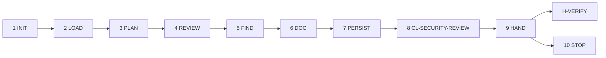

# PB-security-review — Workflow

| Field | Value |
|-------|-------|
| skill_id | PB-security-review |
| version | 1.0.0 |
| status | draft |
| document | 03-workflow |

---

## Overview

Ten-step linear workflow: verify CODE entry → load context → review security dimensions → document findings → validate → hand off at H-VERIFY. **Never mutate code.**

---

## Steps

| Step | ID | Action |
|------|-----|--------|
| 1 | INIT | Verify entry criteria; load INDEX, CL-SECURITY-REVIEW, CODE path from WR |
| 2 | LOAD | Read CODE + SEC-ASSESS (soft) + TEST-RPT (soft) + CONTEXT slice; set `security_review_scope` |
| 3 | PLAN | Map CODE §4 files to review dimensions; confirm Verify phase scope |
| 4 | REVIEW | Inspect cited files for auth, validation, exposure, crypto, deps |
| 5 | FIND | Populate §4 Findings — P0/P1/P2 with file refs and remediation |
| 6 | DOC | Build SEC-REVIEW record per OUT-01; assess_alignment when SEC-ASSESS linked |
| 7 | PERSIST | Write `work/security-review/{work_id}.md`; update WR |
| 8 | VAL | CL-SECURITY-REVIEW (10 checks); recovery ≤3 attempts |
| 9 | HAND | Handoff package; **stop** — await H-VERIFY |
| 10 | STOP | No code patches, no deploy, no PB-prepare-release auto-invoke |

---

## Entry Criteria

| # | Criterion |
|---|-----------|
| EC-01 | `work_id` and linked CODE artifact exist |
| EC-02 | H-IMPLEMENT approved or advisory waive documented in WR |
| EC-03 | No prior SEC-REVIEW with H-VERIFY `approve` unless `mode: revise` |
| EC-04 | `workflow_id` in INDEX.md |
| EC-05 | `project_root` resolvable from WR |
| EC-06 | WR records CODE artifact path in `artifacts[]` |
| EC-07 | SEC-ASSESS linked or `assess_gap: missing \| waiver` documented (soft) |
| EC-08 | Phase is Verify — not Plan assess delivery |

---

## Exit Criteria

| # | Criterion |
|---|-----------|
| XC-01 | OUT-01 SEC-REVIEW persisted at `work/security-review/{work_id}.md` |
| XC-02 | CL-SECURITY-REVIEW `result: pass` |
| XC-03 | OUT-04 handoff includes `gate_id: H-VERIFY`, `decision: pending` |
| XC-04 | WR `status: security_review_pending` |
| XC-05 | §4 Findings complete when issues identified |
| XC-06 | No code mutation actions in output |

---

## Human Gate — H-VERIFY (soft optional)

| Field | Rule |
|-------|------|
| gate_id | `H-VERIFY` |
| optional | `true` — workflow MAY waive per `registry.yaml` |
| Agent sets | `decision: pending` only |
| Human options | `approve` \| `revise` \| `reject` \| `waive` |
| On approve | WR `status: verify_approved`; may recommend PB-prepare-release |
| On revise | Re-enter LOAD with `human_revise_notes`; increment `revision` |
| On reject | WR `status: verify_rejected`; may rewind to Implement |
| On waive | Document in WR `approvals[]`; skip SEC-REVIEW downstream requirement |

**Binding on approve:** Findings accurate, CODE traceability complete, no undisclosed P0 items.

---

## Revise Loop

Human `revise` at H-VERIFY → re-enter **LOAD** → increment `revision` → full CL-SECURITY-REVIEW → handoff again.

---

## Recovery

CL-SECURITY-REVIEW fail → fix per `checklists/security-review.md` recovery table → re-VAL (≤3) → OUT-05 escalation.

---

## Next Playbook Routing (recommend only)

| Signal | Primary | Alternate |
|--------|---------|-----------|
| SEC-REVIEW pass, no P0 | PB-prepare-release | PB-review (parallel) |
| P0 finding — implement fix needed | PB-implement (lane) | — |
| SEC-ASSESS stale vs CODE | PB-security-assess | Human assess waive |
| Missing CODE | PB-implement | — |
| General quality gaps | PB-review | — |