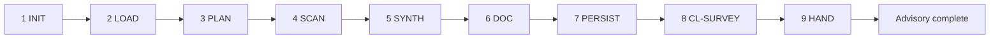

# PB-survey-codebase — Workflow

| Field | Value |
|-------|-------|
| skill_id | PB-survey-codebase |
| version | 1.0.0 |
| status | active |
| document | 03-workflow |

---

## Steps

| Step | ID | Action |
|------|-----|--------|
| 1 | INIT | Verify entry criteria; load INDEX, CL-SURVEY, INT path from WR |
| 2 | LOAD | Read INT + CONTEXT slice; set `survey_type` and scan focus |
| 3 | PLAN | Define bounded scan manifest (paths, file cap) per 05-context.md |
| 4 | SCAN | Execute T3 reads within allowlist; record evidence refs |
| 5 | SYNTH | Module map, stack, dependencies, patterns, risks |
| 6 | DOC | Build SURVEY per 04-io-contract; §6.2 intake alignment only |
| 7 | PERSIST | Write SURVEY; update Work Record |
| 8 | VAL | CL-SURVEY (10 checks); recovery ≤3 attempts |
| 9 | HAND | Advisory handoff; recommend PB-discovery-research; **stop** |

---

## Entry Criteria

| # | Criterion |
|---|-----------|
| EC-01 | `work_id` and linked INT exist |
| EC-02 | INT `status` approved at H-INTAKE, or `human_waiver` documented in WR |
| EC-03 | `project_root` resolvable and readable |
| EC-04 | Prerequisite PB-intake-classify sequential gate PASS (or PB-onboard-project gate PASS) |
| EC-05 | Explicit invocation — optional skill; not auto-chained from intake |
| EC-06 | No duplicate SURVEY for same `work_id` + `revision` unless `mode: refresh` |

---

## Exit — No Human Gate

| Field | Rule |
|-------|------|
| exit_gate | `none` |
| Agent sets | WR `status: survey_complete` on CL-SURVEY pass |
| Human options | Accept advisory handoff; invoke PB-discovery-research or skip |
| On complete | SURVEY linked in WR `artifacts[]`; recommend next only |

**Binding:** SURVEY is advisory input — not approval-blocking for Plan phase.

---

## Refresh Loop

Human or orchestrator `mode: refresh` → re-enter **PLAN** → increment `revision` → full CL-SURVEY → handoff again.

---

## Recovery

CL-SURVEY fail → fix per `checklists/survey.md` recovery table → re-VAL (≤3) → OUT-05 escalation.

---

## Next Playbook Routing (recommend only)

| Signal | Primary | Alternate |
|--------|---------|-----------|
| Survey complete; framing needed | PB-discovery-research | — |
| `alignment: requires_re_intake` | PB-intake-classify | — |
| CONTEXT.md refresh before discovery | PB-draft-doc-update | Human direct edit |

**Never embed routing-matrix rows in SURVEY output.**