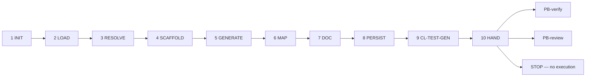

# PB-test-generate — Workflow

| Field | Value |
|-------|-------|
| skill_id | PB-test-generate |
| version | 1.0.0 |
| status | draft |
| document | 03-workflow |

---

## Overview

Ten-step linear workflow: verify entry → load TEST-PLAN + CODE → resolve TC-* → generate files → catalog paths → persist TEST-GEN → validate → hand off to PB-verify. **Never execute tests or approve H-VERIFY.**

---

## Steps

| Step | ID | Action |
|------|-----|--------|
| 1 | INIT | Verify entry criteria; load INDEX, CL-TEST-GEN, PB-test-plan gate record |
| 2 | LOAD | Read TEST-PLAN + CODE (soft) + CONTEXT slice; set `test_scope` from plan |
| 3 | RESOLVE | Extract TC-* from TEST-PLAN §3.1/§3.2; note deferred layers from §2.1 |
| 4 | SCAFFOLD | Plan file paths per CONTEXT conventions and CODE §6 |
| 5 | GENERATE | Write test source files and fixtures; set `file_action` per file |
| 6 | MAP | Build §3 TC-* → file path mapping; §4 fixtures when applicable |
| 7 | DOC | Build TEST-GEN per OUT-01; `test_phase: generate`; no execution evidence |
| 8 | PERSIST | Write `work/testing/generate/{work_id}.md`; update WR |
| 9 | VAL | CL-TEST-GEN (10 checks); recovery ≤3 attempts |
| 10 | HAND | Handoff package; **stop** — recommend PB-verify (primary), PB-review (alternate) |

---

## Entry Criteria

| # | Criterion |
|---|-----------|
| EC-ENT-01 | `work_id` and resolvable `project_root` from WR |
| EC-ENT-02 | `workflow_id` in INDEX.md |
| EC-ENT-03 | TEST-PLAN at `work/testing/plan/{work_id}.md` linked or path in WR |
| EC-ENT-04 | CODE linked or `code_gap: missing \| waiver` documented (soft) |
| EC-ENT-05 | TEST-PLAN `test_phase: plan` with §3.1 TC-* catalog |
| EC-ENT-06 | No prior TEST-GEN with conflicting `revision` unless `mode: revise` |
| EC-ENT-07 | WR records TEST-PLAN + CODE paths in `artifacts[]` |
| EC-ENT-08 | PB-test-plan gate PASS documented (prerequisite IN-33) |

---

## Exit Criteria

| # | Criterion |
|---|-----------|
| XC-01 | OUT-01 TEST-GEN persisted at `work/testing/generate/{work_id}.md` |
| XC-02 | CL-TEST-GEN `result: pass` |
| XC-03 | OUT-04 handoff includes `recommended_next_skill: PB-verify` |
| XC-04 | WR `status: test_gen_pending_review` |
| XC-05 | `test_phase: generate` in document metadata |
| XC-06 | Every `created` / `updated` file path listed in §3 catalog |
| XC-07 | No test execution commands run by agent |
| XC-08 | No H-VERIFY `decision: approve` in output |

---

## Human Gate — none

| Field | Rule |
|-------|------|
| exit_gate | `none` — generation does not bind H-VERIFY |
| Agent sets | No gate decision; handoff recommends PB-verify only |
| H-VERIFY approve | **Forbidden** — human decides after PB-verify TEST-RPT |
| On human review of TEST-GEN | Optional inline notes; may invoke PB-verify when satisfied |

**Binding on handoff:** Every in-scope TC-* addressed; all generated paths cataloged; no execution evidence; no H-VERIFY approve claim.

---

## Revise Loop

Human or orchestrator `mode: revise` → re-enter **LOAD** → increment `revision` → full CL-TEST-GEN → handoff again.

---

## Recovery

CL-TEST-GEN fail → fix per `checklists/test-generate.md` recovery table → re-VAL (≤3) → OUT-05 escalation.

---

## Next Playbook Routing (recommend only)

| Signal | Primary | Alternate |
|--------|---------|-----------|
| TEST-GEN complete, files cataloged | PB-verify | PB-review |
| `plan_alignment: requires_plan_revise` | PB-test-plan | — |
| `code_alignment: requires_code_revise` | PB-implement-* (lane) | — |
| Human skips verify | PB-review (with waiver) | — |