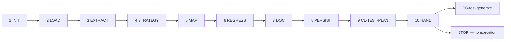

# PB-test-plan — Workflow

| Field | Value |
|-------|-------|
| skill_id | PB-test-plan |
| version | 1.0.0 |
| status | draft |
| document | 03-workflow |

---

## Overview

Ten-step linear workflow: verify entry → load upstream artifacts → extract AC → design strategy → map cases → persist plan → validate → hand off to PB-test-generate. **Never execute tests.**

---

## Steps

| Step | ID | Action |
|------|-----|--------|
| 1 | INIT | Verify entry criteria; load INDEX, CL-TEST-PLAN, artifact paths from WR |
| 2 | LOAD | Read CODE (soft) + PRD (soft) + ISS (soft) + CONTEXT slice; set `test_scope` |
| 3 | EXTRACT | Collect AC IDs from PRD, ISS, CODE §2; deduplicate and prioritize |
| 4 | STRATEGY | Select test layers in §2.1 with rationale — STD-TEST-002 |
| 5 | MAP | Build §3.1 AC → TC-* mapping; draft §3.2 case details (planned only) |
| 6 | REGRESS | Populate §4 when CODE §4 Files Changed present |
| 7 | DOC | Build TEST-PLAN per OUT-01; `test_phase: plan`; leave §9 empty |
| 8 | PERSIST | Write `work/testing/plan/{work_id}.md`; update WR |
| 9 | VAL | CL-TEST-PLAN (10 checks); recovery ≤3 attempts |
| 10 | HAND | Handoff package; **stop** — recommend PB-test-generate |

---

## Entry Criteria

| # | Criterion |
|---|-----------|
| EC-ENT-01 | `work_id` and resolvable `project_root` from WR |
| EC-ENT-02 | `workflow_id` in INDEX.md |
| EC-ENT-03 | CODE linked or `code_gap: missing \| waiver` documented |
| EC-ENT-04 | H-IMPLEMENT approved when CODE present (soft) |
| EC-ENT-05 | PRD and/or ISS / ISS-* linked for AC grounding (soft) |
| EC-ENT-06 | No prior TEST-PLAN with H-VERIFY `approve` unless `mode: revise` |
| EC-ENT-07 | WR records upstream artifact paths in `artifacts[]` |
| EC-ENT-08 | PB-implement-devops gate PASS documented (prerequisite) |

---

## Exit Criteria

| # | Criterion |
|---|-----------|
| XC-01 | OUT-01 TEST-PLAN persisted at `work/testing/plan/{work_id}.md` |
| XC-02 | CL-TEST-PLAN `result: pass` |
| XC-03 | OUT-04 handoff includes `recommended_next_skill: PB-test-generate` |
| XC-04 | WR `status: test_plan_pending_review` |
| XC-05 | `test_phase: plan` in document metadata |
| XC-06 | §9 Execution Evidence empty or explicitly `plan_only — deferred to PB-verify` |
| XC-07 | No test execution commands run by agent |

---

## Human Gate — H-VERIFY (soft, plan sub-artifact)

| Field | Rule |
|-------|------|
| gate_id | `H-VERIFY` |
| mode | **soft** — plan sub-artifact; full H-VERIFY applies after PB-verify evidence |
| Agent sets | `decision: pending` or `plan_sub_handoff: PB-test-generate` |
| Human options | `approve_plan` \| `revise_plan` \| `reject_plan` (inline) — or defer to execution chain |
| On approve_plan | WR notes plan approved; may invoke PB-test-generate |
| On revise_plan | Re-enter LOAD with `human_revise_notes`; increment `revision` |
| On reject_plan | WR `status: test_plan_rejected` |

**Binding on plan handoff:** Every in-scope AC mapped; no execution evidence; strategy layers documented.

---

## Revise Loop

Human `revise_plan` → re-enter **LOAD** → increment `revision` → full CL-TEST-PLAN → handoff again.

---

## Recovery

CL-TEST-PLAN fail → fix per `checklists/test-plan.md` recovery table → re-VAL (≤3) → OUT-05 escalation.

---

## Next Playbook Routing (recommend only)

| Signal | Primary | Alternate |
|--------|---------|-----------|
| TEST-PLAN complete, AC mapped | PB-test-generate | — |
| `code_alignment: requires_code_revise` | PB-implement-* (lane) | — |
| Missing AC grounding | PB-draft-prd / PB-decompose-issues | — |
| Human skips generation | PB-verify (with waiver) | PB-review |