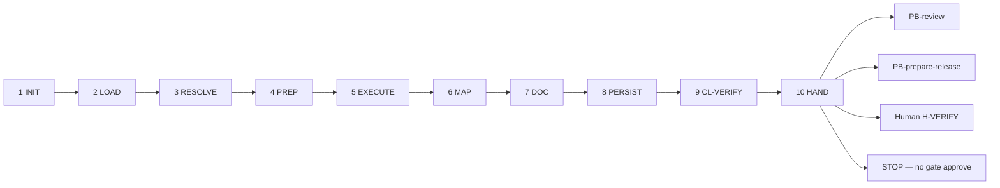

# PB-verify — Workflow

| Field | Value |
|-------|-------|
| skill_id | PB-verify |
| version | 1.0.0 |
| status | draft |
| document | 03-workflow |

---

## Overview

Ten-step linear workflow: verify entry → load upstream artifacts → resolve scope → execute suites → map TC-* results → persist TEST-RPT → validate → hand off for human H-VERIFY. **Never approve H-VERIFY.**

---

## Steps

| Step | ID | Action |
|------|-----|--------|
| 1 | INIT | Verify entry criteria; load INDEX, CL-VERIFY, PB-test-generate gate record |
| 2 | LOAD | Read TEST-PLAN + TEST-GEN (soft) + CODE (soft) + CONTEXT slice; set `test_scope` |
| 3 | RESOLVE | Extract TC-* and file paths from TEST-PLAN §3 + TEST-GEN §3 |
| 4 | PREP | Confirm environment per TEST-PLAN §8 and CONTEXT; note blockers |
| 5 | EXECUTE | Run test commands per layer; capture exit codes and timestamps |
| 6 | MAP | Update §3.2 actual results; populate §9.1–§9.3 evidence |
| 7 | DOC | Build TEST-RPT per OUT-01; `test_phase: evidence`; §10 sign-off criteria with evidence |
| 8 | PERSIST | Write `work/testing/{work_id}.md`; update WR |
| 9 | VAL | CL-VERIFY (10 checks); recovery ≤3 attempts |
| 10 | HAND | Handoff package; **stop** — H-VERIFY `decision: pending`; recommend PB-review / PB-prepare-release |

---

## Entry Criteria

| # | Criterion |
|---|-----------|
| EC-ENT-01 | `work_id` and resolvable `project_root` from WR |
| EC-ENT-02 | `workflow_id` in INDEX.md |
| EC-ENT-03 | TEST-PLAN at `work/testing/plan/{work_id}.md` linked or path in WR (soft) |
| EC-ENT-04 | TEST-GEN at `work/testing/generate/{work_id}.md` linked or path in WR (soft) |
| EC-ENT-05 | CODE linked or `code_gap: missing \| waiver` documented (soft) |
| EC-ENT-06 | TEST-PLAN `test_phase: plan` with §3.1 TC-* catalog |
| EC-ENT-07 | No prior TEST-RPT with H-VERIFY `approve` unless `mode: revise` |
| EC-ENT-08 | PB-test-generate gate PASS documented (prerequisite IN-33) |

---

## Exit Criteria

| # | Criterion |
|---|-----------|
| XC-01 | OUT-01 TEST-RPT persisted at `work/testing/{work_id}.md` |
| XC-02 | CL-VERIFY `result: pass` |
| XC-03 | OUT-04 handoff includes `gate_id: H-VERIFY`, `decision: pending` |
| XC-04 | WR `status: verify_pending_review` |
| XC-05 | `test_phase: evidence` in document metadata |
| XC-06 | §9 Execution Evidence populated with commands run (or documented waiver) |
| XC-07 | Test commands executed for all non-deferred in-scope layers |
| XC-08 | No H-VERIFY `decision: approve` in output |

---

## Human Gate — H-VERIFY (soft, evidence sub-artifact)

| Field | Rule |
|-------|------|
| gate_id | `H-VERIFY` |
| mode | **soft** — evidence sub-artifact; agent documents only |
| Agent sets | `decision: pending`; never `approve` |
| Human options | `approve` \| `revise` \| `reject` after reviewing TEST-RPT |
| On approve | WR `approvals[]` appended; may invoke PB-prepare-release |
| On revise | Re-enter EXECUTE or upstream PB-implement-* per failure type |
| On reject | WR `status: verify_rejected`; rewind per routing |

**Binding on handoff:** Execution evidence captured; TC-* results mapped; H-VERIFY pending only — agent does **not** approve gate.

---

## Revise Loop

Human `revise` at H-VERIFY or orchestrator `mode: revise` → re-enter **EXECUTE** (or **LOAD** if scope changed) → increment `revision` → full CL-VERIFY → handoff again.

---

## Recovery

CL-VERIFY fail → fix per `checklists/verify.md` recovery table → re-VAL (≤3) → OUT-05 escalation.

---

## Next Playbook Routing (recommend only)

| Signal | Primary | Alternate |
|--------|---------|-----------|
| TEST-RPT complete, evidence captured | PB-review | PB-prepare-release |
| `execution_result: fail` with code defects | PB-implement-* (lane) | PB-review |
| `plan_alignment: requires_plan_revise` | PB-test-plan | — |
| Missing TEST-GEN files on disk | PB-test-generate | — |
| Human skips review | PB-prepare-release (with waiver) | — |