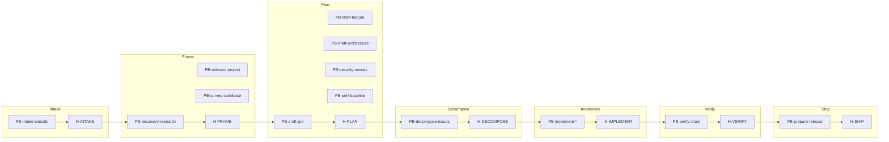

# AI Development OS v1.0 — Dependency Graph

| Field | Value |
|-------|-------|
| graph_id | GRAPH-SKILLS-001 |
| platform_version | 1.0.0 |
| status | frozen |
| updated | 2026-06-18 |
| machine_ssot | `release/v1.0/DEPENDENCY-GRAPH.yaml` |
| live_ssot | `workflows/project-orchestrator/skill-dependency-graph.yaml` |

---

## Overview

The dependency graph defines **skill ordering**, **artifact bindings**, **human gate placement**, and **workflow execution sequences** for AI Development OS v1.0. The orchestrator reads the YAML SSOT; this document provides the human-readable freeze snapshot.

---

## Phase DAG

---

## Human Gates

| Gate | After skills | Binds artifacts | Blocks |
|------|--------------|-----------------|--------|
| H-INTAKE | PB-intake-classify | INT | Frame, Plan |
| H-FRAME | PB-discovery-research, PB-onboard-project | DISC, ONBOARD | Plan |
| H-PLAN | PB-draft-prd, PB-draft-feature, PB-draft-architecture, PB-draft-issue, PB-security-assess, PB-perf-baseline, PB-draft-doc-update, PB-diagnose-bug, PB-bootstrap-project | PRD, FEAT, ARCH, ISS, SEC-ASSESS, PERF-BASE, DOC-PLAN, DIAG, SCAFFOLD | Decompose, Implement |
| H-DECOMPOSE | PB-decompose-issues | ISS-* | Implement |
| H-IMPLEMENT | PB-implement, PB-implement-* lanes | CODE | Verify |
| H-VERIFY | PB-verify, PB-review, PB-security-review, PB-perf-review, PB-test-plan, PB-test-generate | TEST-RPT, REVIEW, SEC-REVIEW, PERF-REVIEW, TEST-PLAN, TEST-GEN | Ship |
| H-SHIP | PB-prepare-release | REL | Operate |
| H-OPERATE | PB-maintenance-triage | MAINT | DONE |

---

## Workflow Execution Sequences

| workflow_id | Sequence |
|-------------|----------|
| WF-FEATURE | intake → H-INTAKE → discovery → H-FRAME → prd → arch → db → api → uiux → H-PLAN → decompose → H-DECOMPOSE → implement-backend → H-IMPLEMENT → test-plan → test-generate → verify → review → security-review → perf-review → H-VERIFY → prepare-release → H-SHIP |
| WF-BUGFIX | intake → H-INTAKE → diagnose → draft-issue → H-PLAN → implement → H-IMPLEMENT → verify → H-VERIFY |
| WF-SECURITY | intake → H-INTAKE → security-assess → H-PLAN |
| WF-PERF | intake → H-INTAKE → perf-baseline → H-PLAN |
| WF-DOCS | intake → H-INTAKE → draft-doc-update → H-PLAN |
| WF-PROJECT-EXISTING | intake → H-INTAKE → onboard → H-FRAME |
| WF-RELEASE | intake → H-INTAKE → maintenance-triage → prepare-release → H-OPERATE |

Full machine sequences: `DEPENDENCY-GRAPH.yaml` → `execution_graphs`

---

## Skill Priority Tiers (Frozen)

| Tier | Skills |
|------|--------|
| P0 | intake, discovery, onboard, draft-prd, draft-architecture, decompose, implement-*, verify, prepare-release, maintenance |
| P1 | draft-database, draft-api, draft-ui-ux, test-plan, test-generate, review, security-review, perf-review, draft-doc-update |
| P2 | security-assess, perf-baseline |
| P3 | diagnose-bug, survey-codebase, draft-feature, bootstrap-project |

---

## Key Dependencies

| Skill | Requires | Produces |
|-------|----------|----------|
| PB-discovery-research | INT, H-INTAKE | DISC |
| PB-onboard-project | INT, CONTEXT, H-INTAKE | ONBOARD |
| PB-survey-codebase | INT, H-INTAKE | SURVEY |
| PB-draft-feature | DISC, H-FRAME | FEAT |
| PB-draft-prd | INT, DISC (soft), H-FRAME (soft) | PRD |
| PB-decompose-issues | PRD or FEAT, H-PLAN | ISS-* |
| PB-implement-backend | ISS-*, H-DECOMPOSE | CODE |
| PB-verify | CODE, H-IMPLEMENT | TEST-RPT |

---

## Optional & Alternative Paths

| Skill | Optional when | Alternative to |
|-------|---------------|----------------|
| PB-survey-codebase | Human requests deep context | — |
| PB-draft-feature | Narrow slice from DISC | PB-draft-prd |
| PB-diagnose-bug | Repro partial in INT | — |
| PB-discovery-research | WF-BUGFIX, disc_waived | — |

---

## Routing SSOT

| File | Role |
|------|------|
| `routing-matrix.yaml` | Per-skill invoke preconditions |
| `skill-dependency-graph.yaml` | Global ordering + execution graphs |
| `gates.yaml` | Gate bindings + waivable_gates |

**Rule:** Orchestrator invokes `routing-matrix` row skills only — never umbrella labels (`PB-feature-planner`, `PB-implement`).