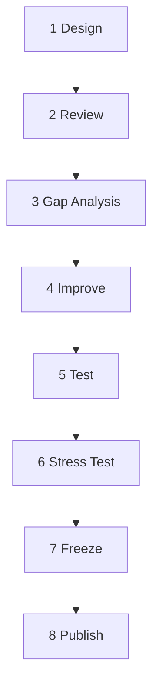

# Skill Build Lifecycle

Every skill (PB-*, MS-*, ORCH-PROJECT) follows **the same eight phases** before `status: active`.

| Phase | Deliverable | Owner | Exit criterion |
|-------|-------------|-------|----------------|
| **1 Design** | 01–04 draft, README | Author | Purpose + I/O + workflow sketched |
| **2 Review** | `10-review.md` | Principal Architect | Approve with changes / Reject |
| **3 Gap Analysis** | Gap table vs STD-SKILL-001 + graph | MS-* or human | All P0 gaps listed |
| **4 Improve** | 05–09, checklist, registry | Author | P0 gaps closed |
| **5 Test** | `11-test-plan.md` HT+ET+FT pass | QA | Promotion formula met; `test-runs/latest-gate.md` VERDICT PASS |
| **6 Stress Test** | `12-qa-scenarios.md` ST suite | QA | ≥80% ST pass |
| **7 Freeze** | `registry.yaml` locked, changelog | Architect | No open P0; spec_sha pinned |
| **8 Publish** | INDEX `active`, routing-matrix row | Maintainer | Orchestrator integration verified |

Track phase in `skills/meta-skill/SKILL-CATALOG.yaml` → `lifecycle_phase` per skill.

## Sequential promotion rule

**One skill at a time.** Do not author, review, or freeze skill *N+1* until skill *N* has:

1. `scripts/verify-skill-spec.sh playbooks/<skill>/` → exit 0
2. `test-runs/latest-gate.md` with `VERDICT: PASS` and manual rubric table
3. `10-review.md` sequential re-review ≥70 with no open P0
4. `11-test-plan.md` promotion evidence updated

Build order for planning skills: `PB-intake-classify` → `PB-discovery-research` → `PB-draft-prd` → `PB-feature-planner` (umbrella) → `PB-draft-architecture`.

Build order for engineering skills: `PB-draft-database` → `PB-draft-api` → `PB-draft-ui-ux` → `PB-implement` (umbrella) → `PB-implement-backend` → `PB-implement-frontend` → `PB-implement-mobile` → `PB-implement-devops`.

Engineering gates MAY use fixture upstream artifacts (ARCH, PRD, ISS-*) when planning-chain gates are still pending — document in `test-runs/latest-gate.md`.

Build order for quality skills: `PB-test-plan` → `PB-test-generate` → `PB-review` → `PB-security-review` → `PB-perf-review` → `PB-draft-doc-update` → `PB-prepare-release`.

Prerequisite: last engineering gate (`PB-implement-devops`) PASS. Quality gates MAY use fixture CODE / TEST-PLAN upstream artifacts.

**Status (2026-06-18):** Full delivery spine **32 active playbooks** — planning, engineering, quality, verify, ship, onboard, bugfix, maintenance, survey, feature-spec, security-assess, perf-baseline. E2E-WF-FEATURE canonical path verified in `workflows/WF-FEATURE/phases.yaml`. Remaining: meta skills (`MS-*`) promotion, Foundation freeze sign-off.