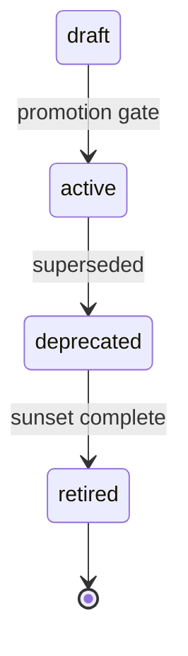

# STD-SKILL-001 — Universal Skill Contract

| Field | Value |
|-------|-------|
| standard_id | STD-SKILL-001 |
| name | Universal Skill Contract |
| version | 1.0.0 |
| status | active |
| effective | 2026-06-18 |
| supersedes | playbooks/README.md informal convention |
| audience | Playbook authors, orchestrator, platform adapters |

**Normative keywords:** MUST, MUST NOT, SHOULD, SHOULD NOT, MAY per RFC 2119 sense.

Every playbook (`skill_id: PB-*`) **inherits this contract in full**. Deviations require architect approval recorded in `10-review.md` and `registry.yaml` `contract_waivers[]`.

---

## 1. Identity

| Field | Rule |
|-------|------|
| `skill_id` | `PB-<kebab-case>` — globally unique, immutable after `active` |
| `name` | Human-readable title |
| `version` | Semver `MAJOR.MINOR.PATCH` — spec + contract |
| `prompt_version` | Semver — `09-system-prompt.md` only; may diverge from spec patch |
| `status` | `draft` \| `active` \| `deprecated` \| `retired` |
| `exit_gate` | `H-*` human gate id or `none` |
| `orchestrator_phase` | SDLC phase(s) this skill runs in |

Platform adapters MAY alias `PB-*` to vendor "skills" under `skills/` — **SSOT remains** `playbooks/<kebab-name>/`.

---

## 2. Folder Structure

### 2.1 Playbook root (MUST)

```
{AI_DEV_OS_HOME}/playbooks/<kebab-name>/
├── README.md                 # Skill index — mandatory
├── registry.yaml             # Machine SSOT — mandatory at promotion
├── 01-purpose.md
├── 02-responsibilities.md
├── 03-workflow.md
├── 04-io-contract.md
├── 05-context.md
├── 06-quality.md
├── 07-edge-cases.md
├── 08-limitations.md
├── 09-system-prompt.md
├── 10-review.md
├── 11-test-plan.md
├── 12-qa-scenarios.md        # SHOULD for active; MAY start in draft
├── fixtures/                 # MUST before active
│   ├── projects/
│   └── inputs/
└── examples/                 # MUST before active (or 17-examples.md)
    ├── golden/
    └── anti-patterns/
```

### 2.2 OS-level companions (MUST register)

| Artifact | Path | Owner |
|----------|------|-------|
| Checklist | `{AI_DEV_OS_HOME}/checklists/<kebab-short>.md` | `CL-<SHORT>` id |
| INDEX row | `{AI_DEV_OS_HOME}/INDEX.md` §Playbooks | Maintainer |
| Routing row | `workflows/project-orchestrator/routing-matrix.yaml` | Maintainer |
| Document template | `{AI_DEV_OS_HOME}/templates/<type>/template.md` | If skill produces TP-* |

`<kebab-short>`: intake, discovery, draft-prd, etc.

### 2.3 Forbidden locations

| Path | Reason |
|------|--------|
| `skills/<name>/01-purpose.md` | Adapters only — not SSOT |
| `prompts/` as sole spec | Prompts are derived from `09-system-prompt.md` |
| Project repo `playbooks/` | OS is global via `AI_DEV_OS_HOME` |

---

## 3. Mandatory Files

### 3.1 Core spec (MUST — all 11 + README)

| File | Purpose | Min size guidance |
|------|---------|-------------------|
| `README.md` | Entry point, quick reference, spec index | Consolidated user doc |
| `01-purpose.md` | Why, when, when not, SRP one-liner | Unambiguous boundaries |
| `02-responsibilities.md` | P/S/O duties, N non-responsibilities, gates | Firewall vs other skills |
| `03-workflow.md` | Steps, decisions, recovery, routing | Diagrams + linear reference |
| `04-io-contract.md` | Canonical IN-*/OUT-* | Undocumented I/O forbidden |
| `05-context.md` | T0–T3, budgets, forbidden paths, memory | Token caps explicit |
| `06-quality.md` | AC-* criteria, checklist map | Measurable pass/fail |
| `07-edge-cases.md` | EC-* catalog | ≥15 P0 scenarios minimum |
| `08-limitations.md` | Honest cannot-do | Sets expectations |
| `09-system-prompt.md` | Deployable prompt between markers | No prompt outside markers |
| `10-review.md` | Architect review record | Required before `active` |
| `11-test-plan.md` | HT/ET/FT + promotion gate | Executable criteria |

### 3.2 Promotion artifacts (MUST before `status: active`)

| Artifact | Requirement |
|----------|---------------|
| `registry.yaml` | Enums, routing, versions, checklist id |
| `checklists/<kebab-short>.md` | CL-* verbatim from 06-quality map |
| `fixtures/` | ≥1 project fixture per entry mode |
| `examples/golden/` | ≥1 golden handoff per primary path |
| `examples/anti-patterns/` | ≥3 documented failures |
| INDEX + routing-matrix rows | Orchestrator integration |

### 3.3 Optional extensions (MAY)

| File | Use when |
|------|----------|
| `12-qa-scenarios.md` | Large scenario catalogs (>30) |
| `13-integrations.md` | Multiple downstream consumers |
| `14-changelog.md` | If not using registry `changelog[]` only |

Do **not** split validation/handoff into separate files unless content exceeds ~400 lines — prefer sections inside 03/04/06.

---

## 4. Mandatory Sections (per file)

Every numbered file MUST begin with metadata table:

```markdown
| Field | Value |
|-------|-------|
| skill_id | PB-<name> |
| version | x.y.z |
| status | draft |
| document | NN-<name> |
```

### 4.1 Section checklist

| File | Required sections |
|------|-------------------|
| `01-purpose` | One-Liner, Problem, When to Use, When Not, Single Responsibility, Boundaries |
| `02-responsibilities` | Primary (P1–Pn), Secondary, Optional, Non-Responsibilities (N1–Nn), Human vs Agent matrix, Required dependencies |
| `03-workflow` | Overview, Diagram, Steps, Entry criteria (EC-ENT-*), Exit criteria, Human gate, Revise loop, Recovery, Next-skill routing (recommend only) |
| `04-io-contract` | Overview, Input summary, Inputs (IN-*), Outputs (OUT-*), Human-only outputs, Invoke template, Contract rule |
| `05-context` | Layers T0–T3, Allowed reads, Forbidden reads, Budget table, Memory strategy |
| `06-quality` | Quality dimensions, AC-* table, CL-* map, Required pass scorecard |
| `07-edge-cases` | P0 table (ID, trigger, behaviour, human?), Recovery |
| `08-limitations` | Cannot reliably do, Human required, AI limits |
| `09-system-prompt` | Deployment, Determinism contract, Output order, PROMPT START/END, NEVER list |
| `10-review` | Executive summary, Dimension scores, P0/P1 findings, Recommendation, Readiness score |
| `11-test-plan` | Prerequisites, HT, ET, FT, Promotion gate formula |
| `README` | Overview, Quick reference, Spec index, Version/promotion status |

---

## 5. Inputs (Universal)

### 5.1 Contract rule

**Undocumented inputs are forbidden.** Agent MUST NOT rely on fields not listed in `04-io-contract.md`.

### 5.2 Input categories (every skill MUST declare)

| Category | ID prefix | Examples |
|----------|-----------|----------|
| Invocation | IN-01–09 | `skill_invocation`, `work_id`, `revision`, `mode` |
| Human / request | IN-10–19 | Domain-specific request bodies |
| Environment | IN-20–29 | `ai_dev_os_home`, `project_root`, `session_context` |
| OS artifacts (read) | IN-30–39 | INDEX, checklist, self-spec, templates |
| Project artifacts (read) | IN-40–49 | CONTEXT.md, upstream artifacts, Work Record |
| Revise / loop | IN-50–59 | `human_revise_notes`, prior artifact paths |
| Orchestrator envelope | IN-60–69 | `orchestrator_ref`, `artifact_refs[]`, `token_budget_remaining` |

Skills MAY omit unused numeric ranges but MUST NOT reuse IDs for different meanings.

### 5.3 Universal invocation envelope (from ORCH-PROJECT)

When invoked by orchestrator, every skill MUST accept:

```yaml
orchestrator_ref:
  run_id: RUN-###
  orchestrator_id: ORCH-PROJECT
  workflow_id: WF-*
  current_phase: <phase>
playbook_invocation:
  skill_id: PB-*
  mode: new | resume | revise
work_id: WR-###
project_root: <path|null>
ai_dev_os_home: <path>
artifact_refs: []
token_budget_remaining: <int>
```

Standalone invocation MUST still provide `work_id`, `project_root` (when required), `ai_dev_os_home`.

### 5.4 Input attribute schema (per IN-*)

Each input MUST document:

| Attribute | Required |
|-----------|----------|
| **Required** | yes \| no \| conditional |
| **Source** | Human, WR, OS, orchestrator |
| **Format** | Type / enum / path |
| **Validation rules** | Bullet list |
| **Default behavior** | When absent |

---

## 6. Outputs (Universal)

### 6.1 Contract rule

**Fixed output order is mandatory** — declared in `09-system-prompt.md` §Output Order. Agent MUST NOT reorder or omit required blocks on success path.

### 6.2 Universal output set

| ID | Name | Required | Blocks handoff |
|----|------|----------|----------------|
| OUT-01 | Primary artifact | yes* | yes |
| OUT-02 | Work Record update | yes | yes |
| OUT-03 | Validation Record | yes | yes if `fail` |
| OUT-04 | Handoff Package | yes | — |
| OUT-05 | Escalation Package | conditional | — |
| OUT-06 | Context Plan | optional | — |
| OUT-07 | Context Log | optional | — |

\*Partial OUT-01 allowed only if explicitly defined (e.g. low-confidence intake).

### 6.3 Validation Record (OUT-03) — MUST

```yaml
checklist_id: CL-<SHORT>
result: pass | fail
failed_items: []
attempt: 1-3
agent_confidence: high | medium | low  # if applicable
timestamp: ISO-8601
evidence_links: []
```

### 6.4 Handoff Package (OUT-04) — MUST sections

| Section | Content |
|---------|---------|
| Summary | ≤10 lines |
| Outputs | Paths to OUT-01, OUT-02 |
| Validation Record | Embedded OUT-03 |
| Decisions needed | Human gate questions |
| Open questions | From primary artifact |
| Recommended next skill | Text only — **never auto-started** |
| Approval block | `gate_id`, `decision: pending` |
| Context reload list | Artifacts for next session |

### 6.5 Stop marker (MUST)

Every `09-system-prompt.md` MUST end successful runs with HTML comment stop marker:

```html
<!-- END PB-<kebab-name> — await H-<GATE> -->
```

---

## 7. Validation

### 7.1 Layers

| Layer | Id | Owner | When |
|-------|-----|-------|------|
| Entry | EC-ENT-* | Skill workflow | Before work starts |
| Step | VC-* | Skill workflow | Between internal steps |
| Agent self-check | CL-* | Skill agent | Before OUT-04 |
| Human gate | H-* | Human | After OUT-04 |
| Orchestrator | CL-ORCH | ORCH-PROJECT | On tick ingest |
| Promotion | G-PROMOTE | QA / architect | draft → active |

### 7.2 Checklist contract (MUST)

Every skill MUST have `{AI_DEV_OS_HOME}/checklists/<kebab-short>.md`:

| Property | Rule |
|----------|------|
| `checklist_id` | `CL-<SHORT>` uppercase |
| Items | Numbered; each maps to AC-* in `06-quality.md` |
| Pass rule | 100% items for handoff unless skill defines explicit partial path |
| Recovery | Fail category → return step → max attempts |

Checklist file is **SSOT** for validation items; `03-workflow` and `09-system-prompt` reference — do not duplicate verbatim in three places (use registry or include by reference).

### 7.3 Acceptance criteria (AC-*)

| Property | Rule |
|----------|------|
| ID format | `AC-<DIM>-##` (DIM = ACC, COM, SEC, CON, PRD, DOC, …) |
| Measurement | Objective pass/fail |
| Required vs golden | Required = promotion blockers |

---

## 8. Handoff

### 8.1 Rules (MUST)

| Rule | Description |
|------|-------------|
| H1 | Skill **recommends** next skill only — MUST NOT invoke it |
| H2 | `decision: pending` until human approves at `exit_gate` |
| H3 | Handoff cites paths — not chat paraphrase |
| H4 | `recommended_next_skill` MUST exist in INDEX §Playbooks |
| H5 | On `requires_re_intake` or equivalent, recommend `PB-intake-classify` |
| H6 | Orchestrator ingests OUT-04 per `integrations.md` iff rules |

### 8.2 Modes

| mode | Trigger | Behaviour |
|------|---------|-----------|
| `new` | First run | Full workflow |
| `resume` | Interrupted session | Continue from last step |
| `revise` | Human gate revise | Human notes authoritative; increment `revision` |

---

## 9. Logging

### 9.1 Skill-level logging (MUST record)

| Log | Destination | Contents |
|-----|-------------|----------|
| Validation attempts | OUT-03 `attempt` | Failed checklist items per try |
| Context budget | OUT-07 or WR note | Tokens/layers used if tracked |
| Persist status | Handoff | `paths[]` or `persist: pending` |
| Escalation | OUT-05 | Failure code, return step, human actions |

### 9.2 Project artifact paths (SHOULD)

```
{project_root}/work/logs/{skill_id}/{work_id}/{revision}.md
```

Minimum fields: `timestamp`, `skill_id`, `prompt_version`, `checklist_result`, `ors_run_id` (if orchestrated).

### 9.3 Orchestrator tick log (when orchestrated)

ORCH-PROJECT writes `{project_root}/work/orchestrator/logs/{run_id}.md` — skills MUST NOT duplicate full tick state.

### 9.4 Forbidden in logs

- Secrets, tokens, PII — use `[REDACTED]`
- Full `src/**` dumps
- Undocumented outputs presented as authoritative

---

## 10. Examples

### 10.1 Required example types (before `active`)

| Type | Path | Count |
|------|------|-------|
| Golden path | `examples/golden/` | ≥1 per primary `mode` |
| Anti-pattern | `examples/anti-patterns/` | ≥3 |
| Revise loop | `examples/golden/` or `12-qa-scenarios.md` | ≥1 |
| Escalation | `examples/anti-patterns/` | ≥1 |

### 10.2 Golden snapshot format (MUST)

Each golden MUST include:

```yaml
scenario_id: HT-##
skill_id: PB-*
prompt_version: x.y.z
inputs: <invoke yaml>
expected_outputs:
  out_01_path: ...
  checklist_result: pass
  gate_decision: pending
  recommended_next_skill: PB-*
```

### 10.3 Regression

Prompt or `registry.yaml` change MUST re-run golden hashes — see §14 Versioning.

---

## 11. Review

### 11.1 Architect review (MUST before `active`)

`10-review.md` MUST contain:

| Section | Content |
|---------|---------|
| Reviewer role | Principal AI Systems Architect (or delegate) |
| Recommendation | Approve \| Approve with changes \| Reject |
| Dimension scores | 1–5 on SRP, completeness, workflow, context, security, integration |
| P0 blockers | Explicit list |
| Production readiness score | 0–100 |

No skill MAY ship to `active` with open P0 blockers.

### 11.2 Review triggers (MUST re-review)

- MAJOR version bump
- `exit_gate` change
- New OUT-* type
- Removal of non-responsibility (N-*)
- Breaking change per §16

---

## 12. Tests

### 11-test-plan.md MUST define

| Suite | Purpose | Promotion |
|-------|---------|-----------|
| HT | Happy path | 100% pass |
| ET | Edge cases | 100% P0 pass |
| FT | Failure / escalation | 100% pass |
| RT | Golden regression | 100% pass |
| IT | Orchestrator integration | 100% if orchestrated |
| ST | Stress / budget | ≥80% SHOULD |

**Promotion gate (default):**

```
HT 100% AND ET(P0) 100% AND FT 100% AND RT 100% AND IT 100%
```

Skills MAY tighten; MUST NOT loosen without architect waiver.

### Fixtures (MUST before active)

```
fixtures/
├── projects/<fixture-name>/   # CONTEXT.md, minimal tree
└── inputs/<scenario-id>.yaml
```

---

## 13. Versioning

### 13.1 Semver rules

| Bump | When |
|------|------|
| **MAJOR** | Breaking contract change (§16) |
| **MINOR** | New capability, new optional IN/OUT, new EC-* |
| **PATCH** | Clarifications, typos, non-behaviour prompt tuning |

`prompt_version` follows same rules but MAY patch independently for wording-only prompt fixes if `spec_sha` unchanged.

### 13.2 registry.yaml (MUST at promotion)

```yaml
skill_id: PB-<name>
spec_version: 1.0.0
prompt_version: 1.0.0
status: draft
exit_gate: H-*
checklist_id: CL-<SHORT>
contract: STD-SKILL-001@1.0.0
enums: {}
routing:
  workflows: []
  phases: []
  next_candidates: []
changelog: []
contract_waivers: []
```

### 13.3 Traceability (MUST)

Work Record `os_refs` SHOULD record:

```yaml
os_refs:
  skill: PB-*
  spec_version: x.y.z
  prompt_version: x.y.z
  spec_sha: <optional hash>
```

---

## 14. Deprecation

### 14.1 Status lifecycle



### 14.2 deprecated (MUST when setting)

| Action | Requirement |
|--------|-------------|
| INDEX flag | `status: deprecated` |
| `registry.yaml` | `superseded_by: PB-*` or `retirement_date` |
| `01-purpose.md` | Banner: use `<replacement>` |
| Orchestrator | `routing-matrix.yaml` redirect or block with message |
| Minimum notice | 90 days SHOULD before `retired` |

### 14.3 retired

- MUST NOT be invoked by orchestrator
- Spec files MAY remain read-only for audit
- Adapters MUST fail fast with migration link

---

## 15. Breaking Changes

### 15.1 Definition

A change is **breaking** if any of:

| # | Breaking condition |
|---|-------------------|
| B1 | Removes or renames required IN-* / OUT-* |
| B2 | Changes output block order |
| B3 | Tightens entry criteria without waiver path |
| B4 | Changes `exit_gate` id |
| B5 | Removes checklist item (tightens validation) |
| B6 | Changes primary artifact path convention |
| B7 | Alters enum values without backward mapping |

### 15.2 Breaking change process (MUST)

1. Bump **MAJOR** `spec_version`
2. Document in `registry.yaml` `changelog[]` with migration steps
3. Architect re-review in `10-review.md`
4. Re-run full promotion gate + golden RT suite
5. Update orchestrator `routing-matrix.yaml` if routing affected
6. Provide `MIGRATION.md` section in README for one MAJOR cycle

### 15.3 Non-breaking (examples)

- New optional IN-*
- New edge case EC-*
- New golden example
- Additional non-responsibility N-*

---

## 16. Quality Gates

### 16.1 Skill gates (draft → active)

| Gate | Criterion |
|------|-----------|
| G-SKILL-01 | STD-SKILL-001 folder + files complete |
| G-SKILL-02 | `10-review.md` ≥70/100, no P0 |
| G-SKILL-03 | Promotion formula pass |
| G-SKILL-04 | `checklists/<kebab-short>.md` exists |
| G-SKILL-05 | INDEX + routing-matrix registered |
| G-SKILL-06 | `09-system-prompt.md` markers + NEVER list present |
| G-SKILL-07 | ≥15 EC-* in `07-edge-cases.md` |
| G-SKILL-08 | Orchestrator integration test (if in routing matrix) |

### 16.2 Per-run gates

| Gate | Type | Owner |
|------|------|-------|
| CL-* | AI self-check | Agent |
| H-* | Human approval | Human |
| CL-ORCH | Orchestrator ingest | ORCH-PROJECT |

### 16.3 Quality dimensions (every skill SHOULD score in 06-quality)

| Dimension | Code |
|-----------|------|
| Accuracy | ACC |
| Completeness | COM |
| Consistency | CON |
| Security | SEC |
| Performance/budget | PER |
| Documentation | DOC |
| Testability | TST |

---

## 17. Orchestrator Integration (MUST for routed skills)

Every skill in `routing-matrix.yaml` MUST publish in `registry.yaml`:

```yaml
routing:
  workflows: [WF-*]
  phases: [Intake|Frame|Plan|...]
  requires_artifacts: [INT, ...]
  produces_artifacts: [DISC, ...]
  requires_gates: [H-INTAKE, ...]
  exit_gate: H-*
  next_candidates: [PB-*]
  entry_denied_redirect: PB-* | null
  rewind_phase: <phase>
```

Handoff MUST be ingestible per `workflows/project-orchestrator/DESIGN.md` §15.

---

## 18. Compliance Checklist (author)

Before requesting `active`:

- [ ] Folder matches §2.1
- [ ] All §3.1 files present with §4.1 metadata
- [ ] IN-* and OUT-* complete in `04-io-contract.md`
- [ ] CL-* checklist file exists and maps to AC-*
- [ ] `09-system-prompt.md` output order + stop marker + NEVER
- [ ] `07-edge-cases.md` ≥15 P0 scenarios
- [ ] `11-test-plan.md` promotion gate defined
- [ ] `examples/golden/` + `anti-patterns/` populated
- [ ] `fixtures/` populated
- [ ] `registry.yaml` complete
- [ ] INDEX + routing-matrix rows added
- [ ] `10-review.md` signed with score ≥70, no P0

---

## 19. Document History

| Version | Date | Change |
|---------|------|--------|
| 1.0.0 | 2026-06-18 | Initial universal contract STD-SKILL-001 |

---

## 20. References

| Doc | Path |
|-----|------|
| Playbook scaffold | `playbooks/_contract-scaffold/` |
| Orchestrator design | `workflows/project-orchestrator/DESIGN.md` |
| OS index | `INDEX.md` |
| Intake reference impl | `playbooks/intake-classify/` |
| Discovery reference impl | `playbooks/discovery-research/` |