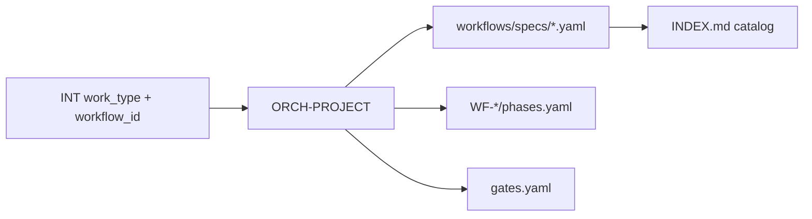

# Workflow Engine

| Field | Value |
|-------|-------|
| document_id | WF-ENGINE-001 |
| version | 1.0.0 |
| status | active |
| owner | Workflow Owner |
| updated | 2026-06-18 |

---

## 1. Purpose

The workflow engine **routes work** through phased skill sequences under ORCH-PROJECT. It defines *what* runs and *when* — not *how* skills execute (playbooks) or *how* ticks run (`DESIGN.md`).

## 2. Architecture



### SSOT split

| Concern | SSOT | Consumed by |
|---------|------|-------------|
| Workflow specification | `workflows/specs/WF-*.yaml` | Humans, MS-workflow-review |
| Execution DAG | `workflows/WF-*/phases.yaml` | ORCH-PROJECT ROUTE step |
| Skill dependencies | `skill-dependency-graph.yaml` | Planning; phases derived |
| Gate registry | `gates.yaml` | ORCH-PROJECT, specs |
| Routing eligibility | `routing-matrix.yaml` | ORCH-PROJECT preflight |

**Rule:** `phases.yaml` MUST align with its `specs/WF-*.yaml` `execution_sequence`. Spec is normative for inputs/outputs/gates; phases are machine execution.

## 3. Workflow classes

| Class | Description | Examples |
|-------|-------------|----------|
| **End-to-end** | Full delivery or project lifecycle | WF-FEATURE, WF-PROJECT-NEW |
| **Slice** | Single phase spine for focused work | WF-DISCOVERY, WF-PRD, WF-TESTING |
| **Operate** | Run/ship/maintenance | WF-RELEASE, WF-MAINTENANCE |

## 4. Catalog (user-facing → `workflow_id`)

| Business name | workflow_id | Class | Terminal gate |
|---------------|-------------|-------|---------------|
| New Project | WF-PROJECT-NEW | end-to-end | H-PLAN |
| Existing Project | WF-PROJECT-EXISTING | end-to-end | H-FRAME |
| Discovery / Research | WF-DISCOVERY | slice | H-FRAME |
| PRD | WF-PRD | slice | H-PLAN |
| Feature | WF-FEATURE | end-to-end | H-SHIP |
| Enhancement | WF-ENHANCEMENT | end-to-end | H-PLAN |
| Bug Fix | WF-BUGFIX | end-to-end | H-VERIFY |
| Refactor | WF-REFACTOR | end-to-end | H-PLAN |
| Testing | WF-TESTING | slice | H-VERIFY |
| Release | WF-RELEASE | end-to-end | H-OPERATE |
| Maintenance | WF-MAINTENANCE | end-to-end | H-OPERATE |

**Research** is an alias for **Discovery** — same skill (`PB-discovery-research`), same workflow (`WF-DISCOVERY`).

## 5. Lifecycle

```text
1. Human/raw_request → PB-intake-classify → INT.workflow_id
2. H-INTAKE approves workflow_id
3. ORCH-PROJECT loads specs/WF-{id}.yaml + phases.yaml
4. For each step: preflight skills/templates/standards → invoke → gate → advance
5. Terminal: exit_criteria satisfied → ORS done
```

## 6. Workflow-level quality gates (G-WF)

| Gate | Applies | Criterion |
|------|---------|-----------|
| G-WF-01 | All | Spec + phases.yaml exist |
| G-WF-02 | All | Required skills in INDEX |
| G-WF-03 | All | Terminal gate in sequence |
| G-WF-04 | Slice | Entry prerequisites documented |
| G-WF-05 | End-to-end | Happy path in 11-test-plan (orchestrator) |

## 7. Failure recovery (engine-level)

| Code | Meaning | Engine action |
|------|---------|---------------|
| E-WF-PREFLIGHT | Missing input/artifact | Hold; list spec `inputs.required` |
| E-WF-GATE | Human reject | Abort or rewind per gate decision |
| E-WF-SKILL | Playbook escalation | Delegate to playbook recovery; then ORCH |
| E-WF-PLANNED | Skill status `planned` | Block invoke; human ack or waiver |
| E-WF-REWIND | DISC requires_re_intake | Reset to Intake per DESIGN §3 |

Per-workflow recovery tables live in each `specs/WF-*.yaml`.

## 8. Related documents

| Doc | Path |
|-----|------|
| Spec schema | `WORKFLOW-SPEC-SCHEMA.md` |
| Spec template | `_spec-template.yaml` |
| All specifications | `specs/README.md` |
| Workflow standard | `standards/engineering/STD-WF-001.md` |
| Orchestrator | `project-orchestrator/DESIGN.md` |