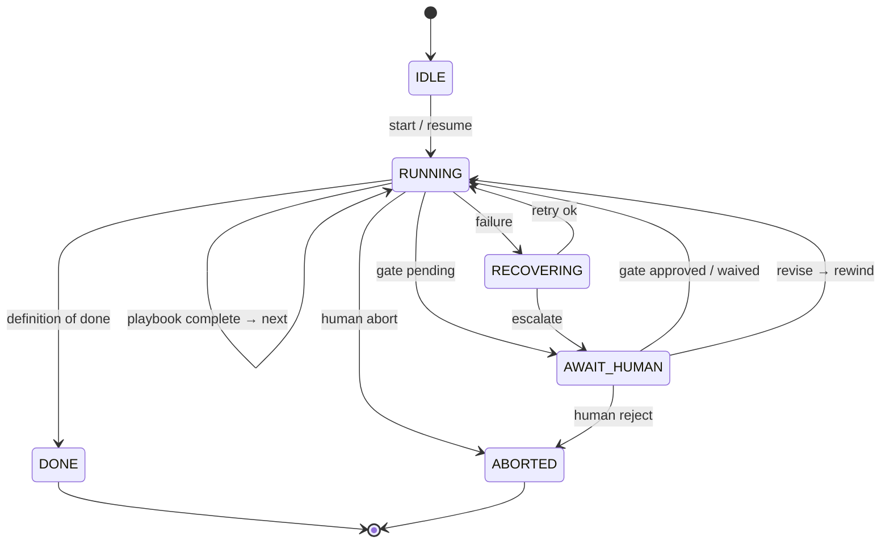
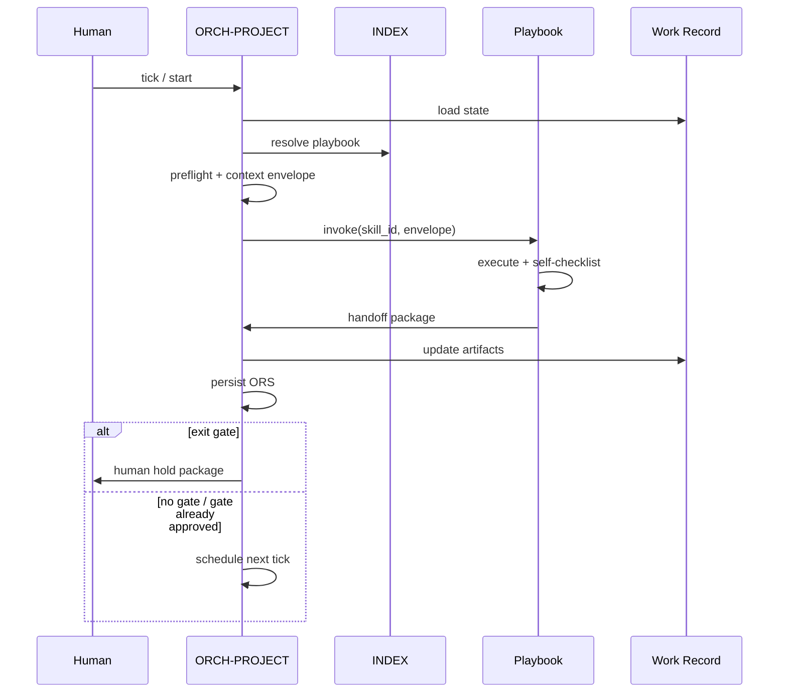
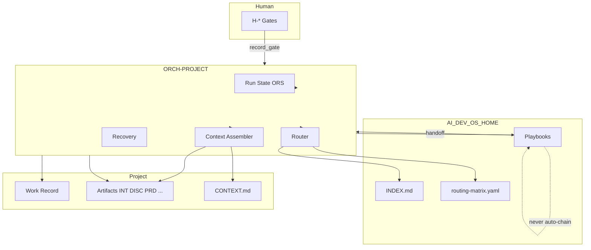

# ORCH-PROJECT — Project Orchestrator Design

| Field | Value |
|-------|-------|
| orchestrator_id | ORCH-PROJECT |
| alias | PB-project-orchestrator |
| version | 0.1.0-design |
| status | design |
| document | DESIGN |
| date | 2026-06-18 |
| scope | Design only — no prompts |

---

## 1. Purpose

### One-liner

**Route, sequence, gate, and recover work across the AI Dev OS** — invoking atomic playbooks in the correct order while preserving human authority at every phase transition.

### Problem

Individual playbooks (intake, discovery, PRD, implement, etc.) are intentionally **single-responsibility** and **stop after handoff**. Without a central coordinator:

| Failure | Cost |
|---------|------|
| Playbooks auto-chain | Governance bypass; H-* gates skipped |
| Humans manually track “what’s next” | Context loss; wrong skill invoked |
| No durable run state | Sessions cannot resume mid-workflow |
| Inconsistent retry/recovery | Duplicate artifacts; stuck work items |
| Ad-hoc context loading | Token waste; cross-project leakage |

### Role in the OS

ORCH-PROJECT is the **central brain** — not a worker. It:

- Owns **workflow state** and **phase progression**
- **Selects and invokes** exactly one playbook at a time
- **Blocks** until human gates pass (advisory model — human acts; orchestrator records)
- **Never** performs intake, discovery, PRD, or implementation work itself

### Non-goals

- Replace playbook specs or system prompts
- Auto-approve human gates
- Enforce via CI (advisory gates only)
- Store project domain knowledge (lives in `CONTEXT.md` + artifacts)

---

## 2. Responsibilities

### Primary (ORCH-P1–P12)

| # | Responsibility | Owner action |
|---|----------------|--------------|
| ORCH-P1 | Accept new work or resume existing `work_id` | Validate invocation envelope |
| ORCH-P2 | Bind work to `workflow_id` from approved INT | After H-INTAKE only |
| ORCH-P3 | Maintain authoritative **Run State** | Persist ORS artifact |
| ORCH-P4 | Compute **next eligible playbook** | Routing matrix + gate history |
| ORCH-P5 | Assemble **invocation envelope** per playbook I/O | Context router T0–T3 |
| ORCH-P6 | Invoke **one** playbook per tick | No parallel playbooks same work_id |
| ORCH-P7 | Ingest playbook **handoff package** | Validate against contract |
| ORCH-P8 | Advance or hold **phase** | Gate-dependent |
| ORCH-P9 | Record **human gate decisions** | Append-only approvals |
| ORCH-P10 | Execute **retry/recovery policy** | Categorized failures |
| ORCH-P11 | Emit **orchestrator handoff** to human when blocked | Clear decisions needed |
| ORCH-P12 | Terminate run on Done or Abort | Definition of Done check |

### Secondary (ORCH-S1–S8)

| # | When | Action |
|---|------|--------|
| ORCH-S1 | Playbook recommends alternate | Present options; human picks |
| ORCH-S2 | `requires_re_intake` from DISC | Rewind to Intake phase |
| ORCH-S3 | Multi work_id batch (maintenance) | Fan-out child runs |
| ORCH-S4 | Waiver documented | Allow phase skip with audit |
| ORCH-S5 | Stale artifact detected | Trigger refresh playbook |
| ORCH-S6 | Token budget exceeded | Degrade context tier |
| ORCH-S7 | Playbook `status: draft` | Warn human; require explicit ack |
| ORCH-S8 | Cross-work dependency | Block with dependency graph |

### Explicit non-responsibilities (ORCH-N1–N10)

| # | Forbidden | Owner |
|---|-----------|-------|
| ORCH-N1 | Classify work | PB-intake-classify |
| ORCH-N2 | Write domain artifacts (INT, DISC, PRD, code) | Respective playbooks |
| ORCH-N3 | Approve H-* gates | Human |
| ORCH-N4 | Modify playbook specs | OS maintainer |
| ORCH-N5 | Run two mutating playbooks concurrently on same work_id | — |
| ORCH-N6 | Override approved INT/DISC without re-intake/re-frame | Human + rewind |
| ORCH-N7 | Invoke playbook without entry criteria | — |
| ORCH-N8 | Skip Run State persistence | — |
| ORCH-N9 | Use chat as SSOT | Artifacts only |
| ORCH-N10 | Copy OS into project repos | Global `AI_DEV_OS_HOME` |

---

## 3. Workflow

### Macro lifecycle



### Orchestrator tick (one cycle)

| Step | ID | Action |
|------|-----|--------|
| 1 | LOAD | Load ORS + WR + INDEX + routing matrix |
| 2 | VALIDATE | Check run invariants (§State Management) |
| 3 | RESOLVE | If `awaiting_human_gate` → emit hold message; **stop tick** |
| 4 | ROUTE | Compute `next_playbook_id` from phase + artifacts + gates |
| 5 | PREFLIGHT | Playbook entry criteria + dependencies |
| 6 | CONTEXT | Build invocation envelope (§Context Management) |
| 7 | INVOKE | Dispatch playbook (§Skill Invocation) |
| 8 | INGEST | Parse handoff; validate OUT-* contract |
| 9 | GATE | If playbook exit gate → set `awaiting_human_gate` |
| 10 | TRANSITION | Update phase/status; persist ORS |
| 11 | BRANCH | Done? / Recover? / Next tick |

### Phase model (workflow spine)

| Phase | Typical playbooks | Human gate |
|-------|-------------------|------------|
| **Intake** | PB-intake-classify | H-INTAKE |
| **Frame** | PB-discovery-research, PB-onboard-project | H-FRAME |
| **Plan** | PB-draft-prd, PB-draft-architecture, PB-draft-issue, PB-security-assess, PB-perf-baseline, PB-draft-doc-update | H-PLAN |
| **Decompose** | PB-decompose-issues | H-DECOMPOSE |
| **Implement** | PB-implement | H-IMPLEMENT (optional) |
| **Verify** | PB-verify, PB-review | H-VERIFY |
| **Ship** | PB-prepare-release | H-SHIP |
| **Operate** | PB-maintenance-triage | H-OPERATE |

Phase graph is **workflow-specific** (`WF-*`). ORCH-PROJECT loads phase DAG from `{AI_DEV_OS_HOME}/workflows/{workflow_id}/phases.yaml` (future) or INDEX fallback.

### Rewind rules

| Signal | Rewind to | Playbook |
|--------|-----------|----------|
| H-INTAKE `revise` | Intake | PB-intake-classify |
| H-FRAME `revise` | Frame | PB-discovery-research (or onboard) |
| DISC `requires_re_intake` | Intake | PB-intake-classify |
| H-* `reject` | ABORTED or IDLE | Human decision |
| Human `rewind_phase` | Named phase | Orchestrator resets `current_phase` only — does not delete artifacts |

---

## 4. Inputs

### Invocation (human or automation)

| ID | Field | Required | Description |
|----|-------|----------|-------------|
| ORCH-IN-01 | `command` | yes | `start` \| `resume` \| `tick` \| `record_gate` \| `abort` \| `rewind` |
| ORCH-IN-02 | `work_id` | conditional | Required except `start` without prior WR |
| ORCH-IN-03 | `project_root` | conditional | Required when WR/INT require it |
| ORCH-IN-04 | `ai_dev_os_home` | yes | Global OS path |
| ORCH-IN-05 | `raw_request` | `start` only | Passed through to first playbook if Intake |
| ORCH-IN-06 | `workflow_id_hint` | no | Non-binding; INT is authoritative post H-INTAKE |
| ORCH-IN-07 | `human_gate_decision` | `record_gate` | See §Human Approval |
| ORCH-IN-08 | `resume_token` | `resume` | ORS `run_id` + checksum |
| ORCH-IN-09 | `session_context` | no | Provider, token budget, correlation_id |

### Read-only dependencies (each tick)

| ID | Source |
|----|--------|
| ORCH-IN-20 | `{project_root}/work/{work_id}.md` (WR) |
| ORCH-IN-21 | `{project_root}/work/orchestrator/{work_id}.ors.md` (ORS) |
| ORCH-IN-22 | `{AI_DEV_OS_HOME}/INDEX.md` |
| ORCH-IN-23 | `{AI_DEV_OS_HOME}/workflows/project-orchestrator/routing-matrix.yaml` |
| ORCH-IN-24 | Linked artifacts per WR `artifacts[]` |
| ORCH-IN-25 | `{project_root}/CONTEXT.md` (slice per context policy) |

---

## 5. Outputs

| ID | Name | Destination | When |
|----|------|-------------|------|
| ORCH-OUT-01 | **ORS** (Orchestrator Run State) | `{project_root}/work/orchestrator/{work_id}.ors.md` | Every tick |
| ORCH-OUT-02 | **Invocation envelope** | Dispatched to playbook | INVOKE step |
| ORCH-OUT-03 | **Tick log** | `{project_root}/work/orchestrator/logs/{run_id}.md` | Every tick |
| ORCH-OUT-04 | **Human hold package** | Human channel | AWAIT_HUMAN |
| ORCH-OUT-05 | **Escalation package** | Human channel | Recovery exhausted |
| ORCH-OUT-06 | **Done package** | Human + WR update | DONE |

### ORS minimum schema

```yaml
run_id: RUN-###
work_id: WR-###
workflow_id: WF-*
current_phase: Intake | Frame | Plan | Decompose | Implement | Verify | Ship | Operate | DONE
run_status: idle | running | awaiting_human | recovering | done | aborted
current_playbook_id: PB-* | null
awaiting_human_gate: H-* | null
phase_history: []
gate_history: []
playbook_history: []
retry_state: {}
context_plan_ref: optional
revision: 0
updated: ISO-8601
```

### Done package contents

- Final WR status
- Artifact index
- Gate audit trail
- `recommended_next_work` (optional — new work_id suggestion only)

---

## 6. Dependencies

### OS dependencies (required)

| ID | Artifact | Path |
|----|----------|------|
| D-OS-01 | INDEX | `INDEX.md` |
| D-OS-02 | Routing matrix | `workflows/project-orchestrator/routing-matrix.yaml` |
| D-OS-03 | Gate registry | `workflows/project-orchestrator/gates.yaml` |
| D-OS-04 | Phase DAGs | `workflows/{workflow_id}/phases.yaml` |
| D-OS-05 | Playbook registry | `INDEX.md` §Playbooks |
| D-OS-06 | Integration contract | `workflows/project-orchestrator/integrations.md` |

### Per-playbook dependencies

Before invoke, ORCH-PROJECT verifies:

| Check | Rule |
|-------|------|
| Playbook exists in INDEX | `status: draft` triggers ORCH-S7 |
| Entry criteria | Playbook `03-workflow.md` EC-* |
| Required inputs | Playbook `04-io-contract.md` IN-* |
| Upstream artifacts | WR `artifacts[]` contains required types |
| Human gate passed | Prior phase exit gate in `gate_history` |

### Tool dependencies (abstract)

| Capability | Purpose |
|------------|---------|
| `read_file` | WR, ORS, artifacts, INDEX |
| `write_file` | ORS, tick log |
| `invoke_playbook` | Adapter dispatches prompt + envelope |
| `hash_file` | Artifact integrity in ORS |

---

## 7. State Management

### Sources of truth

| Concern | SSOT | Orchestrator role |
|---------|------|-------------------|
| Domain classification | INT (post H-INTAKE) | Read-only |
| Discovery findings | DISC (post H-FRAME) | Read-only |
| Work metadata | WR | Update phase fields only |
| Run control | ORS | Read/write |
| Gate decisions | WR `approvals[]` + ORS `gate_history` | Append on `record_gate` |

### Work Record orchestrator fields (extension)

```yaml
orchestrator:
  run_id: RUN-###
  current_phase: <phase>
  run_status: <status>
  ors_path: work/orchestrator/{work_id}.ors.md
```

### Invariants (must hold every tick)

| # | Invariant |
|---|-----------|
| INV-01 | At most one `current_playbook_id` in `running` substate |
| INV-02 | `awaiting_human_gate` set ⟹ no playbook invoke |
| INV-03 | Phase cannot advance past gate without `gate_history` entry `decision: approve` |
| INV-04 | `workflow_id` matches approved INT unless human `rewind` + re-intake |
| INV-05 | `playbook_history` append-only |
| INV-06 | DONE ⟹ Definition of Done satisfied |

### Concurrency

- **One active run per `work_id`** — second `start` returns resume prompt
- Maintenance batch: parent ORS + child ORS linked via `parent_run_id`

---

## 8. Context Management

### Principles

1. **Orchestrator loads minimal context** — routing + state only (~5% budget)
2. **Playbooks own deep context** — per playbook `05-context.md`
3. **No duplicate loads** — ORS stores `context_digest_refs[]` from each playbook handoff
4. **Project isolation** — `project_root` boundary enforced

### Context assembly (per invocation)

| Tier | Contents | Budget |
|------|----------|--------|
| T0 | ORS slice, command, work_id, phase | Fixed small |
| T1 | WR frontmatter, last handoff summary | ≤5% |
| T2 | Artifact paths + digests (not full PRD) | ≤8% |
| T3 | Playbook-specific bundle | Delegated to playbook spec |

### Envelope passed to playbook

```yaml
orchestrator_ref:
  run_id: RUN-###
  orchestrator_id: ORCH-PROJECT
  workflow_id: WF-*
  current_phase: <phase>
  parent_command: tick
playbook_invocation:
  skill_id: PB-*
  mode: new | resume | revise
work_id: WR-###
project_root: <path>
ai_dev_os_home: <path>
artifact_refs:
  - type: INT
    path: <path>
    digest_sha: <hash>
context_reload_list: []  # from prior handoff
human_gate_context: {}   # if resuming after revise
token_budget_remaining: <n>
```

### Memory across sessions

| Data | Persist where |
|------|---------------|
| Where am I in workflow? | ORS |
| What artifacts exist? | WR `artifacts[]` |
| What did human approve? | WR `approvals[]`, ORS `gate_history` |
| What playbook ran last? | ORS `playbook_history` |
| Chat | **Never SSOT** |

---

## 9. Skill Invocation

### Invocation rules

| Rule | Description |
|------|-------------|
| INV-R1 | One playbook per orchestrator tick |
| INV-R2 | Playbook must complete handoff before next tick |
| INV-R3 | Orchestrator never passes `auto_start_next: true` |
| INV-R4 | `recommended_next_skill` from playbook is **hint only** — ROUTE step validates |
| INV-R5 | Adapter calls playbook system prompt with envelope as user/session context |
| INV-R6 | Chat-only agents: orchestrator records `persist: pending` from handoff |

### Invocation sequence



### Playbook completion signals

| Signal | Orchestrator action |
|--------|---------------------|
| `handoff_valid` + CL pass | Proceed to GATE step |
| `escalation` (OUT-05) | Enter RECOVERING |
| `entry_denied` | Human hold — fix prerequisites |
| `persist: pending` | ORS flag; human or tool persist before gate |

---

## 10. Human Approval

### Gate registry

| gate_id | Phase boundary | Binds artifact |
|---------|----------------|----------------|
| H-INTAKE | Intake → Frame/Plan | INT |
| H-FRAME | Frame → Plan | DISC (or onboard record) |
| H-PLAN | Plan → Decompose/Implement | PRD / plan artifacts |
| H-DECOMPOSE | Decompose → Implement | Issue set |
| H-IMPLEMENT | Implement → Verify | Implementation record |
| H-VERIFY | Verify → Ship | Test/review artifacts |
| H-SHIP | Ship → Operate | Release artifact |
| H-OPERATE | Operate closure | Maintenance record |

### `record_gate` input

```yaml
work_id: WR-###
gate_id: H-*
decision: approve | revise | reject | waive
approver: <identity>
notes: <markdown>
confirmed_fields:  # gate-specific
  work_type: optional
  workflow_id: optional
```

### Orchestrator behaviour by decision

| Decision | Action |
|----------|--------|
| `approve` | Append `gate_history`; clear `awaiting_human_gate`; advance phase; next tick |
| `revise` | Append history; invoke same playbook `mode: revise` with notes |
| `reject` | `run_status: aborted`; human hold with reason |
| `waive` | Requires `waiver_reason`; logged; phase advance per routing matrix `waivable_gates` |

### Advisory model

- Orchestrator **surfaces** gate packages — does not block CI
- Human may run playbooks standalone; orchestrator **reconciles** on next `resume` from WR/ORS

---

## 11. Error Recovery

### Failure taxonomy

| Code | Source | Category |
|------|--------|----------|
| E-PREFLIGHT | ORCH | Missing artifact, entry criteria fail |
| E-CONTRACT | ORCH | Handoff missing OUT-* |
| E-PLAYBOOK | Playbook OUT-05 | Playbook escalation |
| E-GATE | Human | Reject |
| E-STATE | ORCH | Invariant violation |
| E-CONTEXT | ORCH/Playbook | Budget exceeded |
| E-TOOL | Adapter | File write fail |

### Recovery matrix

| Category | First action | Max orch retries | Escalate to |
|----------|--------------|------------------|-------------|
| E-PREFLIGHT | Human hold with missing list | 0 | Human |
| E-CONTRACT | Re-invoke playbook once | 1 | Human |
| E-PLAYBOOK | Use playbook recovery table | 3 (delegated) | Human |
| E-GATE | Abort or rewind | 0 | Human |
| E-STATE | Halt run; ORS `recovering` | 0 | Human + maintainer |
| E-CONTEXT | Degrade tier; re-invoke | 2 | Human |
| E-TOOL | Retry persist | 3 | Human |

### Escalation package (ORCH-OUT-05)

- `run_id`, `work_id`, failure code
- Last playbook + last handoff
- Suggested human actions (resume, rewind, abort, run playbook manually)
- **Never** auto-fix domain content

---

## 12. Retry Strategy

### Layers

| Layer | Owner | Scope |
|-------|-------|-------|
| L1 Playbook internal | Playbook CL-* loops | Validation recovery (≤3) |
| L2 Orchestrator invoke | ORCH-PROJECT | Contract / tool failures |
| L3 Human revise | Human | Semantic correction |

### Orchestrator retry state

```yaml
retry_state:
  playbook_id: PB-*
  attempt: 1
  max_attempts: 3
  failure_code: E-*
  next_action: reinvoke | rewind | escalate
  backoff: none  # human-in-loop; no autonomous backoff
```

### Idempotency

| Operation | Key |
|-----------|-----|
| `tick` | `run_id` + `ors.revision` |
| Playbook re-invoke | Same `work_id` + `mode` + `playbook_revision` |
| `record_gate` | `gate_id` + `work_id` + `approval_sha` |

Duplicate `record_gate` with same content: no-op. Conflicting: E-STATE → human.

---

## 13. Quality Gates

### Orchestrator self-check (CL-ORCH)

Before persisting ORS after tick:

| # | Check |
|---|-------|
| 1 | Invariants INV-01–06 |
| 2 | `playbook_history[-1]` matches completed handoff |
| 3 | Phase transition valid per `phases.yaml` |
| 4 | Gate state consistent |
| 5 | WR `artifacts[]` paths exist or `persist: pending` flagged |
| 6 | No playbook invoked while `awaiting_human_gate` |

### Promotion gates (orchestrator release)

| Gate | Criteria |
|------|----------|
| G-ORCH-01 | All WF-* phase DAGs defined |
| G-ORCH-02 | Routing matrix covers all INDEX playbooks |
| G-ORCH-03 | Integration test: WF-FEATURE happy path |
| G-ORCH-04 | Recovery test: DISC `requires_re_intake` rewind |
| G-ORCH-05 | Concurrent work_id isolation test |

---

## 14. Definition of Done

### Work item DONE

All must be true for `workflow_id`-specific terminal condition:

| # | Criterion |
|---|-----------|
| DOD-01 | Terminal phase reached per `phases.yaml` |
| DOD-02 | All **required** gates for workflow have `approve` in `gate_history` |
| DOD-03 | Required artifacts per workflow matrix exist and linked in WR |
| DOD-04 | No `awaiting_human_gate` |
| DOD-05 | No playbook `status: in_progress` |
| DOD-06 | ORS `run_status: done` |
| DOD-07 | Human acknowledgment recorded (explicit `record_gate` or Done command) |

### Workflow-specific terminals

| workflow_id | Terminal artifact / phase |
|-------------|---------------------------|
| WF-PROJECT-NEW | PRD + architecture approved; optional bootstrap |
| WF-FEATURE | H-SHIP or H-VERIFY per routing |
| WF-BUGFIX | H-VERIFY |
| WF-RELEASE | H-SHIP + H-OPERATE |
| WF-MAINTENANCE | H-OPERATE |
| WF-PROJECT-EXISTING | Onboarding complete at H-FRAME |

---

## 15. Integration with Every Future Skill

### Registration contract (required for INDEX listing)

Every playbook **must** publish:

| Field | Location |
|-------|----------|
| `skill_id` | `playbooks/<name>/01-purpose.md` |
| `entry_criteria` | `03-workflow.md` |
| `exit_gate` | `03-workflow.md` or `none` |
| `inputs` / `outputs` | `04-io-contract.md` |
| `context_policy` | `05-context.md` |
| `checklist_id` | `checklists/<name>.md` |
| `handoff_schema` | `04-io-contract.md` OUT-04 |
| `failure_codes` | `07-edge-cases.md` or `16-failure-handling.md` |
| `status` | `draft` \| `active` |

### Routing matrix entry (required)

```yaml
# workflows/project-orchestrator/routing-matrix.yaml
PB-<name>:
  workflows: [WF-*]
  phases: [Plan]
  requires_artifacts: [INT, DISC]
  produces_artifacts: [PRD]
  exit_gate: H-PLAN
  next_candidates: [PB-decompose-issues]
  rewind_phase: Plan
  entry_denied_redirect: null
```

### Integration table (current + future)

| skill_id | Phase | Requires gates | Requires artifacts | Produces | Exit gate |
|----------|-------|----------------|------------------|----------|-----------|
| PB-intake-classify | Intake | — | raw_request | INT | H-INTAKE |
| PB-discovery-research | Frame | H-INTAKE | INT | DISC | H-FRAME |
| PB-onboard-project | Frame | H-INTAKE | INT | ONBOARD | H-FRAME |
| PB-bootstrap-project | Plan | H-FRAME, H-PLAN | PRD | SCAFFOLD | H-PLAN |
| PB-draft-prd | Plan | H-FRAME | INT, DISC? | PRD | H-PLAN |
| PB-draft-architecture | Plan | H-PLAN | PRD | ARCH | H-PLAN |
| PB-draft-issue | Plan | H-INTAKE | INT | ISS | H-PLAN |
| PB-security-assess | Plan | H-INTAKE | INT | SEC-ASSess | H-PLAN |
| PB-perf-baseline | Plan | H-INTAKE | INT | PERF-BASE | H-PLAN |
| PB-draft-doc-update | Plan | H-INTAKE | INT | DOC-PLAN | H-PLAN |
| PB-decompose-issues | Decompose | H-PLAN | PRD | ISS-* | H-DECOMPOSE |
| PB-draft-feature | Plan | H-FRAME | DISC | FEAT | H-PLAN |
| PB-implement | Implement | H-DECOMPOSE | ISS | CODE | H-IMPLEMENT |
| PB-verify | Verify | H-IMPLEMENT | CODE, TEST | TEST-RPT | H-VERIFY |
| PB-review | Verify | H-IMPLEMENT | CODE | REVIEW | H-VERIFY |
| PB-prepare-release | Ship | H-VERIFY | TEST-RPT | REL | H-SHIP |
| PB-maintenance-triage | Operate | H-INTAKE | INT | MAINT | H-OPERATE |
| PB-survey-codebase | Frame | H-INTAKE | INT | SURVEY | none |
| PB-diagnose-bug | Plan | H-INTAKE | INT | DIAG | H-PLAN |

`?` = optional per workflow path. Orchestrator resolves via `phases.yaml` + artifact presence.

### Handoff ingestion contract

Orchestrator accepts playbook handoff **iff**:

1. `skill_id` matches invoked playbook
2. `work_id` matches ORS
3. Validation record `result: pass` OR escalation declared
4. Required OUT-* paths listed
5. `exit_gate` field present if playbook has gate
6. `recommended_next_skill` ∈ routing matrix `next_candidates` (warning if not)

### Adding a new skill (checklist for maintainers)

1. Publish playbook spec 01–11
2. Add row to INDEX.md §Playbooks
3. Add row to routing-matrix.yaml
4. Update relevant `workflows/{WF-*}/phases.yaml`
5. Add checklist if agent self-validates
6. Add integration test path in orchestrator test plan
7. Set `status: active` only after playbook promotion gate

---

## 16. Architecture Diagram



---

## 17. Open Design Decisions (awaiting approval)

| # | Decision | Options |
|---|----------|---------|
| OD-01 | Physical path | `workflows/project-orchestrator/` (recommended) vs `playbooks/project-orchestrator/` |
| OD-02 | Implementation form | Spec-only coordinator vs executable adapter service |
| OD-03 | `tick` driver | Human-triggered vs scheduled vs event-driven on artifact save |
| OD-04 | Batch maintenance | Parent/child ORS depth limit |
| OD-05 | Gate waive policy | Per-workflow allowlist in `gates.yaml` |

---

## 18. Document Index (planned artifacts)

| File | Purpose |
|------|---------|
| `DESIGN.md` | This document |
| `routing-matrix.yaml` | Playbook routing SSOT |
| `skill-dependency-graph.yaml` | Skill dependency + execution SSOT |
| `skill-dependency-graph.md` | Human-readable graphs + priority matrix |
| `gates.yaml` | Gate registry |
| `integrations.md` | Per-playbook contracts |
| `phases.yaml` | Default phase DAG template |
| `01-purpose.md` … `11-test-plan.md` | Full spec (post-approval) |