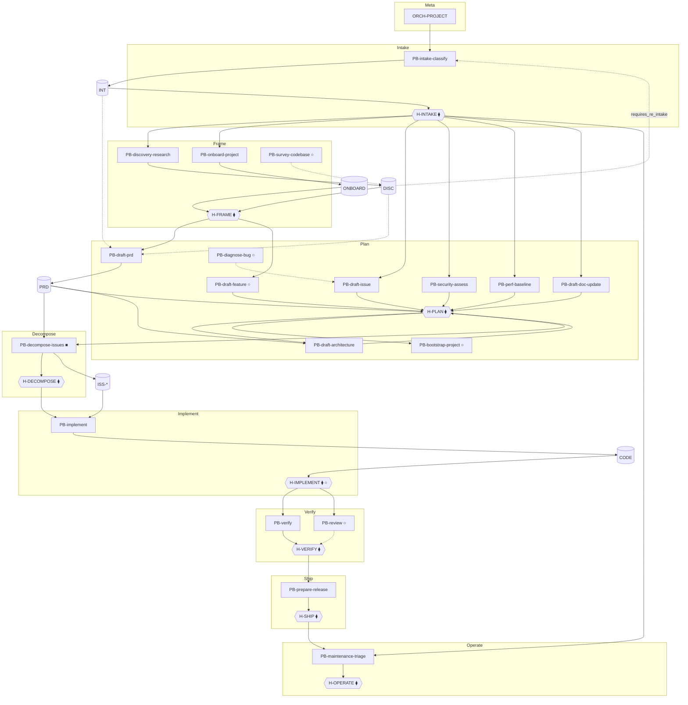

# Skill Dependency Graph — AI Dev OS

| Field | Value |
|-------|-------|
| document_id | GRAPH-SKILLS-001 |
| version | 1.0.0 |
| status | active |
| date | 2026-06-18 |
| companion | `skill-dependency-graph.yaml` |
| owner | ORCH-PROJECT |

Describes **all playbooks** (`PB-*`), their dependencies, execution order, parallelism, blocking behaviour, and human gates. ORCH-PROJECT is the runtime coordinator — not a playbook, but listed as **ORCH-PROJECT** for graph completeness.

**Legend**

| Symbol | Meaning |
|--------|---------|
| → | Hard dependency (artifact + prior gate) |
| ⇢ | Soft / conditional dependency |
| ⧫ | Human gate (blocks until approve) |
| ∥ | Phase-parallel (sequential ticks, same phase) |
| ○ | Optional skill |
| ■ | Blocking skill (downstream cannot start without) |

---

## 1. Skill Catalog

| skill_id | Phase | Status | Exit gate | Role |
|----------|-------|--------|-----------|------|
| **ORCH-PROJECT** | Meta | design | — | Central brain — routes all PB-* |
| **PB-intake-classify** | Intake | draft | H-INTAKE ■ | Universal entry — produces INT |
| **PB-discovery-research** | Frame | draft | H-FRAME | Research — produces DISC |
| **PB-onboard-project** | Frame | active | H-FRAME | OS adoption — produces ONBOARD |
| **PB-survey-codebase** | Frame | planned | none ○ | Bounded code survey — SURVEY |
| **PB-draft-prd** | Plan | active | H-PLAN | PRD — PRD artifact |
| **PB-draft-feature** | Plan | planned | H-PLAN ○ | Feature spec — FEAT (PRD alternative path) |
| **PB-draft-architecture** | Plan | planned | H-PLAN | Architecture — ARCH |
| **PB-draft-issue** | Plan | planned | H-PLAN | Issue spec — ISS |
| **PB-security-assess** | Plan | planned | H-PLAN | Security assessment |
| **PB-perf-baseline** | Plan | planned | H-PLAN | Performance baseline |
| **PB-draft-doc-update** | Plan | draft | H-PLAN | Documentation plan |
| **PB-diagnose-bug** | Plan | planned | H-PLAN ○ | Root-cause analysis — DIAG |
| **PB-bootstrap-project** | Plan | planned | H-PLAN ○ | Scaffold repo — SCAFFOLD |
| **PB-decompose-issues** | Decompose | planned | H-DECOMPOSE ■ | Issue breakdown — ISS-* |
| **PB-implement** | Implement | planned | H-IMPLEMENT | Code — CODE |
| **PB-verify** | Verify | planned | H-VERIFY ∥ | Test execution — TEST-RPT |
| **PB-review** | Verify | planned | H-VERIFY ∥ ○ | Code review — REVIEW |
| **PB-prepare-release** | Ship | planned | H-SHIP | Release — REL |
| **PB-maintenance-triage** | Operate | active | H-OPERATE | Maintenance routing — MAINT |

---

## 2. Dependency Graph

Artifact and gate dependencies (directed acyclic per workflow path; rewind edges shown separately).

### 2.1 Dependency matrix (skill → depends on)

| Skill | Depends on skills | Depends on artifacts | Depends on gates |
|-------|-------------------|----------------------|------------------|
| ORCH-PROJECT | — | WR, ORS | — |
| PB-intake-classify | — | `raw_request` | — |
| PB-discovery-research | PB-intake-classify | INT | H-INTAKE |
| PB-onboard-project | PB-intake-classify | INT | H-INTAKE |
| PB-survey-codebase | PB-intake-classify | INT | H-INTAKE |
| PB-draft-prd | PB-intake-classify; PB-discovery-research ⇢ | INT; DISC ⇢ | H-FRAME ⇢ |
| PB-draft-feature | PB-discovery-research | DISC | H-FRAME |
| PB-draft-architecture | PB-draft-prd | PRD | H-PLAN ⇢ |
| PB-draft-issue | PB-intake-classify; PB-diagnose-bug ⇢ | INT; DIAG ⇢ | H-INTAKE |
| PB-diagnose-bug | PB-intake-classify | INT | H-INTAKE |
| PB-security-assess | PB-intake-classify | INT | H-INTAKE |
| PB-perf-baseline | PB-intake-classify | INT | H-INTAKE |
| PB-draft-doc-update | PB-intake-classify | INT | H-INTAKE |
| PB-bootstrap-project | PB-draft-prd | PRD | H-PLAN |
| PB-decompose-issues | PB-draft-prd | PRD | H-PLAN |
| PB-implement | PB-decompose-issues ⇢; PB-draft-issue ⇢ | ISS-* or ISS | H-DECOMPOSE ⇢; H-PLAN |
| PB-verify | PB-implement | CODE, TEST | H-IMPLEMENT ⇢ |
| PB-review | PB-implement | CODE | H-IMPLEMENT ⇢ |
| PB-prepare-release | PB-verify ⇢ | TEST-RPT | H-VERIFY |
| PB-maintenance-triage | PB-intake-classify | INT | H-INTAKE |

⇢ = conditional / workflow-specific / waivable.

### 2.2 Blocking skills

Skills that **block all downstream work** on a path until complete + gate approved:

| Skill | Blocks | Reason |
|-------|--------|--------|
| **PB-intake-classify** | Entire workflow | No INT → no classification, no routing |
| **PB-decompose-issues** | Implement (feature path) | No ISS-* → implement scope undefined |
| **ORCH-PROJECT** | Automated sequencing | No ORS → no deterministic invoke (human can still run playbooks standalone) |

Gate nodes **H-*** block phase transitions regardless of skill.

### 2.3 Optional skills

| Skill | Optional when | Skip trigger |
|-------|---------------|--------------|
| PB-discovery-research | Enhancement fast path; DISC waived | Human waiver at H-INTAKE |
| PB-survey-codebase | CONTEXT sufficient | Human or orchestrator skip |
| PB-draft-feature | PRD path chosen | Routing prefers PB-draft-prd |
| PB-diagnose-bug | Repro sufficient in INT | bugfix simple path |
| PB-draft-architecture | Small change; no structural delta | WF-ENHANCEMENT, WF-DOCS |
| PB-bootstrap-project | Existing repo | `entry_mode: normal` |
| PB-review | Verify-only path | Human waive at H-VERIFY |
| PB-implement | Docs-only / plan-only terminal | WF-DOCS terminal |
| H-IMPLEMENT gate | Advisory optional | Documented in orchestrator OD |

### 2.4 Parallel skills (phase-level)

ORCH-PROJECT invokes **one playbook per tick** — parallelism is **phase co-location**, not concurrent execution.

| Phase | Parallel group | Execution order within phase |
|-------|----------------|------------------------------|
| Frame | PB-discovery-research ∥ PB-onboard-project ∥ PB-survey-codebase | **Mutually exclusive** by `work_type` — only one path |
| Plan | PRD → ARCH (sequential); ISS/SEC/PERF/DOC **mutually exclusive** by `work_type` | PRD before ARCH when both required |
| Plan | PB-draft-prd ∥ PB-draft-feature | **Alternative** — one selected |
| Verify | PB-verify ∥ PB-review | VERIFY first, REVIEW second (SHOULD) — both before H-VERIFY |

**Never parallel:** two mutating playbooks on same `work_id` in same tick (ORCH-N5).

---

## 3. Execution Graph

### 3.1 Master spine (WF-FEATURE — reference path)

### 3.2 Execution order by workflow

| Order | WF-PROJECT-NEW | WF-FEATURE | WF-BUGFIX | WF-RELEASE | WF-PROJECT-EXISTING |
|-------|----------------|------------|-----------|------------|---------------------|
| 1 | PB-intake-classify | PB-intake-classify | PB-intake-classify | PB-intake-classify | PB-intake-classify |
| ⧫ | H-INTAKE | H-INTAKE | H-INTAKE | H-INTAKE | H-INTAKE |
| 2 | PB-discovery-research | PB-discovery-research ○ | PB-diagnose-bug ○ | PB-prepare-release ⇢ | PB-onboard-project |
| ⧫ | H-FRAME | H-FRAME | — | — | H-FRAME |
| 3 | PB-draft-prd | PB-draft-prd | PB-draft-issue | — | — |
| 4 | PB-draft-architecture ○ | PB-draft-architecture ○ | — | — | — |
| ⧫ | H-PLAN | H-PLAN | H-PLAN | H-PLAN ⇢ | — |
| 5 | PB-bootstrap-project ○ | PB-decompose-issues | PB-implement | — | — |
| ⧫ | — | H-DECOMPOSE | H-IMPLEMENT ○ | — | — |
| 6 | — | PB-implement | PB-verify | — | — |
| ⧫ | — | H-IMPLEMENT | H-VERIFY | H-VERIFY ⇢ | — |
| 7 | — | PB-verify | — | — | — |
| 8 | — | PB-review ○ | — | — | — |
| ⧫ | — | H-VERIFY | — | H-SHIP | — |
| 9 | — | PB-prepare-release ○ | — | — | — |
| ⧫ | — | H-SHIP ○ | — | H-OPERATE ○ | — |

### 3.3 Work-type → first Plan skill (after Frame gate)

| work_type | Plan entry skill | Frame skill |
|-----------|------------------|-------------|
| `new_project` | PB-draft-prd | PB-discovery-research |
| `feature` | PB-draft-prd | PB-discovery-research |
| `enhancement` | PB-draft-prd | PB-discovery-research ○ |
| `existing_project` | — | PB-onboard-project |
| `bugfix` | PB-draft-issue | — |
| `refactor` | PB-draft-architecture | PB-discovery-research ○ |
| `security` | PB-security-assess | — |
| `performance` | PB-perf-baseline | — |
| `documentation` | PB-draft-doc-update | — |
| `release` | PB-prepare-release | — |
| `maintenance` | PB-maintenance-triage | — |

### 3.4 Rewind edges (non-happy path)

| From | Signal | To skill | Gate |
|------|--------|----------|------|
| PB-discovery-research | `requires_re_intake` | PB-intake-classify | H-INTAKE |
| Any | H-* `revise` | Same-phase playbook | Same H-* |
| Any | H-* `reject` | — (ABORT) | — |
| ORCH-PROJECT | `rewind_phase` | Phase entry skill | Prior gate re-approve MAY be required |

---

## 4. Human Approval Points

| Order | Gate | After skill(s) | Binds artifact | Blocks until |
|-------|------|----------------|----------------|--------------|
| 1 | **H-INTAKE** | PB-intake-classify | INT | Frame or Plan entry |
| 2 | **H-FRAME** | PB-discovery-research, PB-onboard-project | DISC, ONBOARD | Plan entry (feature/new paths) |
| 3 | **H-PLAN** | Plan-phase PB-* | PRD, ARCH, ISS, etc. | Decompose / Implement |
| 4 | **H-DECOMPOSE** | PB-decompose-issues | ISS-* | Implement |
| 5 | **H-IMPLEMENT** | PB-implement | CODE | Verify (optional gate) |
| 6 | **H-VERIFY** | PB-verify, PB-review | TEST-RPT, REVIEW | Ship |
| 7 | **H-SHIP** | PB-prepare-release | REL | Operate |
| 8 | **H-OPERATE** | PB-maintenance-triage | MAINT | Work item DONE |

---

## 5. Priority Matrix

Priority = **implementation and promotion order** for the OS (P0 most critical). Orthogonal to work item P0–P3 priority from intake.

### 5.1 Skill implementation priority

| P | skill_id | Rationale | Unblocks |
|---|----------|-----------|----------|
| **P0** | ORCH-PROJECT | Central brain — without it, manual sequencing only | All automated paths |
| **P0** | PB-intake-classify | Universal entry | All workflows |
| **P1** | PB-discovery-research | Greenfield + feature Frame path | WF-PROJECT-NEW, WF-FEATURE |
| **P1** | PB-draft-prd | Plan spine | Feature delivery |
| **P1** | PB-draft-issue | Bug path | WF-BUGFIX |
| **P1** | PB-decompose-issues | Implement scope | WF-FEATURE Implement |
| **P1** | PB-implement | Execution | Value delivery |
| **P1** | PB-verify | Quality closure | WF-* Verify |
| **P2** | PB-onboard-project | Existing adoption | WF-PROJECT-EXISTING |
| **P2** | PB-draft-architecture | Refactor / new project | WF-REFACTOR, WF-PROJECT-NEW |
| **P2** | PB-prepare-release | Ship | WF-RELEASE |
| **P2** | PB-review | Verify depth | Code quality |
| **P2** | PB-security-assess | Security path | WF-SECURITY |
| **P2** | PB-perf-baseline | Perf path | WF-PERF |
| **P2** | PB-draft-doc-update | Docs path | WF-DOCS |
| **P2** | PB-maintenance-triage | Operate | WF-MAINTENANCE |
| **P3** | PB-diagnose-bug | Complex bugfix aid | Optional bug path |
| **P3** | PB-survey-codebase | Frame aid | Optional discovery input |
| **P3** | PB-draft-feature | PRD alternative | Narrow feature slices |
| **P3** | PB-bootstrap-project | Greenfield scaffold | Post-PRD automation |

### 5.2 Workflow × critical path depth

| workflow_id | Critical path length | Bottleneck gates |
|-------------|---------------------|------------------|
| WF-FEATURE | 8 skills, 6 gates | H-FRAME, H-PLAN, H-DECOMPOSE, H-VERIFY |
| WF-PROJECT-NEW | 5 skills, 3 gates | H-INTAKE, H-FRAME, H-PLAN |
| WF-BUGFIX | 4 skills, 4 gates | H-INTAKE, H-PLAN, H-VERIFY |
| WF-RELEASE | 2 skills, 3 gates | H-INTAKE, H-SHIP, H-OPERATE (H-VERIFY waived per gates.yaml) |
| WF-MAINTENANCE | 2 skills, 2 gates | H-INTAKE, H-OPERATE |
| WF-PROJECT-EXISTING | 2 skills, 2 gates | H-INTAKE, H-FRAME |

### 5.3 Gate criticality matrix

| Gate | Workflows requiring | Skippable |
|------|---------------------|-----------|
| H-INTAKE | All 11 | never |
| H-FRAME | NEW, FEATURE, ENHANCEMENT, EXISTING | BUGFIX, RELEASE, MAINT, DOCS, SEC, PERF |
| H-PLAN | Most | EXISTING (terminal at FRAME) |
| H-DECOMPOSE | FEATURE (full path) | BUGFIX, DOCS, RELEASE |
| H-IMPLEMENT | FEATURE, BUGFIX | Optional advisory |
| H-VERIFY | FEATURE, BUGFIX, RELEASE | MAINT (partial) |
| H-SHIP | RELEASE, FEATURE (full) | BUGFIX |
| H-OPERATE | MAINTENANCE, RELEASE | Most others |

---

## 6. Orchestrator Routing Rules (summary)

1. **First skill** on `start`: always `PB-intake-classify` (unless resuming).
2. **Next skill** = `routing-matrix.yaml` ∩ artifact presence ∩ gates approved ∩ `work_type`.
3. **Optional skills** skipped if waiver in WR or artifact already exists.
4. **Blocking skills** must show `approved` gate before ROUTE advances phase.
5. **Parallel phase skills** run sequential ticks in documented order (§2.4).
6. **One tick — one playbook — one work_id.**

---

## 7. References

| Doc | Path |
|-----|------|
| Machine graph | `skill-dependency-graph.yaml` |
| Orchestrator | `DESIGN.md` |
| INDEX | `../../INDEX.md` |
| Skill contract | `../../standards/SKILL-CONTRACT.md` |